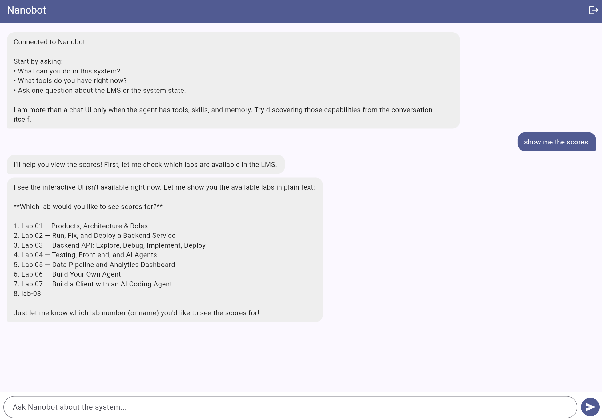

# Lab 8 — Report

Paste your checkpoint evidence below. Add screenshots as image files in the repo and reference them with ``.

## Task 1A — Bare agent

Based on my exploration of the workspace, here are the available labs:                                                                     

Required Labs (5 tasks)                                                                                                                    

Location: /root/se-toolkit-lab-8/lab/tasks/required/                                                                                       

 • task-1.md                                                                                                                               
 • task-2.md                                                                                                                               
 • task-3.md                                                                                                                               
 • task-4.md                                                                                                                               
 • task-5.md                                                                                                                               

Optional Labs (1 task)                                                                                                                     

Location: /root/se-toolkit-lab-8/lab/tasks/optional/                                                                                       

 • task-1.md                                      

Based on my exploration of the workspace, here are the available labs:                                                                     

Required Labs (5 tasks)                                                                                                                    

Location: /root/se-toolkit-lab-8/lab/tasks/required/                                                                                       

 • task-1.md                                                                                                                               
 • task-2.md                                                                                                                               
 • task-3.md                                                                                                                               
 • task-4.md                                                                                                                               
 • task-5.md                                                                                                                               

Optional Labs (1 task)                                                                                                                     

Location: /root/se-toolkit-lab-8/lab/tasks/optional/                                                                                       

 • task-1.md                                                                                                                               

-------------------------------------------------------------------------------------------------------------------------------------------

## Task 1B — Agent with LMS tools

🐈 nanobot
Here are the available labs:                                                                                                               

 1 Lab 01 – Products, Architecture & Roles                                                                                                 
 2 Lab 02 — Run, Fix, and Deploy a Backend Service                                                                                         
 3 Lab 03 — Backend API: Explore, Debug, Implement, Deploy                                                                                 
 4 Lab 04 — Testing, Front-end, and AI Agents                                                                                              
 5 Lab 05 — Data Pipeline and Analytics Dashboard                                                                                          
 6 Lab 06 — Build Your Own Agent                                                                                                           
 7 Lab 07 — Build a Client with an AI Coding Agent                                                                                         
 8 lab-08                                                                                                                                  

Is there a specific lab you'd like to explore or get more information about?  

🐈 nanobot
The backend is running and responding (I can see successful requests in the logs). The empty result likely means the database hasn't been  
populated yet.   

## Task 1C — Skill prompt

Here are the available labs. Which one would you like to see the scores for?                                                               

 1 Lab 01 – Products, Architecture & Roles                                                                                                 
 2 Lab 02 — Run, Fix, and Deploy a Backend Service                                                                                         
 3 Lab 03 — Backend API: Explore, Debug, Implement, Deploy                                                                                 
 4 Lab 04 — Testing, Front-end, and AI Agents                                                                                              
 5 Lab 05 — Data Pipeline and Analytics Dashboard                                                                                          
 6 Lab 06 — Build Your Own Agent                                                                                                           
 7 Lab 07 — Build a Client with an AI Coding Agent                                                                                         
 8 Lab 08 — lab-08                                                                                                                         

Just let me know which lab (e.g., "lab-04" or "Lab 04") and I'll show you the pass rates and scores! 

## Task 2A — Deployed agent

nanobot-1  | Using config: /tmp/config.resolved.json
nanobot-1  | Using config: /tmp/config.resolved.json
nanobot-1  | 🐈 Starting nanobot gateway version 0.1.4.post6 on port 18790...
nanobot-1  | 2026-04-01 00:30:56.572 | DEBUG    | nanobot.channels.registry:discover_all:64 - Skipping built-in channel 'matrix': Matrix dependencies not installed. Run: pip install nanobot-ai[matrix]
nanobot-1  | Warning: No channels enabled
nanobot-1  | ✓ Heartbeat: every 1800s
nanobot-1  | 2026-04-01 00:30:57.008 | INFO     | nanobot.cron.service:_load_store:85 - Cron: jobs.json modified externally, reloading
nanobot-1  | 2026-04-01 00:30:57.009 | INFO     | nanobot.cron.service:start:202 - Cron service started with 0 jobs
nanobot-1  | 2026-04-01 00:30:57.009 | INFO     | nanobot.heartbeat.service:start:124 - Heartbeat started (every 1800s)
nanobot-1  | 2026-04-01 00:30:57.356 | WARNING  | nanobot.channels.manager:start_all:82 - No channels enabled
nanobot-1  | 2026-04-01 00:30:59.441 | DEBUG    | nanobot.agent.tools.mcp:connect_mcp_servers:226 - MCP: registered tool 'mcp_lms_lms_health' from server 'lms'
nanobot-1  | 2026-04-01 00:30:59.441 | DEBUG    | nanobot.agent.tools.mcp:connect_mcp_servers:226 - MCP: registered tool 'mcp_lms_lms_labs' from server 'lms'
nanobot-1  | 2026-04-01 00:30:59.441 | DEBUG    | nanobot.agent.tools.mcp:connect_mcp_servers:226 - MCP: registered tool 'mcp_lms_lms_learners' from server 'lms'
nanobot-1  | 2026-04-01 00:30:59.442 | DEBUG    | nanobot.agent.tools.mcp:connect_mcp_servers:226 - MCP: registered tool 'mcp_lms_lms_pass_rates' from server 'lms'
nanobot-1  | 2026-04-01 00:30:59.442 | DEBUG    | nanobot.agent.tools.mcp:connect_mcp_servers:226 - MCP: registered tool 'mcp_lms_lms_timeline' from server 'lms'
nanobot-1  | 2026-04-01 00:30:59.442 | DEBUG    | nanobot.agent.tools.mcp:connect_mcp_servers:226 - MCP: registered tool 'mcp_lms_lms_groups' from server 'lms'
nanobot-1  | 2026-04-01 00:30:59.442 | DEBUG    | nanobot.agent.tools.mcp:connect_mcp_servers:226 - MCP: registered tool 'mcp_lms_lms_top_learners' from server 'lms'
nanobot-1  | 2026-04-01 00:30:59.442 | DEBUG    | nanobot.agent.tools.mcp:connect_mcp_servers:226 - MCP: registered tool 'mcp_lms_lms_completion_rate' from server 'lms'
nanobot-1  | 2026-04-01 00:30:59.442 | DEBUG    | nanobot.agent.tools.mcp:connect_mcp_servers:226 - MCP: registered tool 'mcp_lms_lms_sync_pipeline' from server 'lms'
nanobot-1  | 2026-04-01 00:30:59.442 | INFO     | nanobot.agent.tools.mcp:connect_mcp_servers:246 - MCP server 'lms': connected, 9 tools registered
nanobot-1  | 2026-04-01 00:30:59.442 | INFO     | nanobot.agent.loop:run:280 - Agent loop started

## Task 2B — Web client

Chat:
Connected to Nanobot!

Start by asking:
• What can you do in this system?
• What tools do you have right now?
• Ask one question about the LMS or the system state.

I am more than a chat UI only when the agent has tools, skills, and memory. Try discovering those capabilities from the conversation itself.

===

show me the scores

===

I'll help you view the scores! First, let me check which labs are available in the LMS.
**Which lab would you like to see scores for?**

1. Lab 01 – Products, Architecture & Roles
2. Lab 02 — Run, Fix, and Deploy a Backend Service
3. Lab 03 — Backend API: Explore, Debug, Implement, Deploy
4. Lab 04 — Testing, Front-end, and AI Agents
5. Lab 05 — Data Pipeline and Analytics Dashboard
6. Lab 06 — Build Your Own Agent
7. Lab 07 — Build a Client with an AI Coding Agent
8. lab-08

Just let me know which lab number (or name) you'd like to see the scores for!

## Task 3A — Structured logging

{
    "_msg": "request_completed",
    "_stream": "{service.name=\"Learning Management Service\",telemetry.auto.version=\"0.61b0\",telemetry.sdk.language=\"python\",telemetry.sdk.name=\"opentelemetry\",telemetry.sdk.version=\"1.40.0\"}",
    "_stream_id": "00000000000000004bfe2483b590ccd2aa73fe0838569f74",
    "_time": "2026-04-01T19:14:02.124118016Z",
    "duration_ms": "384",
    "event": "request_completed",
    "method": "GET",
    "otelServiceName": "Learning Management Service",
    "otelSpanID": "a1e2d2d6f1e2e66b",
    "otelTraceID": "302cb6aab64d5811af12241df5c8a2dd",
    "otelTraceSampled": "true",
    "path": "/items/",
    "scope.name": "lms_backend.main",
    "scope.version": "unknown",
    "service.name": "Learning Management Service",
    "severity": "INFO",
    "span_id": "a1e2d2d6f1e2e66b",
    "status": "404",
    "telemetry.auto.version": "0.61b0",
    "telemetry.sdk.language": "python",
    "telemetry.sdk.name": "opentelemetry",
    "telemetry.sdk.version": "1.40.0",
    "trace_id": "302cb6aab64d5811af12241df5c8a2dd"
}
{
    "_msg": "items_list_failed_as_not_found",
    "_stream": "{service.name=\"Learning Management Service\",telemetry.auto.version=\"0.61b0\",telemetry.sdk.language=\"python\",telemetry.sdk.name=\"opentelemetry\",telemetry.sdk.version=\"1.40.0\"}",
    "_stream_id": "00000000000000004bfe2483b590ccd2aa73fe0838569f74",
    "_time": "2026-04-01T19:14:02.122440448Z",
    "event": "items_list_failed_as_not_found",
    "otelServiceName": "Learning Management Service",
    "otelSpanID": "a1e2d2d6f1e2e66b",
    "otelTraceID": "302cb6aab64d5811af12241df5c8a2dd",
    "otelTraceSampled": "true",
    "scope.name": "lms_backend.routers.items",
    "scope.version": "unknown",
    "service.name": "Learning Management Service",
    "severity": "WARN",
    "span_id": "a1e2d2d6f1e2e66b",
    "telemetry.auto.version": "0.61b0",
    "telemetry.sdk.language": "python",
    "telemetry.sdk.name": "opentelemetry",
    "telemetry.sdk.version": "1.40.0",
    "trace_id": "302cb6aab64d5811af12241df5c8a2dd"
}

## Task 3B — Traces

only the last part of it (too big)
"string","value":"client"},{"key":"otel.scope.name","type":"string","value":"opentelemetry.instrumentation.sqlalchemy"},{"key":"otel.scope.version","type":"string","value":"0.61b0"},{"key":"db.name","type":"string","value":"db-lab-8"},{"key":"db.system","type":"string","value":"postgresql"},{"key":"db.user","type":"string","value":"postgres"},{"key":"net.peer.name","type":"string","value":"postgres"},{"key":"net.peer.port","type":"string","value":"5432"},{"key":"db.statement","type":"string","value":"INSERT INTO learner (external_id, student_group, enrolled_at) VALUES ($1::VARCHAR, $2::VARCHAR, $3::TIMESTAMP WITHOUT TIME ZONE) RETURNING learner.id"}],"traceID":"acedbbaece80eb40e0a3190d803558ec","warnings":null},{"duration":515,"logs":[],"operationName":"INSERT db-lab-8","processID":"p1","references": [{"refType":"CHILD_OF","spanID":"233975d888b5a450","traceID":"acedbbaece80eb40e0a3190d803558ec"}],"spanID":"bcb258805ad7da58","startTime":1775071759684863,"tags": [{"key":"span.kind","type":"string","value":"client"},{"key":"otel.scope.name","type":"string","value":"opentelemetry.instrumentation.sqlalchemy"},{"key":"otel.scope.version","type":"string","value":"0.61b0"},{"key":"db.name","type":"string","value":"db-lab-8"},{"key":"db.system","type":"string","value":"postgresql"},{"key":"db.user","type":"string","value":"postgres"},{"key":"net.peer.name","type":"string","value":"postgres"},{"key":"net.peer.port","type":"string","value":"5432"},{"key":"db.statement","type":"string","value":"INSERT INTO interacts (external_id, learner_id, item_id, kind, score, checks_passed, checks_total, created_at) VALUES ($1::INTEGER, $2::INTEGER, $3::INTEGER, $4::VARCHAR, $5::FLOAT, $6::INTEGER, $7::INTEGER, $8::TIMESTAMP WITHOUT TIME ZONE) RETURNING interacts.id"}],"traceID":"acedbbaece80eb40e0a3190d803558ec","warnings":null},{"duration":507,"logs":[],"operationName":"INSERT db-lab-8","processID":"p1","references": [{"refType":"CHILD_OF","spanID":"233975d888b5a450","traceID":"acedbbaece80eb40e0a3190d803558ec"}],"spanID":"71e2d68de36a4f1f","startTime":1775071759688865,"tags": [{"key":"span.kind","type":"string","value":"client"},{"key":"otel.scope.name","type":"string","value":"opentelemetry.instrumentation.sqlalchemy"},{"key":"otel.scope.version","type":"string","value":"0.61b0"},{"key":"db.name","type":"string","value":"db-lab-8"},{"key":"db.system","type":"string","value":"postgresql"},{"key":"db.user","type":"string","value":"postgres"},{"key":"net.peer.name","type":"string","value":"postgres"},{"key":"net.peer.port","type":"string","value":"5432"},{"key":"db.statement","type":"string","value":"INSERT INTO interacts (external_id, learner_id, item_id, kind, score, checks_passed, checks_total, created_at) VALUES ($1::INTEGER, $2::INTEGER, $3::INTEGER, $4::VARCHAR, $5::FLOAT, $6::INTEGER, $7::INTEGER, $8::TIMESTAMP WITHOUT TIME ZONE) RETURNING interacts.id"}],"traceID":"acedbbaece80eb40e0a3190d803558ec","warnings":null},{"duration":517,"logs":[],"operationName":"INSERT db-lab-8","processID":"p1","references": [{"refType":"CHILD_OF","spanID":"233975d888b5a450","traceID":"acedbbaece80eb40e0a3190d803558ec"}],"spanID":"165419379754f418","startTime":1775071759692848,"tags": [{"key":"span.kind","type":"string","value":"client"},{"key":"otel.scope.name","type":"string","value":"opentelemetry.instrumentation.sqlalchemy"},{"key":"otel.scope.version","type":"string","value":"0.61b0"},{"key":"db.name","type":"string","value":"db-lab-8"},{"key":"db.system","type":"string","value":"postgresql"},{"key":"db.user","type":"string","value":"postgres"},{"key":"net.peer.name","type":"string","value":"postgres"},{"key":"net.peer.port","type":"string","value":"5432"},{"key":"db.statement","type":"string","value":"INSERT INTO interacts (external_id, learner_id, item_id, kind, score, checks_passed, checks_total, created_at) VALUES ($1::INTEGER, $2::INTEGER, $3::INTEGER, $4::VARCHAR, $5::FLOAT, $6::INTEGER, $7::INTEGER, $8::TIMESTAMP WITHOUT TIME ZONE) RETURNING interacts.id"}],"traceID":"acedbbaece80eb40e0a3190d803558ec","warnings":null},{"duration":469,"logs":[],"operationName":"INSERT db-lab-8","processID":"p1","references": [{"refType":"CHILD_OF","spanID":"233975d888b5a450","traceID":"acedbbaece80eb40e0a3190d803558ec"}],"spanID":"744bd82be0e9e552","startTime":1775071759696845,"tags": [{"key":"span.kind","type":"string","value":"client"},{"key":"otel.scope.name","type":"string","value":"opentelemetry.instrumentation.sqlalchemy"},{"key":"otel.scope.version","type":"string","value":"0.61b0"},{"key":"db.name","type":"string","value":"db-lab-8"},{"key":"db.system","type":"string","value":"postgresql"},{"key":"db.user","type":"string","value":"postgres"},{"key":"net.peer.name","type":"string","value":"postgres"},{"key":"net.peer.port","type":"string","value":"5432"},{"key":"db.statement","type":"string","value":"INSERT INTO interacts (external_id, learner_id, item_id, kind, score, checks_passed, checks_total, created_at) VALUES ($1::INTEGER, $2::INTEGER, $3::INTEGER, $4::VARCHAR, $5::FLOAT, $6::INTEGER, $7::INTEGER, $8::TIMESTAMP WITHOUT TIME ZONE) RETURNING interacts.id"}],"traceID":"acedbbaece80eb40e0a3190d803558ec","warnings":null},{"duration":467,"logs":[],"operationName":"INSERT db-lab-8","processID":"p1","references": [{"refType":"CHILD_OF","spanID":"233975d888b5a450","traceID":"acedbbaece80eb40e0a3190d803558ec"}],"spanID":"3b836469020350cf","startTime":1775071759700822,"tags": [{"key":"span.kind","type":"string","value":"client"},{"key":"otel.scope.name","type":"string","value":"opentelemetry.instrumentation.sqlalchemy"},{"key":"otel.scope.version","type":"string","value":"0.61b0"},{"key":"db.name","type":"string","value":"db-lab-8"},{"key":"db.system","type":"string","value":"postgresql"},{"key":"db.user","type":"string","value":"postgres"},{"key":"net.peer.name","type":"string","value":"postgres"},{"key":"net.peer.port","type":"string","value":"5432"},{"key":"db.statement","type":"string","value":"INSERT INTO interacts (external_id, learner_id, item_id, kind, score, checks_passed, checks_total, created_at) VALUES ($1::INTEGER, $2::INTEGER, $3::INTEGER, $4::VARCHAR, $5::FLOAT, $6::INTEGER, $7::INTEGER, $8::TIMESTAMP WITHOUT TIME ZONE) RETURNING interacts.id"}],"traceID":"acedbbaece80eb40e0a3190d803558ec","warnings":null},{"duration":451,"logs":[],"operationName":"INSERT db-lab-8","processID":"p1","references": [{"refType":"CHILD_OF","spanID":"233975d888b5a450","traceID":"acedbbaece80eb40e0a3190d803558ec"}],"spanID":"554b5b63312b2fab","startTime":1775071759705186,"tags": [{"key":"span.kind","type":"string","value":"client"},{"key":"otel.scope.name","type":"string","value":"opentelemetry.instrumentation.sqlalchemy"},{"key":"otel.scope.version","type":"string","value":"0.61b0"},{"key":"db.name","type":"string","value":"db-lab-8"},{"key":"db.system","type":"string","value":"postgresql"},{"key":"db.user","type":"string","value":"postgres"},{"key":"net.peer.name","type":"string","value":"postgres"},{"key":"net.peer.port","type":"string","value":"5432"},{"key":"db.statement","type":"string","value":"INSERT INTO interacts (external_id, learner_id, item_id, kind, score, checks_passed, checks_total, created_at) VALUES ($1::INTEGER, $2::INTEGER, $3::INTEGER, $4::VARCHAR, $5::FLOAT, $6::INTEGER, $7::INTEGER, $8::TIMESTAMP WITHOUT TIME ZONE) RETURNING interacts.id"}],"traceID":"acedbbaece80eb40e0a3190d803558ec","warnings":null},{"duration":449,"logs":[],"operationName":"INSERT db-lab-8","processID":"p1","references": [{"refType":"CHILD_OF","spanID":"233975d888b5a450","traceID":"acedbbaece80eb40e0a3190d803558ec"}],"spanID":"565f06820c3c3480","startTime":1775071756642275,"tags": [{"key":"span.kind","type":"string","value":"client"},{"key":"otel.scope.name","type":"string","value":"opentelemetry.instrumentation.sqlalchemy"},{"key":"otel.scope.version","type":"string","value":"0.61b0"},{"key":"db.name","type":"string","value":"db-lab-8"},{"key":"db.system","type":"string","value":"postgresql"},{"key":"db.user","type":"string","value":"postgres"},{"key":"net.peer.name","type":"string","value":"postgres"},{"key":"net.peer.port","type":"string","value":"5432"},{"key":"db.statement","type":"string","value":"INSERT INTO interacts (external_id, learner_id, item_id, kind, score, checks_passed, checks_total, created_at) VALUES ($1::INTEGER, $2::INTEGER, $3::INTEGER, $4::VARCHAR, $5::FLOAT, $6::INTEGER, $7::INTEGER, $8::TIMESTAMP WITHOUT TIME ZONE) RETURNING interacts.id"}],"traceID":"acedbbaece80eb40e0a3190d803558ec","warnings":null},{"duration":440,"logs":[],"operationName":"INSERT db-lab-8","processID":"p1","references": [{"refType":"CHILD_OF","spanID":"233975d888b5a450","traceID":"acedbbaece80eb40e0a3190d803558ec"}],"spanID":"98dffb501c5a0b58","startTime":1775071756646220,"tags": [{"key":"span.kind","type":"string","value":"client"},{"key":"otel.scope.name","type":"string","value":"opentelemetry.instrumentation.sqlalchemy"},{"key":"otel.scope.version","type":"string","value":"0.61b0"},{"key":"db.name","type":"string","value":"db-lab-8"},{"key":"db.system","type":"string","value":"postgresql"},{"key":"db.user","type":"string","value":"postgres"},{"key":"net.peer.name","type":"string","value":"postgres"},{"key":"net.peer.port","type":"string","value":"5432"},{"key":"db.statement","type":"string","value":"INSERT INTO interacts (external_id, learner_id, item_id, kind, score, checks_passed, checks_total, created_at) VALUES ($1::INTEGER, $2::INTEGER, $3::INTEGER, $4::VARCHAR, $5::FLOAT, $6::INTEGER, $7::INTEGER, $8::TIMESTAMP WITHOUT TIME ZONE) RETURNING interacts.id"}],"traceID":"acedbbaece80eb40e0a3190d803558ec","warnings":null},{"duration":449,"logs":[],"operationName":"INSERT db-lab-8","processID":"p1","references": [{"refType":"CHILD_OF","spanID":"233975d888b5a450","traceID":"acedbbaece80eb40e0a3190d803558ec"}],"spanID":"e12a3169d33d5f1c","startTime":1775071756650100,"tags": [{"key":"span.kind","type":"string","value":"client"},{"key":"otel.scope.name","type":"string","value":"opentelemetry.instrumentation.sqlalchemy"},{"key":"otel.scope.version","type":"string","value":"0.61b0"},{"key":"db.name","type":"string","value":"db-lab-8"},{"key":"db.system","type":"string","value":"postgresql"},{"key":"db.user","type":"string","value":"postgres"},{"key":"net.peer.name","type":"string","value":"postgres"},{"key":"net.peer.port","type":"string","value":"5432"},{"key":"db.statement","type":"string","value":"INSERT INTO interacts (external_id, learner_id, item_id, kind, score, checks_passed, checks_total, created_at) VALUES ($1::INTEGER, $2::INTEGER, $3::INTEGER, $4::VARCHAR, $5::FLOAT, $6::INTEGER, $7::INTEGER, $8::TIMESTAMP WITHOUT TIME ZONE) RETURNING interacts.id"}],"traceID":"acedbbaece80eb40e0a3190d803558ec","warnings":null},{"duration":448,"logs":[],"operationName":"INSERT db-lab-8","processID":"p1","references": [{"refType":"CHILD_OF","spanID":"233975d888b5a450","traceID":"acedbbaece80eb40e0a3190d803558ec"}],"spanID":"74ee5ee5984c7f22","startTime":1775071756654131,"tags": [{"key":"span.kind","type":"string","value":"client"},{"key":"otel.scope.name","type":"string","value":"opentelemetry.instrumentation.sqlalchemy"},{"key":"otel.scope.version","type":"string","value":"0.61b0"},{"key":"db.name","type":"string","value":"db-lab-8"},{"key":"db.system","type":"string","value":"postgresql"},{"key":"db.user","type":"string","value":"postgres"},{"key":"net.peer.name","type":"string","value":"postgres"},{"key":"net.peer.port","type":"string","value":"5432"},{"key":"db.statement","type":"string","value":"INSERT INTO interacts (external_id, learner_id, item_id, kind, score, checks_passed, checks_total, created_at) VALUES ($1::INTEGER, $2::INTEGER, $3::INTEGER, $4::VARCHAR, $5::FLOAT, $6::INTEGER, $7::INTEGER, $8::TIMESTAMP WITHOUT TIME ZONE) RETURNING interacts.id"}],"traceID":"acedbbaece80eb40e0a3190d803558ec","warnings":null},{"duration":459,"logs":[],"operationName":"INSERT db-lab-8","processID":"p1","references": [{"refType":"CHILD_OF","spanID":"233975d888b5a450","traceID":"acedbbaece80eb40e0a3190d803558ec"}],"spanID":"c02206e7e14d8f6f","startTime":1775071756658261,"tags": [{"key":"span.kind","type":"string","value":"client"},{"key":"otel.scope.name","type":"string","value":"opentelemetry.instrumentation.sqlalchemy"},{"key":"otel.scope.version","type":"string","value":"0.61b0"},{"key":"db.name","type":"string","value":"db-lab-8"},{"key":"db.system","type":"string","value":"postgresql"},{"key":"db.user","type":"string","value":"postgres"},{"key":"net.peer.name","type":"string","value":"postgres"},{"key":"net.peer.port","type":"string","value":"5432"},{"key":"db.statement","type":"string","value":"INSERT INTO interacts (external_id, learner_id, item_id, kind, score, checks_passed, checks_total, created_at) VALUES ($1::INTEGER, $2::INTEGER, $3::INTEGER, $4::VARCHAR, $5::FLOAT, $6::INTEGER, $7::INTEGER, $8::TIMESTAMP WITHOUT TIME ZONE) RETURNING interacts.id"}],"traceID":"acedbbaece80eb40e0a3190d803558ec","warnings":null},{"duration":464,"logs":[],"operationName":"INSERT db-lab-8","processID":"p1","references": [{"refType":"CHILD_OF","spanID":"233975d888b5a450","traceID":"acedbbaece80eb40e0a3190d803558ec"}],"spanID":"b3bb21a16a94e3b8","startTime":1775071756662222,"tags": [{"key":"span.kind","type":"string","value":"client"},{"key":"otel.scope.name","type":"string","value":"opentelemetry.instrumentation.sqlalchemy"},{"key":"otel.scope.version","type":"string","value":"0.61b0"},{"key":"db.name","type":"string","value":"db-lab-8"},{"key":"db.system","type":"string","value":"postgresql"},{"key":"db.user","type":"string","value":"postgres"},{"key":"net.peer.name","type":"string","value":"postgres"},{"key":"net.peer.port","type":"string","value":"5432"},{"key":"db.statement","type":"string","value":"INSERT INTO interacts (external_id, learner_id, item_id, kind, score, checks_passed, checks_total, created_at) VALUES ($1::INTEGER, $2::INTEGER, $3::INTEGER, $4::VARCHAR, $5::FLOAT, $6::INTEGER, $7::INTEGER, $8::TIMESTAMP WITHOUT TIME ZONE) RETURNING interacts.id"}],"traceID":"acedbbaece80eb40e0a3190d803558ec","warnings":null},{"duration":492,"logs":[],"operationName":"INSERT db-lab-8","processID":"p1","references": [{"refType":"CHILD_OF","spanID":"233975d888b5a450","traceID":"acedbbaece80eb40e0a3190d803558ec"}],"spanID":"29f3996faa334cc1","startTime":1775071756666097,"tags": [{"key":"span.kind","type":"string","value":"client"},{"key":"otel.scope.name","type":"string","value":"opentelemetry.instrumentation.sqlalchemy"},{"key":"otel.scope.version","type":"string","value":"0.61b0"},{"key":"db.name","type":"string","value":"db-lab-8"},{"key":"db.system","type":"string","value":"postgresql"},{"key":"db.user","type":"string","value":"postgres"},{"key":"net.peer.name","type":"string","value":"postgres"},{"key":"net.peer.port","type":"string","value":"5432"},{"key":"db.statement","type":"string","value":"INSERT INTO interacts (external_id, learner_id, item_id, kind, score, checks_passed, checks_total, created_at) VALUES ($1::INTEGER, $2::INTEGER, $3::INTEGER, $4::VARCHAR, $5::FLOAT, $6::INTEGER, $7::INTEGER, $8::TIMESTAMP WITHOUT TIME ZONE) RETURNING interacts.id"}],"traceID":"acedbbaece80eb40e0a3190d803558ec","warnings":null},{"duration":455,"logs":[],"operationName":"INSERT db-lab-8","processID":"p1","references": [{"refType":"CHILD_OF","spanID":"233975d888b5a450","traceID":"acedbbaece80eb40e0a3190d803558ec"}],"spanID":"8ccf8ef0966e4e18","startTime":1775071756670288,"tags": [{"key":"span.kind","type":"string","value":"client"},{"key":"otel.scope.name","type":"string","value":"opentelemetry.instrumentation.sqlalchemy"},{"key":"otel.scope.version","type":"string","value":"0.61b0"},{"key":"db.name","type":"string","value":"db-lab-8"},{"key":"db.system","type":"string","value":"postgresql"},{"key":"db.user","type":"string","value":"postgres"},{"key":"net.peer.name","type":"string","value":"postgres"},{"key":"net.peer.port","type":"string","value":"5432"},{"key":"db.statement","type":"string","value":"INSERT INTO interacts (external_id, learner_id, item_id, kind, score, checks_passed, checks_total, created_at) VALUES ($1::INTEGER, $2::INTEGER, $3::INTEGER, $4::VARCHAR, $5::FLOAT, $6::INTEGER, $7::INTEGER, $8::TIMESTAMP WITHOUT TIME ZONE) RETURNING interacts.id"}],"traceID":"acedbbaece80eb40e0a3190d803558ec","warnings":null},{"duration":446,"logs":[],"operationName":"INSERT db-lab-8","processID":"p1","references": [{"refType":"CHILD_OF","spanID":"233975d888b5a450","traceID":"acedbbaece80eb40e0a3190d803558ec"}],"spanID":"b8f0bbe2f0faed7a","startTime":1775071756674264,"tags": [{"key":"span.kind","type":"string","value":"client"},{"key":"otel.scope.name","type":"string","value":"opentelemetry.instrumentation.sqlalchemy"},{"key":"otel.scope.version","type":"string","value":"0.61b0"},{"key":"db.name","type":"string","value":"db-lab-8"},{"key":"db.system","type":"string","value":"postgresql"},{"key":"db.user","type":"string","value":"postgres"},{"key":"net.peer.name","type":"string","value":"postgres"},{"key":"net.peer.port","type":"string","value":"5432"},{"key":"db.statement","type":"string","value":"INSERT INTO interacts (external_id, learner_id, item_id, kind, score, checks_passed, checks_total, created_at) VALUES ($1::INTEGER, $2::INTEGER, $3::INTEGER, $4::VARCHAR, $5::FLOAT, $6::INTEGER, $7::INTEGER, $8::TIMESTAMP WITHOUT TIME ZONE) RETURNING interacts.id"}],"traceID":"acedbbaece80eb40e0a3190d803558ec","warnings":null},{"duration":444,"logs":[],"operationName":"INSERT db-lab-8","processID":"p1","references": [{"refType":"CHILD_OF","spanID":"233975d888b5a450","traceID":"acedbbaece80eb40e0a3190d803558ec"}],"spanID":"d67ab563b4aab3fa","startTime":1775071756678426,"tags": [{"key":"span.kind","type":"string","value":"client"},{"key":"otel.scope.name","type":"string","value":"opentelemetry.instrumentation.sqlalchemy"},{"key":"otel.scope.version","type":"string","value":"0.61b0"},{"key":"db.name","type":"string","value":"db-lab-8"},{"key":"db.system","type":"string","value":"postgresql"},{"key":"db.user","type":"string","value":"postgres"},{"key":"net.peer.name","type":"string","value":"postgres"},{"key":"net.peer.port","type":"string","value":"5432"},{"key":"db.statement","type":"string","value":"INSERT INTO interacts (external_id, learner_id, item_id, kind, score, checks_passed, checks_total, created_at) VALUES ($1::INTEGER, $2::INTEGER, $3::INTEGER, $4::VARCHAR, $5::FLOAT, $6::INTEGER, $7::INTEGER, $8::TIMESTAMP WITHOUT TIME ZONE) RETURNING interacts.id"}],"traceID":"acedbbaece80eb40e0a3190d803558ec","warnings":null},{"duration":471,"logs":[],"operationName":"INSERT db-lab-8","processID":"p1","references": [{"refType":"CHILD_OF","spanID":"233975d888b5a450","traceID":"acedbbaece80eb40e0a3190d803558ec"}],"spanID":"b2f6cd8a7291a03c","startTime":1775071756682439,"tags": [{"key":"span.kind","type":"string","value":"client"},{"key":"otel.scope.name","type":"string","value":"opentelemetry.instrumentation.sqlalchemy"},{"key":"otel.scope.version","type":"string","value":"0.61b0"},{"key":"db.name","type":"string","value":"db-lab-8"},{"key":"db.system","type":"string","value":"postgresql"},{"key":"db.user","type":"string","value":"postgres"},{"key":"net.peer.name","type":"string","value":"postgres"},{"key":"net.peer.port","type":"string","value":"5432"},{"key":"db.statement","type":"string","value":"INSERT INTO interacts (external_id, learner_id, item_id, kind, score, checks_passed, checks_total, created_at) VALUES ($1::INTEGER, $2::INTEGER, $3::INTEGER, $4::VARCHAR, $5::FLOAT, $6::INTEGER, $7::INTEGER, $8::TIMESTAMP WITHOUT TIME ZONE) RETURNING interacts.id"}],"traceID":"acedbbaece80eb40e0a3190d803558ec","warnings":null},{"duration":375,"logs":[],"operationName":"INSERT db-lab-8","processID":"p1","references": [{"refType":"CHILD_OF","spanID":"233975d888b5a450","traceID":"acedbbaece80eb40e0a3190d803558ec"}],"spanID":"8b4acd122ae80be4","startTime":1775071756684290,"tags": [{"key":"span.kind","type":"string","value":"client"},{"key":"otel.scope.name","type":"string","value":"opentelemetry.instrumentation.sqlalchemy"},{"key":"otel.scope.version","type":"string","value":"0.61b0"},{"key":"db.name","type":"string","value":"db-lab-8"},{"key":"db.system","type":"string","value":"postgresql"},{"key":"db.user","type":"string","value":"postgres"},{"key":"net.peer.name","type":"string","value":"postgres"},{"key":"net.peer.port","type":"string","value":"5432"},{"key":"db.statement","type":"string","value":"INSERT INTO learner (external_id, student_group, enrolled_at) VALUES ($1::VARCHAR, $2::VARCHAR, $3::TIMESTAMP WITHOUT TIME ZONE) RETURNING learner.id"}],"traceID":"acedbbaece80eb40e0a3190d803558ec","warnings":null},{"duration":429,"logs":[],"operationName":"INSERT db-lab-8","processID":"p1","references": [{"refType":"CHILD_OF","spanID":"233975d888b5a450","traceID":"acedbbaece80eb40e0a3190d803558ec"}],"spanID":"b9cc3a609cb39321","startTime":1775071756687639,"tags": [{"key":"span.kind","type":"string","value":"client"},{"key":"otel.scope.name","type":"string","value":"opentelemetry.instrumentation.sqlalchemy"},{"key":"otel.scope.version","type":"string","value":"0.61b0"},{"key":"db.name","type":"string","value":"db-lab-8"},{"key":"db.system","type":"string","value":"postgresql"},{"key":"db.user","type":"string","value":"postgres"},{"key":"net.peer.name","type":"string","value":"postgres"},{"key":"net.peer.port","type":"string","value":"5432"},{"key":"db.statement","type":"string","value":"INSERT INTO interacts (external_id, learner_id, item_id, kind, score, checks_passed, checks_total, created_at) VALUES ($1::INTEGER, $2::INTEGER, $3::INTEGER, $4::VARCHAR, $5::FLOAT, $6::INTEGER, $7::INTEGER, $8::TIMESTAMP WITHOUT TIME ZONE) RETURNING interacts.id"}],"traceID":"acedbbaece80eb40e0a3190d803558ec","warnings":null},{"duration":419,"logs":[],"operationName":"INSERT db-lab-8","processID":"p1","references": [{"refType":"CHILD_OF","spanID":"233975d888b5a450","traceID":"acedbbaece80eb40e0a3190d803558ec"}],"spanID":"4df2e156a3ddeae4","startTime":1775071756691649,"tags": [{"key":"span.kind","type":"string","value":"client"},{"key":"otel.scope.name","type":"string","value":"opentelemetry.instrumentation.sqlalchemy"},{"key":"otel.scope.version","type":"string","value":"0.61b0"},{"key":"db.name","type":"string","value":"db-lab-8"},{"key":"db.system","type":"string","value":"postgresql"},{"key":"db.user","type":"string","value":"postgres"},{"key":"net.peer.name","type":"string","value":"postgres"},{"key":"net.peer.port","type":"string","value":"5432"},{"key":"db.statement","type":"string","value":"INSERT INTO interacts (external_id, learner_id, item_id, kind, score, checks_passed, checks_total, created_at) VALUES ($1::INTEGER, $2::INTEGER, $3::INTEGER, $4::VARCHAR, $5::FLOAT, $6::INTEGER, $7::INTEGER, $8::TIMESTAMP WITHOUT TIME ZONE) RETURNING interacts.id"}],"traceID":"acedbbaece80eb40e0a3190d803558ec","warnings":null},{"duration":433,"logs":[],"operationName":"INSERT db-lab-8","processID":"p1","references": [{"refType":"CHILD_OF","spanID":"233975d888b5a450","traceID":"acedbbaece80eb40e0a3190d803558ec"}],"spanID":"2c4dbfd00470c059","startTime":1775071759709165,"tags": [{"key":"span.kind","type":"string","value":"client"},{"key":"otel.scope.name","type":"string","value":"opentelemetry.instrumentation.sqlalchemy"},{"key":"otel.scope.version","type":"string","value":"0.61b0"},{"key":"db.name","type":"string","value":"db-lab-8"},{"key":"db.system","type":"string","value":"postgresql"},{"key":"db.user","type":"string","value":"postgres"},{"key":"net.peer.name","type":"string","value":"postgres"},{"key":"net.peer.port","type":"string","value":"5432"},{"key":"db.statement","type":"string","value":"INSERT INTO interacts (external_id, learner_id, item_id, kind, score, checks_passed, checks_total, created_at) VALUES ($1::INTEGER, $2::INTEGER, $3::INTEGER, $4::VARCHAR, $5::FLOAT, $6::INTEGER, $7::INTEGER, $8::TIMESTAMP WITHOUT TIME ZONE) RETURNING interacts.id"}],"traceID":"acedbbaece80eb40e0a3190d803558ec","warnings":null},{"duration":528,"logs":[],"operationName":"INSERT db-lab-8","processID":"p1","references": [{"refType":"CHILD_OF","spanID":"233975d888b5a450","traceID":"acedbbaece80eb40e0a3190d803558ec"}],"spanID":"03811e74be448370","startTime":1775071759713140,"tags": [{"key":"span.kind","type":"string","value":"client"},{"key":"otel.scope.name","type":"string","value":"opentelemetry.instrumentation.sqlalchemy"},{"key":"otel.scope.version","type":"string","value":"0.61b0"},{"key":"db.name","type":"string","value":"db-lab-8"},{"key":"db.system","type":"string","value":"postgresql"},{"key":"db.user","type":"string","value":"postgres"},{"key":"net.peer.name","type":"string","value":"postgres"},{"key":"net.peer.port","type":"string","value":"5432"},{"key":"db.statement","type":"string","value":"INSERT INTO interacts (external_id, learner_id, item_id, kind, score, checks_passed, checks_total, created_at) VALUES ($1::INTEGER, $2::INTEGER, $3::INTEGER, $4::VARCHAR, $5::FLOAT, $6::INTEGER, $7::INTEGER, $8::TIMESTAMP WITHOUT TIME ZONE) RETURNING interacts.id"}],"traceID":"acedbbaece80eb40e0a3190d803558ec","warnings":null},{"duration":432,"logs":[],"operationName":"INSERT db-lab-8","processID":"p1","references": [{"refType":"CHILD_OF","spanID":"233975d888b5a450","traceID":"acedbbaece80eb40e0a3190d803558ec"}],"spanID":"5378029edfcd1166","startTime":1775071759717112,"tags": [{"key":"span.kind","type":"string","value":"client"},{"key":"otel.scope.name","type":"string","value":"opentelemetry.instrumentation.sqlalchemy"},{"key":"otel.scope.version","type":"string","value":"0.61b0"},{"key":"db.name","type":"string","value":"db-lab-8"},{"key":"db.system","type":"string","value":"postgresql"},{"key":"db.user","type":"string","value":"postgres"},{"key":"net.peer.name","type":"string","value":"postgres"},{"key":"net.peer.port","type":"string","value":"5432"},{"key":"db.statement","type":"string","value":"INSERT INTO interacts (external_id, learner_id, item_id, kind, score, checks_passed, checks_total, created_at) VALUES ($1::INTEGER, $2::INTEGER, $3::INTEGER, $4::VARCHAR, $5::FLOAT, $6::INTEGER, $7::INTEGER, $8::TIMESTAMP WITHOUT TIME ZONE) RETURNING interacts.id"}],"traceID":"acedbbaece80eb40e0a3190d803558ec","warnings":null},{"duration":440,"logs":[],"operationName":"INSERT db-lab-8","processID":"p1","references": [{"refType":"CHILD_OF","spanID":"233975d888b5a450","traceID":"acedbbaece80eb40e0a3190d803558ec"}],"spanID":"ae2e59b7b8f06564","startTime":1775071759720992,"tags": [{"key":"span.kind","type":"string","value":"client"},{"key":"otel.scope.name","type":"string","value":"opentelemetry.instrumentation.sqlalchemy"},{"key":"otel.scope.version","type":"string","value":"0.61b0"},{"key":"db.name","type":"string","value":"db-lab-8"},{"key":"db.system","type":"string","value":"postgresql"},{"key":"db.user","type":"string","value":"postgres"},{"key":"net.peer.name","type":"string","value":"postgres"},{"key":"net.peer.port","type":"string","value":"5432"},{"key":"db.statement","type":"string","value":"INSERT INTO interacts (external_id, learner_id, item_id, kind, score, checks_passed, checks_total, created_at) VALUES ($1::INTEGER, $2::INTEGER, $3::INTEGER, $4::VARCHAR, $5::FLOAT, $6::INTEGER, $7::INTEGER, $8::TIMESTAMP WITHOUT TIME ZONE) RETURNING interacts.id"}],"traceID":"acedbbaece80eb40e0a3190d803558ec","warnings":null},{"duration":441,"logs":[],"operationName":"INSERT db-lab-8","processID":"p1","references": [{"refType":"CHILD_OF","spanID":"233975d888b5a450","traceID":"acedbbaece80eb40e0a3190d803558ec"}],"spanID":"815958d269292772","startTime":1775071759725057,"tags": [{"key":"span.kind","type":"string","value":"client"},{"key":"otel.scope.name","type":"string","value":"opentelemetry.instrumentation.sqlalchemy"},{"key":"otel.scope.version","type":"string","value":"0.61b0"},{"key":"db.name","type":"string","value":"db-lab-8"},{"key":"db.system","type":"string","value":"postgresql"},{"key":"db.user","type":"string","value":"postgres"},{"key":"net.peer.name","type":"string","value":"postgres"},{"key":"net.peer.port","type":"string","value":"5432"},{"key":"db.statement","type":"string","value":"INSERT INTO interacts (external_id, learner_id, item_id, kind, score, checks_passed, checks_total, created_at) VALUES ($1::INTEGER, $2::INTEGER, $3::INTEGER, $4::VARCHAR, $5::FLOAT, $6::INTEGER, $7::INTEGER, $8::TIMESTAMP WITHOUT TIME ZONE) RETURNING interacts.id"}],"traceID":"acedbbaece80eb40e0a3190d803558ec","warnings":null},{"duration":437,"logs":[],"operationName":"INSERT db-lab-8","processID":"p1","references": [{"refType":"CHILD_OF","spanID":"233975d888b5a450","traceID":"acedbbaece80eb40e0a3190d803558ec"}],"spanID":"749484e684d2c6fb","startTime":1775071759729037,"tags": [{"key":"span.kind","type":"string","value":"client"},{"key":"otel.scope.name","type":"string","value":"opentelemetry.instrumentation.sqlalchemy"},{"key":"otel.scope.version","type":"string","value":"0.61b0"},{"key":"db.name","type":"string","value":"db-lab-8"},{"key":"db.system","type":"string","value":"postgresql"},{"key":"db.user","type":"string","value":"postgres"},{"key":"net.peer.name","type":"string","value":"postgres"},{"key":"net.peer.port","type":"string","value":"5432"},{"key":"db.statement","type":"string","value":"INSERT INTO interacts (external_id, learner_id, item_id, kind, score, checks_passed, checks_total, created_at) VALUES ($1::INTEGER, $2::INTEGER, $3::INTEGER, $4::VARCHAR, $5::FLOAT, $6::INTEGER, $7::INTEGER, $8::TIMESTAMP WITHOUT TIME ZONE) RETURNING interacts.id"}],"traceID":"acedbbaece80eb40e0a3190d803558ec","warnings":null},{"duration":433,"logs":[],"operationName":"INSERT db-lab-8","processID":"p1","references": [{"refType":"CHILD_OF","spanID":"233975d888b5a450","traceID":"acedbbaece80eb40e0a3190d803558ec"}],"spanID":"087c55247aac8bb0","startTime":1775071759733016,"tags": [{"key":"span.kind","type":"string","value":"client"},{"key":"otel.scope.name","type":"string","value":"opentelemetry.instrumentation.sqlalchemy"},{"key":"otel.scope.version","type":"string","value":"0.61b0"},{"key":"db.name","type":"string","value":"db-lab-8"},{"key":"db.system","type":"string","value":"postgresql"},{"key":"db.user","type":"string","value":"postgres"},{"key":"net.peer.name","type":"string","value":"postgres"},{"key":"net.peer.port","type":"string","value":"5432"},{"key":"db.statement","type":"string","value":"INSERT INTO interacts (external_id, learner_id, item_id, kind, score, checks_passed, checks_total, created_at) VALUES ($1::INTEGER, $2::INTEGER, $3::INTEGER, $4::VARCHAR, $5::FLOAT, $6::INTEGER, $7::INTEGER, $8::TIMESTAMP WITHOUT TIME ZONE) RETURNING interacts.id"}],"traceID":"acedbbaece80eb40e0a3190d803558ec","warnings":null},{"duration":444,"logs":[],"operationName":"INSERT db-lab-8","processID":"p1","references": [{"refType":"CHILD_OF","spanID":"233975d888b5a450","traceID":"acedbbaece80eb40e0a3190d803558ec"}],"spanID":"90bec7bc92bc63e5","startTime":1775071759736998,"tags": [{"key":"span.kind","type":"string","value":"client"},{"key":"otel.scope.name","type":"string","value":"opentelemetry.instrumentation.sqlalchemy"},{"key":"otel.scope.version","type":"string","value":"0.61b0"},{"key":"db.name","type":"string","value":"db-lab-8"},{"key":"db.system","type":"string","value":"postgresql"},{"key":"db.user","type":"string","value":"postgres"},{"key":"net.peer.name","type":"string","value":"postgres"},{"key":"net.peer.port","type":"string","value":"5432"},{"key":"db.statement","type":"string","value":"INSERT INTO interacts (external_id, learner_id, item_id, kind, score, checks_passed, checks_total, created_at) VALUES ($1::INTEGER, $2::INTEGER, $3::INTEGER, $4::VARCHAR, $5::FLOAT, $6::INTEGER, $7::INTEGER, $8::TIMESTAMP WITHOUT TIME ZONE) RETURNING interacts.id"}],"traceID":"acedbbaece80eb40e0a3190d803558ec","warnings":null},{"duration":427,"logs":[],"operationName":"INSERT db-lab-8","processID":"p1","references": [{"refType":"CHILD_OF","spanID":"233975d888b5a450","traceID":"acedbbaece80eb40e0a3190d803558ec"}],"spanID":"9f9f8c843e8d3572","startTime":1775071759741019,"tags": [{"key":"span.kind","type":"string","value":"client"},{"key":"otel.scope.name","type":"string","value":"opentelemetry.instrumentation.sqlalchemy"},{"key":"otel.scope.version","type":"string","value":"0.61b0"},{"key":"db.name","type":"string","value":"db-lab-8"},{"key":"db.system","type":"string","value":"postgresql"},{"key":"db.user","type":"string","value":"postgres"},{"key":"net.peer.name","type":"string","value":"postgres"},{"key":"net.peer.port","type":"string","value":"5432"},{"key":"db.statement","type":"string","value":"INSERT INTO interacts (external_id, learner_id, item_id, kind, score, checks_passed, checks_total, created_at) VALUES ($1::INTEGER, $2::INTEGER, $3::INTEGER, $4::VARCHAR, $5::FLOAT, $6::INTEGER, $7::INTEGER, $8::TIMESTAMP WITHOUT TIME ZONE) RETURNING interacts.id"}],"traceID":"acedbbaece80eb40e0a3190d803558ec","warnings":null},{"duration":500,"logs":[],"operationName":"INSERT db-lab-8","processID":"p1","references": [{"refType":"CHILD_OF","spanID":"233975d888b5a450","traceID":"acedbbaece80eb40e0a3190d803558ec"}],"spanID":"ba7a7ca995e07a41","startTime":1775071759745246,"tags": [{"key":"span.kind","type":"string","value":"client"},{"key":"otel.scope.name","type":"string","value":"opentelemetry.instrumentation.sqlalchemy"},{"key":"otel.scope.version","type":"string","value":"0.61b0"},{"key":"db.name","type":"string","value":"db-lab-8"},{"key":"db.system","type":"string","value":"postgresql"},{"key":"db.user","type":"string","value":"postgres"},{"key":"net.peer.name","type":"string","value":"postgres"},{"key":"net.peer.port","type":"string","value":"5432"},{"key":"db.statement","type":"string","value":"INSERT INTO interacts (external_id, learner_id, item_id, kind, score, checks_passed, checks_total, created_at) VALUES ($1::INTEGER, $2::INTEGER, $3::INTEGER, $4::VARCHAR, $5::FLOAT, $6::INTEGER, $7::INTEGER, $8::TIMESTAMP WITHOUT TIME ZONE) RETURNING interacts.id"}],"traceID":"acedbbaece80eb40e0a3190d803558ec","warnings":null},{"duration":424,"logs":[],"operationName":"INSERT db-lab-8","processID":"p1","references": [{"refType":"CHILD_OF","spanID":"233975d888b5a450","traceID":"acedbbaece80eb40e0a3190d803558ec"}],"spanID":"72d550392ffaac2d","startTime":1775071759749266,"tags": [{"key":"span.kind","type":"string","value":"client"},{"key":"otel.scope.name","type":"string","value":"opentelemetry.instrumentation.sqlalchemy"},{"key":"otel.scope.version","type":"string","value":"0.61b0"},{"key":"db.name","type":"string","value":"db-lab-8"},{"key":"db.system","type":"string","value":"postgresql"},{"key":"db.user","type":"string","value":"postgres"},{"key":"net.peer.name","type":"string","value":"postgres"},{"key":"net.peer.port","type":"string","value":"5432"},{"key":"db.statement","type":"string","value":"INSERT INTO interacts (external_id, learner_id, item_id, kind, score, checks_passed, checks_total, created_at) VALUES ($1::INTEGER, $2::INTEGER, $3::INTEGER, $4::VARCHAR, $5::FLOAT, $6::INTEGER, $7::INTEGER, $8::TIMESTAMP WITHOUT TIME ZONE) RETURNING interacts.id"}],"traceID":"acedbbaece80eb40e0a3190d803558ec","warnings":null},{"duration":434,"logs":[],"operationName":"INSERT db-lab-8","processID":"p1","references": [{"refType":"CHILD_OF","spanID":"233975d888b5a450","traceID":"acedbbaece80eb40e0a3190d803558ec"}],"spanID":"d7b43b04a07f3dfb","startTime":1775071759753136,"tags": [{"key":"span.kind","type":"string","value":"client"},{"key":"otel.scope.name","type":"string","value":"opentelemetry.instrumentation.sqlalchemy"},{"key":"otel.scope.version","type":"string","value":"0.61b0"},{"key":"db.name","type":"string","value":"db-lab-8"},{"key":"db.system","type":"string","value":"postgresql"},{"key":"db.user","type":"string","value":"postgres"},{"key":"net.peer.name","type":"string","value":"postgres"},{"key":"net.peer.port","type":"string","value":"5432"},{"key":"db.statement","type":"string","value":"INSERT INTO interacts (external_id, learner_id, item_id, kind, score, checks_passed, checks_total, created_at) VALUES ($1::INTEGER, $2::INTEGER, $3::INTEGER, $4::VARCHAR, $5::FLOAT, $6::INTEGER, $7::INTEGER, $8::TIMESTAMP WITHOUT TIME ZONE) RETURNING interacts.id"}],"traceID":"acedbbaece80eb40e0a3190d803558ec","warnings":null},{"duration":408,"logs":[],"operationName":"INSERT db-lab-8","processID":"p1","references": [{"refType":"CHILD_OF","spanID":"233975d888b5a450","traceID":"acedbbaece80eb40e0a3190d803558ec"}],"spanID":"a72d4a0505413d0b","startTime":1775071756695624,"tags": [{"key":"span.kind","type":"string","value":"client"},{"key":"otel.scope.name","type":"string","value":"opentelemetry.instrumentation.sqlalchemy"},{"key":"otel.scope.version","type":"string","value":"0.61b0"},{"key":"db.name","type":"string","value":"db-lab-8"},{"key":"db.system","type":"string","value":"postgresql"},{"key":"db.user","type":"string","value":"postgres"},{"key":"net.peer.name","type":"string","value":"postgres"},{"key":"net.peer.port","type":"string","value":"5432"},{"key":"db.statement","type":"string","value":"INSERT INTO interacts (external_id, learner_id, item_id, kind, score, checks_passed, checks_total, created_at) VALUES ($1::INTEGER, $2::INTEGER, $3::INTEGER, $4::VARCHAR, $5::FLOAT, $6::INTEGER, $7::INTEGER, $8::TIMESTAMP WITHOUT TIME ZONE) RETURNING interacts.id"}],"traceID":"acedbbaece80eb40e0a3190d803558ec","warnings":null},{"duration":413,"logs":[],"operationName":"INSERT db-lab-8","processID":"p1","references": [{"refType":"CHILD_OF","spanID":"233975d888b5a450","traceID":"acedbbaece80eb40e0a3190d803558ec"}],"spanID":"a1c676f190100973","startTime":1775071756699704,"tags": [{"key":"span.kind","type":"string","value":"client"},{"key":"otel.scope.name","type":"string","value":"opentelemetry.instrumentation.sqlalchemy"},{"key":"otel.scope.version","type":"string","value":"0.61b0"},{"key":"db.name","type":"string","value":"db-lab-8"},{"key":"db.system","type":"string","value":"postgresql"},{"key":"db.user","type":"string","value":"postgres"},{"key":"net.peer.name","type":"string","value":"postgres"},{"key":"net.peer.port","type":"string","value":"5432"},{"key":"db.statement","type":"string","value":"INSERT INTO interacts (external_id, learner_id, item_id, kind, score, checks_passed, checks_total, created_at) VALUES ($1::INTEGER, $2::INTEGER, $3::INTEGER, $4::VARCHAR, $5::FLOAT, $6::INTEGER, $7::INTEGER, $8::TIMESTAMP WITHOUT TIME ZONE) RETURNING interacts.id"}],"traceID":"acedbbaece80eb40e0a3190d803558ec","warnings":null},{"duration":498,"logs":[],"operationName":"INSERT db-lab-8","processID":"p1","references": [{"refType":"CHILD_OF","spanID":"233975d888b5a450","traceID":"acedbbaece80eb40e0a3190d803558ec"}],"spanID":"1a8cd372244adba9","startTime":1775071756703779,"tags": [{"key":"span.kind","type":"string","value":"client"},{"key":"otel.scope.name","type":"string","value":"opentelemetry.instrumentation.sqlalchemy"},{"key":"otel.scope.version","type":"string","value":"0.61b0"},{"key":"db.name","type":"string","value":"db-lab-8"},{"key":"db.system","type":"string","value":"postgresql"},{"key":"db.user","type":"string","value":"postgres"},{"key":"net.peer.name","type":"string","value":"postgres"},{"key":"net.peer.port","type":"string","value":"5432"},{"key":"db.statement","type":"string","value":"INSERT INTO interacts (external_id, learner_id, item_id, kind, score, checks_passed, checks_total, created_at) VALUES ($1::INTEGER, $2::INTEGER, $3::INTEGER, $4::VARCHAR, $5::FLOAT, $6::INTEGER, $7::INTEGER, $8::TIMESTAMP WITHOUT TIME ZONE) RETURNING interacts.id"}],"traceID":"acedbbaece80eb40e0a3190d803558ec","warnings":null},{"duration":497,"logs":[],"operationName":"INSERT db-lab-8","processID":"p1","references": [{"refType":"CHILD_OF","spanID":"233975d888b5a450","traceID":"acedbbaece80eb40e0a3190d803558ec"}],"spanID":"bfb7739a4c42dd4d","startTime":1775071756708057,"tags": [{"key":"span.kind","type":"string","value":"client"},{"key":"otel.scope.name","type":"string","value":"opentelemetry.instrumentation.sqlalchemy"},{"key":"otel.scope.version","type":"string","value":"0.61b0"},{"key":"db.name","type":"string","value":"db-lab-8"},{"key":"db.system","type":"string","value":"postgresql"},{"key":"db.user","type":"string","value":"postgres"},{"key":"net.peer.name","type":"string","value":"postgres"},{"key":"net.peer.port","type":"string","value":"5432"},{"key":"db.statement","type":"string","value":"INSERT INTO interacts (external_id, learner_id, item_id, kind, score, checks_passed, checks_total, created_at) VALUES ($1::INTEGER, $2::INTEGER, $3::INTEGER, $4::VARCHAR, $5::FLOAT, $6::INTEGER, $7::INTEGER, $8::TIMESTAMP WITHOUT TIME ZONE) RETURNING interacts.id"}],"traceID":"acedbbaece80eb40e0a3190d803558ec","warnings":null},{"duration":454,"logs":[],"operationName":"INSERT db-lab-8","processID":"p1","references": [{"refType":"CHILD_OF","spanID":"233975d888b5a450","traceID":"acedbbaece80eb40e0a3190d803558ec"}],"spanID":"771746c1ac964634","startTime":1775071756712101,"tags": [{"key":"span.kind","type":"string","value":"client"},{"key":"otel.scope.name","type":"string","value":"opentelemetry.instrumentation.sqlalchemy"},{"key":"otel.scope.version","type":"string","value":"0.61b0"},{"key":"db.name","type":"string","value":"db-lab-8"},{"key":"db.system","type":"string","value":"postgresql"},{"key":"db.user","type":"string","value":"postgres"},{"key":"net.peer.name","type":"string","value":"postgres"},{"key":"net.peer.port","type":"string","value":"5432"},{"key":"db.statement","type":"string","value":"INSERT INTO interacts (external_id, learner_id, item_id, kind, score, checks_passed, checks_total, created_at) VALUES ($1::INTEGER, $2::INTEGER, $3::INTEGER, $4::VARCHAR, $5::FLOAT, $6::INTEGER, $7::INTEGER, $8::TIMESTAMP WITHOUT TIME ZONE) RETURNING interacts.id"}],"traceID":"acedbbaece80eb40e0a3190d803558ec","warnings":null},{"duration":490,"logs":[],"operationName":"INSERT db-lab-8","processID":"p1","references": [{"refType":"CHILD_OF","spanID":"233975d888b5a450","traceID":"acedbbaece80eb40e0a3190d803558ec"}],"spanID":"73812318fde94ede","startTime":1775071756716162,"tags": [{"key":"span.kind","type":"string","value":"client"},{"key":"otel.scope.name","type":"string","value":"opentelemetry.instrumentation.sqlalchemy"},{"key":"otel.scope.version","type":"string","value":"0.61b0"},{"key":"db.name","type":"string","value":"db-lab-8"},{"key":"db.system","type":"string","value":"postgresql"},{"key":"db.user","type":"string","value":"postgres"},{"key":"net.peer.name","type":"string","value":"postgres"},{"key":"net.peer.port","type":"string","value":"5432"},{"key":"db.statement","type":"string","value":"INSERT INTO interacts (external_id, learner_id, item_id, kind, score, checks_passed, checks_total, created_at) VALUES ($1::INTEGER, $2::INTEGER, $3::INTEGER, $4::VARCHAR, $5::FLOAT, $6::INTEGER, $7::INTEGER, $8::TIMESTAMP WITHOUT TIME ZONE) RETURNING interacts.id"}],"traceID":"acedbbaece80eb40e0a3190d803558ec","warnings":null},{"duration":457,"logs":[],"operationName":"INSERT db-lab-8","processID":"p1","references": [{"refType":"CHILD_OF","spanID":"233975d888b5a450","traceID":"acedbbaece80eb40e0a3190d803558ec"}],"spanID":"9403ff0265aa6091","startTime":1775071756720185,"tags": [{"key":"span.kind","type":"string","value":"client"},{"key":"otel.scope.name","type":"string","value":"opentelemetry.instrumentation.sqlalchemy"},{"key":"otel.scope.version","type":"string","value":"0.61b0"},{"key":"db.name","type":"string","value":"db-lab-8"},{"key":"db.system","type":"string","value":"postgresql"},{"key":"db.user","type":"string","value":"postgres"},{"key":"net.peer.name","type":"string","value":"postgres"},{"key":"net.peer.port","type":"string","value":"5432"},{"key":"db.statement","type":"string","value":"INSERT INTO interacts (external_id, learner_id, item_id, kind, score, checks_passed, checks_total, created_at) VALUES ($1::INTEGER, $2::INTEGER, $3::INTEGER, $4::VARCHAR, $5::FLOAT, $6::INTEGER, $7::INTEGER, $8::TIMESTAMP WITHOUT TIME ZONE) RETURNING interacts.id"}],"traceID":"acedbbaece80eb40e0a3190d803558ec","warnings":null},{"duration":475,"logs":[],"operationName":"INSERT db-lab-8","processID":"p1","references": [{"refType":"CHILD_OF","spanID":"233975d888b5a450","traceID":"acedbbaece80eb40e0a3190d803558ec"}],"spanID":"fa054643946ae8c4","startTime":1775071756724320,"tags": [{"key":"span.kind","type":"string","value":"client"},{"key":"otel.scope.name","type":"string","value":"opentelemetry.instrumentation.sqlalchemy"},{"key":"otel.scope.version","type":"string","value":"0.61b0"},{"key":"db.name","type":"string","value":"db-lab-8"},{"key":"db.system","type":"string","value":"postgresql"},{"key":"db.user","type":"string","value":"postgres"},{"key":"net.peer.name","type":"string","value":"postgres"},{"key":"net.peer.port","type":"string","value":"5432"},{"key":"db.statement","type":"string","value":"INSERT INTO interacts (external_id, learner_id, item_id, kind, score, checks_passed, checks_total, created_at) VALUES ($1::INTEGER, $2::INTEGER, $3::INTEGER, $4::VARCHAR, $5::FLOAT, $6::INTEGER, $7::INTEGER, $8::TIMESTAMP WITHOUT TIME ZONE) RETURNING interacts.id"}],"traceID":"acedbbaece80eb40e0a3190d803558ec","warnings":null},{"duration":449,"logs":[],"operationName":"INSERT db-lab-8","processID":"p1","references": [{"refType":"CHILD_OF","spanID":"233975d888b5a450","traceID":"acedbbaece80eb40e0a3190d803558ec"}],"spanID":"7dd9d511d1512aa8","startTime":1775071756728595,"tags": [{"key":"span.kind","type":"string","value":"client"},{"key":"otel.scope.name","type":"string","value":"opentelemetry.instrumentation.sqlalchemy"},{"key":"otel.scope.version","type":"string","value":"0.61b0"},{"key":"db.name","type":"string","value":"db-lab-8"},{"key":"db.system","type":"string","value":"postgresql"},{"key":"db.user","type":"string","value":"postgres"},{"key":"net.peer.name","type":"string","value":"postgres"},{"key":"net.peer.port","type":"string","value":"5432"},{"key":"db.statement","type":"string","value":"INSERT INTO interacts (external_id, learner_id, item_id, kind, score, checks_passed, checks_total, created_at) VALUES ($1::INTEGER, $2::INTEGER, $3::INTEGER, $4::VARCHAR, $5::FLOAT, $6::INTEGER, $7::INTEGER, $8::TIMESTAMP WITHOUT TIME ZONE) RETURNING interacts.id"}],"traceID":"acedbbaece80eb40e0a3190d803558ec","warnings":null},{"duration":572,"logs":[],"operationName":"INSERT db-lab-8","processID":"p1","references": [{"refType":"CHILD_OF","spanID":"233975d888b5a450","traceID":"acedbbaece80eb40e0a3190d803558ec"}],"spanID":"7c3655dfdd5e3061","startTime":1775071756734124,"tags": [{"key":"span.kind","type":"string","value":"client"},{"key":"otel.scope.name","type":"string","value":"opentelemetry.instrumentation.sqlalchemy"},{"key":"otel.scope.version","type":"string","value":"0.61b0"},{"key":"db.name","type":"string","value":"db-lab-8"},{"key":"db.system","type":"string","value":"postgresql"},{"key":"db.user","type":"string","value":"postgres"},{"key":"net.peer.name","type":"string","value":"postgres"},{"key":"net.peer.port","type":"string","value":"5432"},{"key":"db.statement","type":"string","value":"INSERT INTO interacts (external_id, learner_id, item_id, kind, score, checks_passed, checks_total, created_at) VALUES ($1::INTEGER, $2::INTEGER, $3::INTEGER, $4::VARCHAR, $5::FLOAT, $6::INTEGER, $7::INTEGER, $8::TIMESTAMP WITHOUT TIME ZONE) RETURNING interacts.id"}],"traceID":"acedbbaece80eb40e0a3190d803558ec","warnings":null},{"duration":527,"logs":[],"operationName":"INSERT db-lab-8","processID":"p1","references": [{"refType":"CHILD_OF","spanID":"233975d888b5a450","traceID":"acedbbaece80eb40e0a3190d803558ec"}],"spanID":"0f02486d9f145959","startTime":1775071756739677,"tags": [{"key":"span.kind","type":"string","value":"client"},{"key":"otel.scope.name","type":"string","value":"opentelemetry.instrumentation.sqlalchemy"},{"key":"otel.scope.version","type":"string","value":"0.61b0"},{"key":"db.name","type":"string","value":"db-lab-8"},{"key":"db.system","type":"string","value":"postgresql"},{"key":"db.user","type":"string","value":"postgres"},{"key":"net.peer.name","type":"string","value":"postgres"},{"key":"net.peer.port","type":"string","value":"5432"},{"key":"db.statement","type":"string","value":"INSERT INTO interacts (external_id, learner_id, item_id, kind, score, checks_passed, checks_total, created_at) VALUES ($1::INTEGER, $2::INTEGER, $3::INTEGER, $4::VARCHAR, $5::FLOAT, $6::INTEGER, $7::INTEGER, $8::TIMESTAMP WITHOUT TIME ZONE) RETURNING interacts.id"}],"traceID":"acedbbaece80eb40e0a3190d803558ec","warnings":null},{"duration":600,"logs":[],"operationName":"INSERT db-lab-8","processID":"p1","references": [{"refType":"CHILD_OF","spanID":"233975d888b5a450","traceID":"acedbbaece80eb40e0a3190d803558ec"}],"spanID":"2672790fcc3f0bcd","startTime":1775071756744790,"tags": [{"key":"span.kind","type":"string","value":"client"},{"key":"otel.scope.name","type":"string","value":"opentelemetry.instrumentation.sqlalchemy"},{"key":"otel.scope.version","type":"string","value":"0.61b0"},{"key":"db.name","type":"string","value":"db-lab-8"},{"key":"db.system","type":"string","value":"postgresql"},{"key":"db.user","type":"string","value":"postgres"},{"key":"net.peer.name","type":"string","value":"postgres"},{"key":"net.peer.port","type":"string","value":"5432"},{"key":"db.statement","type":"string","value":"INSERT INTO interacts (external_id, learner_id, item_id, kind, score, checks_passed, checks_total, created_at) VALUES ($1::INTEGER, $2::INTEGER, $3::INTEGER, $4::VARCHAR, $5::FLOAT, $6::INTEGER, $7::INTEGER, $8::TIMESTAMP WITHOUT TIME ZONE) RETURNING interacts.id"}],"traceID":"acedbbaece80eb40e0a3190d803558ec","warnings":null},{"duration":499,"logs":[],"operationName":"INSERT db-lab-8","processID":"p1","references": [{"refType":"CHILD_OF","spanID":"233975d888b5a450","traceID":"acedbbaece80eb40e0a3190d803558ec"}],"spanID":"88bf2f2197e13e19","startTime":1775071756750155,"tags": [{"key":"span.kind","type":"string","value":"client"},{"key":"otel.scope.name","type":"string","value":"opentelemetry.instrumentation.sqlalchemy"},{"key":"otel.scope.version","type":"string","value":"0.61b0"},{"key":"db.name","type":"string","value":"db-lab-8"},{"key":"db.system","type":"string","value":"postgresql"},{"key":"db.user","type":"string","value":"postgres"},{"key":"net.peer.name","type":"string","value":"postgres"},{"key":"net.peer.port","type":"string","value":"5432"},{"key":"db.statement","type":"string","value":"INSERT INTO interacts (external_id, learner_id, item_id, kind, score, checks_passed, checks_total, created_at) VALUES ($1::INTEGER, $2::INTEGER, $3::INTEGER, $4::VARCHAR, $5::FLOAT, $6::INTEGER, $7::INTEGER, $8::TIMESTAMP WITHOUT TIME ZONE) RETURNING interacts.id"}],"traceID":"acedbbaece80eb40e0a3190d803558ec","warnings":null},{"duration":440,"logs":[],"operationName":"INSERT db-lab-8","processID":"p1","references": [{"refType":"CHILD_OF","spanID":"233975d888b5a450","traceID":"acedbbaece80eb40e0a3190d803558ec"}],"spanID":"7dc6ddcb605b7330","startTime":1775071756754460,"tags": [{"key":"span.kind","type":"string","value":"client"},{"key":"otel.scope.name","type":"string","value":"opentelemetry.instrumentation.sqlalchemy"},{"key":"otel.scope.version","type":"string","value":"0.61b0"},{"key":"db.name","type":"string","value":"db-lab-8"},{"key":"db.system","type":"string","value":"postgresql"},{"key":"db.user","type":"string","value":"postgres"},{"key":"net.peer.name","type":"string","value":"postgres"},{"key":"net.peer.port","type":"string","value":"5432"},{"key":"db.statement","type":"string","value":"INSERT INTO interacts (external_id, learner_id, item_id, kind, score, checks_passed, checks_total, created_at) VALUES ($1::INTEGER, $2::INTEGER, $3::INTEGER, $4::VARCHAR, $5::FLOAT, $6::INTEGER, $7::INTEGER, $8::TIMESTAMP WITHOUT TIME ZONE) RETURNING interacts.id"}],"traceID":"acedbbaece80eb40e0a3190d803558ec","warnings":null},{"duration":430,"logs":[],"operationName":"INSERT db-lab-8","processID":"p1","references": [{"refType":"CHILD_OF","spanID":"233975d888b5a450","traceID":"acedbbaece80eb40e0a3190d803558ec"}],"spanID":"04f2ecc36a1fc80e","startTime":1775071759757169,"tags": [{"key":"span.kind","type":"string","value":"client"},{"key":"otel.scope.name","type":"string","value":"opentelemetry.instrumentation.sqlalchemy"},{"key":"otel.scope.version","type":"string","value":"0.61b0"},{"key":"db.name","type":"string","value":"db-lab-8"},{"key":"db.system","type":"string","value":"postgresql"},{"key":"db.user","type":"string","value":"postgres"},{"key":"net.peer.name","type":"string","value":"postgres"},{"key":"net.peer.port","type":"string","value":"5432"},{"key":"db.statement","type":"string","value":"INSERT INTO interacts (external_id, learner_id, item_id, kind, score, checks_passed, checks_total, created_at) VALUES ($1::INTEGER, $2::INTEGER, $3::INTEGER, $4::VARCHAR, $5::FLOAT, $6::INTEGER, $7::INTEGER, $8::TIMESTAMP WITHOUT TIME ZONE) RETURNING interacts.id"}],"traceID":"acedbbaece80eb40e0a3190d803558ec","warnings":null},{"duration":430,"logs":[],"operationName":"INSERT db-lab-8","processID":"p1","references": [{"refType":"CHILD_OF","spanID":"233975d888b5a450","traceID":"acedbbaece80eb40e0a3190d803558ec"}],"spanID":"8a8d62d539b1f1c4","startTime":1775071759761145,"tags": [{"key":"span.kind","type":"string","value":"client"},{"key":"otel.scope.name","type":"string","value":"opentelemetry.instrumentation.sqlalchemy"},{"key":"otel.scope.version","type":"string","value":"0.61b0"},{"key":"db.name","type":"string","value":"db-lab-8"},{"key":"db.system","type":"string","value":"postgresql"},{"key":"db.user","type":"string","value":"postgres"},{"key":"net.peer.name","type":"string","value":"postgres"},{"key":"net.peer.port","type":"string","value":"5432"},{"key":"db.statement","type":"string","value":"INSERT INTO interacts (external_id, learner_id, item_id, kind, score, checks_passed, checks_total, created_at) VALUES ($1::INTEGER, $2::INTEGER, $3::INTEGER, $4::VARCHAR, $5::FLOAT, $6::INTEGER, $7::INTEGER, $8::TIMESTAMP WITHOUT TIME ZONE) RETURNING interacts.id"}],"traceID":"acedbbaece80eb40e0a3190d803558ec","warnings":null},{"duration":427,"logs":[],"operationName":"INSERT db-lab-8","processID":"p1","references": [{"refType":"CHILD_OF","spanID":"233975d888b5a450","traceID":"acedbbaece80eb40e0a3190d803558ec"}],"spanID":"4eb282629f1e2587","startTime":1775071759765018,"tags": [{"key":"span.kind","type":"string","value":"client"},{"key":"otel.scope.name","type":"string","value":"opentelemetry.instrumentation.sqlalchemy"},{"key":"otel.scope.version","type":"string","value":"0.61b0"},{"key":"db.name","type":"string","value":"db-lab-8"},{"key":"db.system","type":"string","value":"postgresql"},{"key":"db.user","type":"string","value":"postgres"},{"key":"net.peer.name","type":"string","value":"postgres"},{"key":"net.peer.port","type":"string","value":"5432"},{"key":"db.statement","type":"string","value":"INSERT INTO interacts (external_id, learner_id, item_id, kind, score, checks_passed, checks_total, created_at) VALUES ($1::INTEGER, $2::INTEGER, $3::INTEGER, $4::VARCHAR, $5::FLOAT, $6::INTEGER, $7::INTEGER, $8::TIMESTAMP WITHOUT TIME ZONE) RETURNING interacts.id"}],"traceID":"acedbbaece80eb40e0a3190d803558ec","warnings":null},{"duration":446,"logs":[],"operationName":"INSERT db-lab-8","processID":"p1","references": [{"refType":"CHILD_OF","spanID":"233975d888b5a450","traceID":"acedbbaece80eb40e0a3190d803558ec"}],"spanID":"e556faaa9a26eaf4","startTime":1775071759768975,"tags": [{"key":"span.kind","type":"string","value":"client"},{"key":"otel.scope.name","type":"string","value":"opentelemetry.instrumentation.sqlalchemy"},{"key":"otel.scope.version","type":"string","value":"0.61b0"},{"key":"db.name","type":"string","value":"db-lab-8"},{"key":"db.system","type":"string","value":"postgresql"},{"key":"db.user","type":"string","value":"postgres"},{"key":"net.peer.name","type":"string","value":"postgres"},{"key":"net.peer.port","type":"string","value":"5432"},{"key":"db.statement","type":"string","value":"INSERT INTO interacts (external_id, learner_id, item_id, kind, score, checks_passed, checks_total, created_at) VALUES ($1::INTEGER, $2::INTEGER, $3::INTEGER, $4::VARCHAR, $5::FLOAT, $6::INTEGER, $7::INTEGER, $8::TIMESTAMP WITHOUT TIME ZONE) RETURNING interacts.id"}],"traceID":"acedbbaece80eb40e0a3190d803558ec","warnings":null},{"duration":403,"logs":[],"operationName":"INSERT db-lab-8","processID":"p1","references": [{"refType":"CHILD_OF","spanID":"233975d888b5a450","traceID":"acedbbaece80eb40e0a3190d803558ec"}],"spanID":"e4add09ad3c0186f","startTime":1775071759772916,"tags": [{"key":"span.kind","type":"string","value":"client"},{"key":"otel.scope.name","type":"string","value":"opentelemetry.instrumentation.sqlalchemy"},{"key":"otel.scope.version","type":"string","value":"0.61b0"},{"key":"db.name","type":"string","value":"db-lab-8"},{"key":"db.system","type":"string","value":"postgresql"},{"key":"db.user","type":"string","value":"postgres"},{"key":"net.peer.name","type":"string","value":"postgres"},{"key":"net.peer.port","type":"string","value":"5432"},{"key":"db.statement","type":"string","value":"INSERT INTO interacts (external_id, learner_id, item_id, kind, score, checks_passed, checks_total, created_at) VALUES ($1::INTEGER, $2::INTEGER, $3::INTEGER, $4::VARCHAR, $5::FLOAT, $6::INTEGER, $7::INTEGER, $8::TIMESTAMP WITHOUT TIME ZONE) RETURNING interacts.id"}],"traceID":"acedbbaece80eb40e0a3190d803558ec","warnings":null},{"duration":458,"logs":[],"operationName":"INSERT db-lab-8","processID":"p1","references": [{"refType":"CHILD_OF","spanID":"233975d888b5a450","traceID":"acedbbaece80eb40e0a3190d803558ec"}],"spanID":"34ed33536c420c9f","startTime":1775071759776927,"tags": [{"key":"span.kind","type":"string","value":"client"},{"key":"otel.scope.name","type":"string","value":"opentelemetry.instrumentation.sqlalchemy"},{"key":"otel.scope.version","type":"string","value":"0.61b0"},{"key":"db.name","type":"string","value":"db-lab-8"},{"key":"db.system","type":"string","value":"postgresql"},{"key":"db.user","type":"string","value":"postgres"},{"key":"net.peer.name","type":"string","value":"postgres"},{"key":"net.peer.port","type":"string","value":"5432"},{"key":"db.statement","type":"string","value":"INSERT INTO interacts (external_id, learner_id, item_id, kind, score, checks_passed, checks_total, created_at) VALUES ($1::INTEGER, $2::INTEGER, $3::INTEGER, $4::VARCHAR, $5::FLOAT, $6::INTEGER, $7::INTEGER, $8::TIMESTAMP WITHOUT TIME ZONE) RETURNING interacts.id"}],"traceID":"acedbbaece80eb40e0a3190d803558ec","warnings":null},{"duration":408,"logs":[],"operationName":"INSERT db-lab-8","processID":"p1","references": [{"refType":"CHILD_OF","spanID":"233975d888b5a450","traceID":"acedbbaece80eb40e0a3190d803558ec"}],"spanID":"7a7cb334188bbad4","startTime":1775071759780828,"tags": [{"key":"span.kind","type":"string","value":"client"},{"key":"otel.scope.name","type":"string","value":"opentelemetry.instrumentation.sqlalchemy"},{"key":"otel.scope.version","type":"string","value":"0.61b0"},{"key":"db.name","type":"string","value":"db-lab-8"},{"key":"db.system","type":"string","value":"postgresql"},{"key":"db.user","type":"string","value":"postgres"},{"key":"net.peer.name","type":"string","value":"postgres"},{"key":"net.peer.port","type":"string","value":"5432"},{"key":"db.statement","type":"string","value":"INSERT INTO interacts (external_id, learner_id, item_id, kind, score, checks_passed, checks_total, created_at) VALUES ($1::INTEGER, $2::INTEGER, $3::INTEGER, $4::VARCHAR, $5::FLOAT, $6::INTEGER, $7::INTEGER, $8::TIMESTAMP WITHOUT TIME ZONE) RETURNING interacts.id"}],"traceID":"acedbbaece80eb40e0a3190d803558ec","warnings":null},{"duration":413,"logs":[],"operationName":"INSERT db-lab-8","processID":"p1","references": [{"refType":"CHILD_OF","spanID":"233975d888b5a450","traceID":"acedbbaece80eb40e0a3190d803558ec"}],"spanID":"1fcd654636469da1","startTime":1775071759784784,"tags": [{"key":"span.kind","type":"string","value":"client"},{"key":"otel.scope.name","type":"string","value":"opentelemetry.instrumentation.sqlalchemy"},{"key":"otel.scope.version","type":"string","value":"0.61b0"},{"key":"db.name","type":"string","value":"db-lab-8"},{"key":"db.system","type":"string","value":"postgresql"},{"key":"db.user","type":"string","value":"postgres"},{"key":"net.peer.name","type":"string","value":"postgres"},{"key":"net.peer.port","type":"string","value":"5432"},{"key":"db.statement","type":"string","value":"INSERT INTO interacts (external_id, learner_id, item_id, kind, score, checks_passed, checks_total, created_at) VALUES ($1::INTEGER, $2::INTEGER, $3::INTEGER, $4::VARCHAR, $5::FLOAT, $6::INTEGER, $7::INTEGER, $8::TIMESTAMP WITHOUT TIME ZONE) RETURNING interacts.id"}],"traceID":"acedbbaece80eb40e0a3190d803558ec","warnings":null},{"duration":444,"logs":[],"operationName":"INSERT db-lab-8","processID":"p1","references": [{"refType":"CHILD_OF","spanID":"233975d888b5a450","traceID":"acedbbaece80eb40e0a3190d803558ec"}],"spanID":"6d93edf62900e7c4","startTime":1775071759789082,"tags": [{"key":"span.kind","type":"string","value":"client"},{"key":"otel.scope.name","type":"string","value":"opentelemetry.instrumentation.sqlalchemy"},{"key":"otel.scope.version","type":"string","value":"0.61b0"},{"key":"db.name","type":"string","value":"db-lab-8"},{"key":"db.system","type":"string","value":"postgresql"},{"key":"db.user","type":"string","value":"postgres"},{"key":"net.peer.name","type":"string","value":"postgres"},{"key":"net.peer.port","type":"string","value":"5432"},{"key":"db.statement","type":"string","value":"INSERT INTO interacts (external_id, learner_id, item_id, kind, score, checks_passed, checks_total, created_at) VALUES ($1::INTEGER, $2::INTEGER, $3::INTEGER, $4::VARCHAR, $5::FLOAT, $6::INTEGER, $7::INTEGER, $8::TIMESTAMP WITHOUT TIME ZONE) RETURNING interacts.id"}],"traceID":"acedbbaece80eb40e0a3190d803558ec","warnings":null},{"duration":449,"logs":[],"operationName":"INSERT db-lab-8","processID":"p1","references": [{"refType":"CHILD_OF","spanID":"233975d888b5a450","traceID":"acedbbaece80eb40e0a3190d803558ec"}],"spanID":"8b749689f3c685e9","startTime":1775071759792981,"tags": [{"key":"span.kind","type":"string","value":"client"},{"key":"otel.scope.name","type":"string","value":"opentelemetry.instrumentation.sqlalchemy"},{"key":"otel.scope.version","type":"string","value":"0.61b0"},{"key":"db.name","type":"string","value":"db-lab-8"},{"key":"db.system","type":"string","value":"postgresql"},{"key":"db.user","type":"string","value":"postgres"},{"key":"net.peer.name","type":"string","value":"postgres"},{"key":"net.peer.port","type":"string","value":"5432"},{"key":"db.statement","type":"string","value":"INSERT INTO interacts (external_id, learner_id, item_id, kind, score, checks_passed, checks_total, created_at) VALUES ($1::INTEGER, $2::INTEGER, $3::INTEGER, $4::VARCHAR, $5::FLOAT, $6::INTEGER, $7::INTEGER, $8::TIMESTAMP WITHOUT TIME ZONE) RETURNING interacts.id"}],"traceID":"acedbbaece80eb40e0a3190d803558ec","warnings":null},{"duration":409,"logs":[],"operationName":"INSERT db-lab-8","processID":"p1","references": [{"refType":"CHILD_OF","spanID":"233975d888b5a450","traceID":"acedbbaece80eb40e0a3190d803558ec"}],"spanID":"d2418f427e028ea1","startTime":1775071759796883,"tags": [{"key":"span.kind","type":"string","value":"client"},{"key":"otel.scope.name","type":"string","value":"opentelemetry.instrumentation.sqlalchemy"},{"key":"otel.scope.version","type":"string","value":"0.61b0"},{"key":"db.name","type":"string","value":"db-lab-8"},{"key":"db.system","type":"string","value":"postgresql"},{"key":"db.user","type":"string","value":"postgres"},{"key":"net.peer.name","type":"string","value":"postgres"},{"key":"net.peer.port","type":"string","value":"5432"},{"key":"db.statement","type":"string","value":"INSERT INTO interacts (external_id, learner_id, item_id, kind, score, checks_passed, checks_total, created_at) VALUES ($1::INTEGER, $2::INTEGER, $3::INTEGER, $4::VARCHAR, $5::FLOAT, $6::INTEGER, $7::INTEGER, $8::TIMESTAMP WITHOUT TIME ZONE) RETURNING interacts.id"}],"traceID":"acedbbaece80eb40e0a3190d803558ec","warnings":null},{"duration":406,"logs":[],"operationName":"INSERT db-lab-8","processID":"p1","references": [{"refType":"CHILD_OF","spanID":"233975d888b5a450","traceID":"acedbbaece80eb40e0a3190d803558ec"}],"spanID":"94bbc23d395a47bf","startTime":1775071759800810,"tags": [{"key":"span.kind","type":"string","value":"client"},{"key":"otel.scope.name","type":"string","value":"opentelemetry.instrumentation.sqlalchemy"},{"key":"otel.scope.version","type":"string","value":"0.61b0"},{"key":"db.name","type":"string","value":"db-lab-8"},{"key":"db.system","type":"string","value":"postgresql"},{"key":"db.user","type":"string","value":"postgres"},{"key":"net.peer.name","type":"string","value":"postgres"},{"key":"net.peer.port","type":"string","value":"5432"},{"key":"db.statement","type":"string","value":"INSERT INTO interacts (external_id, learner_id, item_id, kind, score, checks_passed, checks_total, created_at) VALUES ($1::INTEGER, $2::INTEGER, $3::INTEGER, $4::VARCHAR, $5::FLOAT, $6::INTEGER, $7::INTEGER, $8::TIMESTAMP WITHOUT TIME ZONE) RETURNING interacts.id"}],"traceID":"acedbbaece80eb40e0a3190d803558ec","warnings":null},{"duration":397,"logs":[],"operationName":"INSERT db-lab-8","processID":"p1","references": [{"refType":"CHILD_OF","spanID":"233975d888b5a450","traceID":"acedbbaece80eb40e0a3190d803558ec"}],"spanID":"da4ca6f14364d652","startTime":1775071759804879,"tags": [{"key":"span.kind","type":"string","value":"client"},{"key":"otel.scope.name","type":"string","value":"opentelemetry.instrumentation.sqlalchemy"},{"key":"otel.scope.version","type":"string","value":"0.61b0"},{"key":"db.name","type":"string","value":"db-lab-8"},{"key":"db.system","type":"string","value":"postgresql"},{"key":"db.user","type":"string","value":"postgres"},{"key":"net.peer.name","type":"string","value":"postgres"},{"key":"net.peer.port","type":"string","value":"5432"},{"key":"db.statement","type":"string","value":"INSERT INTO interacts (external_id, learner_id, item_id, kind, score, checks_passed, checks_total, created_at) VALUES ($1::INTEGER, $2::INTEGER, $3::INTEGER, $4::VARCHAR, $5::FLOAT, $6::INTEGER, $7::INTEGER, $8::TIMESTAMP WITHOUT TIME ZONE) RETURNING interacts.id"}],"traceID":"acedbbaece80eb40e0a3190d803558ec","warnings":null},{"duration":2240,"logs":[],"operationName":"INSERT db-lab-8","processID":"p1","references": [{"refType":"CHILD_OF","spanID":"233975d888b5a450","traceID":"acedbbaece80eb40e0a3190d803558ec"}],"spanID":"1cea1e473383da62","startTime":1775071756761021,"tags": [{"key":"span.kind","type":"string","value":"client"},{"key":"otel.scope.name","type":"string","value":"opentelemetry.instrumentation.sqlalchemy"},{"key":"otel.scope.version","type":"string","value":"0.61b0"},{"key":"db.name","type":"string","value":"db-lab-8"},{"key":"db.system","type":"string","value":"postgresql"},{"key":"db.user","type":"string","value":"postgres"},{"key":"net.peer.name","type":"string","value":"postgres"},{"key":"net.peer.port","type":"string","value":"5432"},{"key":"db.statement","type":"string","value":"INSERT INTO interacts (external_id, learner_id, item_id, kind, score, checks_passed, checks_total, created_at) VALUES ($1::INTEGER, $2::INTEGER, $3::INTEGER, $4::VARCHAR, $5::FLOAT, $6::INTEGER, $7::INTEGER, $8::TIMESTAMP WITHOUT TIME ZONE) RETURNING interacts.id"}],"traceID":"acedbbaece80eb40e0a3190d803558ec","warnings":null},{"duration":1013,"logs":[],"operationName":"INSERT db-lab-8","processID":"p1","references": [{"refType":"CHILD_OF","spanID":"233975d888b5a450","traceID":"acedbbaece80eb40e0a3190d803558ec"}],"spanID":"c6ddcf28f59256d2","startTime":1775071756776307,"tags": [{"key":"span.kind","type":"string","value":"client"},{"key":"otel.scope.name","type":"string","value":"opentelemetry.instrumentation.sqlalchemy"},{"key":"otel.scope.version","type":"string","value":"0.61b0"},{"key":"db.name","type":"string","value":"db-lab-8"},{"key":"db.system","type":"string","value":"postgresql"},{"key":"db.user","type":"string","value":"postgres"},{"key":"net.peer.name","type":"string","value":"postgres"},{"key":"net.peer.port","type":"string","value":"5432"},{"key":"db.statement","type":"string","value":"INSERT INTO interacts (external_id, learner_id, item_id, kind, score, checks_passed, checks_total, created_at) VALUES ($1::INTEGER, $2::INTEGER, $3::INTEGER, $4::VARCHAR, $5::FLOAT, $6::INTEGER, $7::INTEGER, $8::TIMESTAMP WITHOUT TIME ZONE) RETURNING interacts.id"}],"traceID":"acedbbaece80eb40e0a3190d803558ec","warnings":null},{"duration":829,"logs":[],"operationName":"INSERT db-lab-8","processID":"p1","references": [{"refType":"CHILD_OF","spanID":"233975d888b5a450","traceID":"acedbbaece80eb40e0a3190d803558ec"}],"spanID":"ce475f6bb5a5f399","startTime":1775071756784694,"tags": [{"key":"span.kind","type":"string","value":"client"},{"key":"otel.scope.name","type":"string","value":"opentelemetry.instrumentation.sqlalchemy"},{"key":"otel.scope.version","type":"string","value":"0.61b0"},{"key":"db.name","type":"string","value":"db-lab-8"},{"key":"db.system","type":"string","value":"postgresql"},{"key":"db.user","type":"string","value":"postgres"},{"key":"net.peer.name","type":"string","value":"postgres"},{"key":"net.peer.port","type":"string","value":"5432"},{"key":"db.statement","type":"string","value":"INSERT INTO interacts (external_id, learner_id, item_id, kind, score, checks_passed, checks_total, created_at) VALUES ($1::INTEGER, $2::INTEGER, $3::INTEGER, $4::VARCHAR, $5::FLOAT, $6::INTEGER, $7::INTEGER, $8::TIMESTAMP WITHOUT TIME ZONE) RETURNING interacts.id"}],"traceID":"acedbbaece80eb40e0a3190d803558ec","warnings":null},{"duration":752,"logs":[],"operationName":"INSERT db-lab-8","processID":"p1","references": [{"refType":"CHILD_OF","spanID":"233975d888b5a450","traceID":"acedbbaece80eb40e0a3190d803558ec"}],"spanID":"782ceb507823ad5f","startTime":1775071756791682,"tags": [{"key":"span.kind","type":"string","value":"client"},{"key":"otel.scope.name","type":"string","value":"opentelemetry.instrumentation.sqlalchemy"},{"key":"otel.scope.version","type":"string","value":"0.61b0"},{"key":"db.name","type":"string","value":"db-lab-8"},{"key":"db.system","type":"string","value":"postgresql"},{"key":"db.user","type":"string","value":"postgres"},{"key":"net.peer.name","type":"string","value":"postgres"},{"key":"net.peer.port","type":"string","value":"5432"},{"key":"db.statement","type":"string","value":"INSERT INTO interacts (external_id, learner_id, item_id, kind, score, checks_passed, checks_total, created_at) VALUES ($1::INTEGER, $2::INTEGER, $3::INTEGER, $4::VARCHAR, $5::FLOAT, $6::INTEGER, $7::INTEGER, $8::TIMESTAMP WITHOUT TIME ZONE) RETURNING interacts.id"}],"traceID":"acedbbaece80eb40e0a3190d803558ec","warnings":null},{"duration":471,"logs":[],"operationName":"INSERT db-lab-8","processID":"p1","references": [{"refType":"CHILD_OF","spanID":"233975d888b5a450","traceID":"acedbbaece80eb40e0a3190d803558ec"}],"spanID":"06053249827f02c0","startTime":1775071756794820,"tags": [{"key":"span.kind","type":"string","value":"client"},{"key":"otel.scope.name","type":"string","value":"opentelemetry.instrumentation.sqlalchemy"},{"key":"otel.scope.version","type":"string","value":"0.61b0"},{"key":"db.name","type":"string","value":"db-lab-8"},{"key":"db.system","type":"string","value":"postgresql"},{"key":"db.user","type":"string","value":"postgres"},{"key":"net.peer.name","type":"string","value":"postgres"},{"key":"net.peer.port","type":"string","value":"5432"},{"key":"db.statement","type":"string","value":"INSERT INTO learner (external_id, student_group, enrolled_at) VALUES ($1::VARCHAR, $2::VARCHAR, $3::TIMESTAMP WITHOUT TIME ZONE) RETURNING learner.id"}],"traceID":"acedbbaece80eb40e0a3190d803558ec","warnings":null},{"duration":513,"logs":[],"operationName":"INSERT db-lab-8","processID":"p1","references": [{"refType":"CHILD_OF","spanID":"233975d888b5a450","traceID":"acedbbaece80eb40e0a3190d803558ec"}],"spanID":"605ce7db8adf8d32","startTime":1775071756799625,"tags": [{"key":"span.kind","type":"string","value":"client"},{"key":"otel.scope.name","type":"string","value":"opentelemetry.instrumentation.sqlalchemy"},{"key":"otel.scope.version","type":"string","value":"0.61b0"},{"key":"db.name","type":"string","value":"db-lab-8"},{"key":"db.system","type":"string","value":"postgresql"},{"key":"db.user","type":"string","value":"postgres"},{"key":"net.peer.name","type":"string","value":"postgres"},{"key":"net.peer.port","type":"string","value":"5432"},{"key":"db.statement","type":"string","value":"INSERT INTO interacts (external_id, learner_id, item_id, kind, score, checks_passed, checks_total, created_at) VALUES ($1::INTEGER, $2::INTEGER, $3::INTEGER, $4::VARCHAR, $5::FLOAT, $6::INTEGER, $7::INTEGER, $8::TIMESTAMP WITHOUT TIME ZONE) RETURNING interacts.id"}],"traceID":"acedbbaece80eb40e0a3190d803558ec","warnings":null},{"duration":490,"logs":[],"operationName":"INSERT db-lab-8","processID":"p1","references": [{"refType":"CHILD_OF","spanID":"233975d888b5a450","traceID":"acedbbaece80eb40e0a3190d803558ec"}],"spanID":"fea6da6bbd2063da","startTime":1775071756804422,"tags": [{"key":"span.kind","type":"string","value":"client"},{"key":"otel.scope.name","type":"string","value":"opentelemetry.instrumentation.sqlalchemy"},{"key":"otel.scope.version","type":"string","value":"0.61b0"},{"key":"db.name","type":"string","value":"db-lab-8"},{"key":"db.system","type":"string","value":"postgresql"},{"key":"db.user","type":"string","value":"postgres"},{"key":"net.peer.name","type":"string","value":"postgres"},{"key":"net.peer.port","type":"string","value":"5432"},{"key":"db.statement","type":"string","value":"INSERT INTO interacts (external_id, learner_id, item_id, kind, score, checks_passed, checks_total, created_at) VALUES ($1::INTEGER, $2::INTEGER, $3::INTEGER, $4::VARCHAR, $5::FLOAT, $6::INTEGER, $7::INTEGER, $8::TIMESTAMP WITHOUT TIME ZONE) RETURNING interacts.id"}],"traceID":"acedbbaece80eb40e0a3190d803558ec","warnings":null},{"duration":729,"logs":[],"operationName":"INSERT db-lab-8","processID":"p1","references": [{"refType":"CHILD_OF","spanID":"233975d888b5a450","traceID":"acedbbaece80eb40e0a3190d803558ec"}],"spanID":"5ba66c3900ba8a14","startTime":1775071756809024,"tags": [{"key":"span.kind","type":"string","value":"client"},{"key":"otel.scope.name","type":"string","value":"opentelemetry.instrumentation.sqlalchemy"},{"key":"otel.scope.version","type":"string","value":"0.61b0"},{"key":"db.name","type":"string","value":"db-lab-8"},{"key":"db.system","type":"string","value":"postgresql"},{"key":"db.user","type":"string","value":"postgres"},{"key":"net.peer.name","type":"string","value":"postgres"},{"key":"net.peer.port","type":"string","value":"5432"},{"key":"db.statement","type":"string","value":"INSERT INTO interacts (external_id, learner_id, item_id, kind, score, checks_passed, checks_total, created_at) VALUES ($1::INTEGER, $2::INTEGER, $3::INTEGER, $4::VARCHAR, $5::FLOAT, $6::INTEGER, $7::INTEGER, $8::TIMESTAMP WITHOUT TIME ZONE) RETURNING interacts.id"}],"traceID":"acedbbaece80eb40e0a3190d803558ec","warnings":null},{"duration":436,"logs":[],"operationName":"INSERT db-lab-8","processID":"p1","references": [{"refType":"CHILD_OF","spanID":"233975d888b5a450","traceID":"acedbbaece80eb40e0a3190d803558ec"}],"spanID":"3e12dd52c8131d42","startTime":1775071756813137,"tags": [{"key":"span.kind","type":"string","value":"client"},{"key":"otel.scope.name","type":"string","value":"opentelemetry.instrumentation.sqlalchemy"},{"key":"otel.scope.version","type":"string","value":"0.61b0"},{"key":"db.name","type":"string","value":"db-lab-8"},{"key":"db.system","type":"string","value":"postgresql"},{"key":"db.user","type":"string","value":"postgres"},{"key":"net.peer.name","type":"string","value":"postgres"},{"key":"net.peer.port","type":"string","value":"5432"},{"key":"db.statement","type":"string","value":"INSERT INTO interacts (external_id, learner_id, item_id, kind, score, checks_passed, checks_total, created_at) VALUES ($1::INTEGER, $2::INTEGER, $3::INTEGER, $4::VARCHAR, $5::FLOAT, $6::INTEGER, $7::INTEGER, $8::TIMESTAMP WITHOUT TIME ZONE) RETURNING interacts.id"}],"traceID":"acedbbaece80eb40e0a3190d803558ec","warnings":null},{"duration":436,"logs":[],"operationName":"INSERT db-lab-8","processID":"p1","references": [{"refType":"CHILD_OF","spanID":"233975d888b5a450","traceID":"acedbbaece80eb40e0a3190d803558ec"}],"spanID":"c76397facfc4f2c5","startTime":1775071756816955,"tags": [{"key":"span.kind","type":"string","value":"client"},{"key":"otel.scope.name","type":"string","value":"opentelemetry.instrumentation.sqlalchemy"},{"key":"otel.scope.version","type":"string","value":"0.61b0"},{"key":"db.name","type":"string","value":"db-lab-8"},{"key":"db.system","type":"string","value":"postgresql"},{"key":"db.user","type":"string","value":"postgres"},{"key":"net.peer.name","type":"string","value":"postgres"},{"key":"net.peer.port","type":"string","value":"5432"},{"key":"db.statement","type":"string","value":"INSERT INTO interacts (external_id, learner_id, item_id, kind, score, checks_passed, checks_total, created_at) VALUES ($1::INTEGER, $2::INTEGER, $3::INTEGER, $4::VARCHAR, $5::FLOAT, $6::INTEGER, $7::INTEGER, $8::TIMESTAMP WITHOUT TIME ZONE) RETURNING interacts.id"}],"traceID":"acedbbaece80eb40e0a3190d803558ec","warnings":null},{"duration":411,"logs":[],"operationName":"INSERT db-lab-8","processID":"p1","references": [{"refType":"CHILD_OF","spanID":"233975d888b5a450","traceID":"acedbbaece80eb40e0a3190d803558ec"}],"spanID":"39ef02249923319f","startTime":1775071756820767,"tags": [{"key":"span.kind","type":"string","value":"client"},{"key":"otel.scope.name","type":"string","value":"opentelemetry.instrumentation.sqlalchemy"},{"key":"otel.scope.version","type":"string","value":"0.61b0"},{"key":"db.name","type":"string","value":"db-lab-8"},{"key":"db.system","type":"string","value":"postgresql"},{"key":"db.user","type":"string","value":"postgres"},{"key":"net.peer.name","type":"string","value":"postgres"},{"key":"net.peer.port","type":"string","value":"5432"},{"key":"db.statement","type":"string","value":"INSERT INTO interacts (external_id, learner_id, item_id, kind, score, checks_passed, checks_total, created_at) VALUES ($1::INTEGER, $2::INTEGER, $3::INTEGER, $4::VARCHAR, $5::FLOAT, $6::INTEGER, $7::INTEGER, $8::TIMESTAMP WITHOUT TIME ZONE) RETURNING interacts.id"}],"traceID":"acedbbaece80eb40e0a3190d803558ec","warnings":null},{"duration":726,"logs":[],"operationName":"INSERT db-lab-8","processID":"p1","references": [{"refType":"CHILD_OF","spanID":"233975d888b5a450","traceID":"acedbbaece80eb40e0a3190d803558ec"}],"spanID":"726a53a181341a7f","startTime":1775071756824881,"tags": [{"key":"span.kind","type":"string","value":"client"},{"key":"otel.scope.name","type":"string","value":"opentelemetry.instrumentation.sqlalchemy"},{"key":"otel.scope.version","type":"string","value":"0.61b0"},{"key":"db.name","type":"string","value":"db-lab-8"},{"key":"db.system","type":"string","value":"postgresql"},{"key":"db.user","type":"string","value":"postgres"},{"key":"net.peer.name","type":"string","value":"postgres"},{"key":"net.peer.port","type":"string","value":"5432"},{"key":"db.statement","type":"string","value":"INSERT INTO interacts (external_id, learner_id, item_id, kind, score, checks_passed, checks_total, created_at) VALUES ($1::INTEGER, $2::INTEGER, $3::INTEGER, $4::VARCHAR, $5::FLOAT, $6::INTEGER, $7::INTEGER, $8::TIMESTAMP WITHOUT TIME ZONE) RETURNING interacts.id"}],"traceID":"acedbbaece80eb40e0a3190d803558ec","warnings":null},{"duration":446,"logs":[],"operationName":"INSERT db-lab-8","processID":"p1","references": [{"refType":"CHILD_OF","spanID":"233975d888b5a450","traceID":"acedbbaece80eb40e0a3190d803558ec"}],"spanID":"4140feb003366f36","startTime":1775071756827090,"tags": [{"key":"span.kind","type":"string","value":"client"},{"key":"otel.scope.name","type":"string","value":"opentelemetry.instrumentation.sqlalchemy"},{"key":"otel.scope.version","type":"string","value":"0.61b0"},{"key":"db.name","type":"string","value":"db-lab-8"},{"key":"db.system","type":"string","value":"postgresql"},{"key":"db.user","type":"string","value":"postgres"},{"key":"net.peer.name","type":"string","value":"postgres"},{"key":"net.peer.port","type":"string","value":"5432"},{"key":"db.statement","type":"string","value":"INSERT INTO learner (external_id, student_group, enrolled_at) VALUES ($1::VARCHAR, $2::VARCHAR, $3::TIMESTAMP WITHOUT TIME ZONE) RETURNING learner.id"}],"traceID":"acedbbaece80eb40e0a3190d803558ec","warnings":null},{"duration":333,"logs":[],"operationName":"INSERT db-lab-8","processID":"p1","references": [{"refType":"CHILD_OF","spanID":"233975d888b5a450","traceID":"acedbbaece80eb40e0a3190d803558ec"}],"spanID":"c7ef3b15f3468ff0","startTime":1775071759806684,"tags": [{"key":"span.kind","type":"string","value":"client"},{"key":"otel.scope.name","type":"string","value":"opentelemetry.instrumentation.sqlalchemy"},{"key":"otel.scope.version","type":"string","value":"0.61b0"},{"key":"db.name","type":"string","value":"db-lab-8"},{"key":"db.system","type":"string","value":"postgresql"},{"key":"db.user","type":"string","value":"postgres"},{"key":"net.peer.name","type":"string","value":"postgres"},{"key":"net.peer.port","type":"string","value":"5432"},{"key":"db.statement","type":"string","value":"INSERT INTO learner (external_id, student_group, enrolled_at) VALUES ($1::VARCHAR, $2::VARCHAR, $3::TIMESTAMP WITHOUT TIME ZONE) RETURNING learner.id"}],"traceID":"acedbbaece80eb40e0a3190d803558ec","warnings":null},{"duration":492,"logs":[],"operationName":"INSERT db-lab-8","processID":"p1","references": [{"refType":"CHILD_OF","spanID":"233975d888b5a450","traceID":"acedbbaece80eb40e0a3190d803558ec"}],"spanID":"542401c1816bc6aa","startTime":1775071759809886,"tags": [{"key":"span.kind","type":"string","value":"client"},{"key":"otel.scope.name","type":"string","value":"opentelemetry.instrumentation.sqlalchemy"},{"key":"otel.scope.version","type":"string","value":"0.61b0"},{"key":"db.name","type":"string","value":"db-lab-8"},{"key":"db.system","type":"string","value":"postgresql"},{"key":"db.user","type":"string","value":"postgres"},{"key":"net.peer.name","type":"string","value":"postgres"},{"key":"net.peer.port","type":"string","value":"5432"},{"key":"db.statement","type":"string","value":"INSERT INTO interacts (external_id, learner_id, item_id, kind, score, checks_passed, checks_total, created_at) VALUES ($1::INTEGER, $2::INTEGER, $3::INTEGER, $4::VARCHAR, $5::FLOAT, $6::INTEGER, $7::INTEGER, $8::TIMESTAMP WITHOUT TIME ZONE) RETURNING interacts.id"}],"traceID":"acedbbaece80eb40e0a3190d803558ec","warnings":null},{"duration":497,"logs":[],"operationName":"INSERT db-lab-8","processID":"p1","references": [{"refType":"CHILD_OF","spanID":"233975d888b5a450","traceID":"acedbbaece80eb40e0a3190d803558ec"}],"spanID":"4c7d5a125497964a","startTime":1775071759813907,"tags": [{"key":"span.kind","type":"string","value":"client"},{"key":"otel.scope.name","type":"string","value":"opentelemetry.instrumentation.sqlalchemy"},{"key":"otel.scope.version","type":"string","value":"0.61b0"},{"key":"db.name","type":"string","value":"db-lab-8"},{"key":"db.system","type":"string","value":"postgresql"},{"key":"db.user","type":"string","value":"postgres"},{"key":"net.peer.name","type":"string","value":"postgres"},{"key":"net.peer.port","type":"string","value":"5432"},{"key":"db.statement","type":"string","value":"INSERT INTO interacts (external_id, learner_id, item_id, kind, score, checks_passed, checks_total, created_at) VALUES ($1::INTEGER, $2::INTEGER, $3::INTEGER, $4::VARCHAR, $5::FLOAT, $6::INTEGER, $7::INTEGER, $8::TIMESTAMP WITHOUT TIME ZONE) RETURNING interacts.id"}],"traceID":"acedbbaece80eb40e0a3190d803558ec","warnings":null},{"duration":447,"logs":[],"operationName":"INSERT db-lab-8","processID":"p1","references": [{"refType":"CHILD_OF","spanID":"233975d888b5a450","traceID":"acedbbaece80eb40e0a3190d803558ec"}],"spanID":"3815b0c2ed99dda3","startTime":1775071759817989,"tags": [{"key":"span.kind","type":"string","value":"client"},{"key":"otel.scope.name","type":"string","value":"opentelemetry.instrumentation.sqlalchemy"},{"key":"otel.scope.version","type":"string","value":"0.61b0"},{"key":"db.name","type":"string","value":"db-lab-8"},{"key":"db.system","type":"string","value":"postgresql"},{"key":"db.user","type":"string","value":"postgres"},{"key":"net.peer.name","type":"string","value":"postgres"},{"key":"net.peer.port","type":"string","value":"5432"},{"key":"db.statement","type":"string","value":"INSERT INTO interacts (external_id, learner_id, item_id, kind, score, checks_passed, checks_total, created_at) VALUES ($1::INTEGER, $2::INTEGER, $3::INTEGER, $4::VARCHAR, $5::FLOAT, $6::INTEGER, $7::INTEGER, $8::TIMESTAMP WITHOUT TIME ZONE) RETURNING interacts.id"}],"traceID":"acedbbaece80eb40e0a3190d803558ec","warnings":null},{"duration":418,"logs":[],"operationName":"INSERT db-lab-8","processID":"p1","references": [{"refType":"CHILD_OF","spanID":"233975d888b5a450","traceID":"acedbbaece80eb40e0a3190d803558ec"}],"spanID":"2fa933b027fd3c4e","startTime":1775071759821881,"tags": [{"key":"span.kind","type":"string","value":"client"},{"key":"otel.scope.name","type":"string","value":"opentelemetry.instrumentation.sqlalchemy"},{"key":"otel.scope.version","type":"string","value":"0.61b0"},{"key":"db.name","type":"string","value":"db-lab-8"},{"key":"db.system","type":"string","value":"postgresql"},{"key":"db.user","type":"string","value":"postgres"},{"key":"net.peer.name","type":"string","value":"postgres"},{"key":"net.peer.port","type":"string","value":"5432"},{"key":"db.statement","type":"string","value":"INSERT INTO interacts (external_id, learner_id, item_id, kind, score, checks_passed, checks_total, created_at) VALUES ($1::INTEGER, $2::INTEGER, $3::INTEGER, $4::VARCHAR, $5::FLOAT, $6::INTEGER, $7::INTEGER, $8::TIMESTAMP WITHOUT TIME ZONE) RETURNING interacts.id"}],"traceID":"acedbbaece80eb40e0a3190d803558ec","warnings":null},{"duration":426,"logs":[],"operationName":"INSERT db-lab-8","processID":"p1","references": [{"refType":"CHILD_OF","spanID":"233975d888b5a450","traceID":"acedbbaece80eb40e0a3190d803558ec"}],"spanID":"de4c9dee1eb568a0","startTime":1775071759825824,"tags": [{"key":"span.kind","type":"string","value":"client"},{"key":"otel.scope.name","type":"string","value":"opentelemetry.instrumentation.sqlalchemy"},{"key":"otel.scope.version","type":"string","value":"0.61b0"},{"key":"db.name","type":"string","value":"db-lab-8"},{"key":"db.system","type":"string","value":"postgresql"},{"key":"db.user","type":"string","value":"postgres"},{"key":"net.peer.name","type":"string","value":"postgres"},{"key":"net.peer.port","type":"string","value":"5432"},{"key":"db.statement","type":"string","value":"INSERT INTO interacts (external_id, learner_id, item_id, kind, score, checks_passed, checks_total, created_at) VALUES ($1::INTEGER, $2::INTEGER, $3::INTEGER, $4::VARCHAR, $5::FLOAT, $6::INTEGER, $7::INTEGER, $8::TIMESTAMP WITHOUT TIME ZONE) RETURNING interacts.id"}],"traceID":"acedbbaece80eb40e0a3190d803558ec","warnings":null},{"duration":465,"logs":[],"operationName":"INSERT db-lab-8","processID":"p1","references": [{"refType":"CHILD_OF","spanID":"233975d888b5a450","traceID":"acedbbaece80eb40e0a3190d803558ec"}],"spanID":"3babf54496ae0560","startTime":1775071759829796,"tags": [{"key":"span.kind","type":"string","value":"client"},{"key":"otel.scope.name","type":"string","value":"opentelemetry.instrumentation.sqlalchemy"},{"key":"otel.scope.version","type":"string","value":"0.61b0"},{"key":"db.name","type":"string","value":"db-lab-8"},{"key":"db.system","type":"string","value":"postgresql"},{"key":"db.user","type":"string","value":"postgres"},{"key":"net.peer.name","type":"string","value":"postgres"},{"key":"net.peer.port","type":"string","value":"5432"},{"key":"db.statement","type":"string","value":"INSERT INTO interacts (external_id, learner_id, item_id, kind, score, checks_passed, checks_total, created_at) VALUES ($1::INTEGER, $2::INTEGER, $3::INTEGER, $4::VARCHAR, $5::FLOAT, $6::INTEGER, $7::INTEGER, $8::TIMESTAMP WITHOUT TIME ZONE) RETURNING interacts.id"}],"traceID":"acedbbaece80eb40e0a3190d803558ec","warnings":null},{"duration":455,"logs":[],"operationName":"INSERT db-lab-8","processID":"p1","references": [{"refType":"CHILD_OF","spanID":"233975d888b5a450","traceID":"acedbbaece80eb40e0a3190d803558ec"}],"spanID":"5038f12fd458d172","startTime":1775071759833933,"tags": [{"key":"span.kind","type":"string","value":"client"},{"key":"otel.scope.name","type":"string","value":"opentelemetry.instrumentation.sqlalchemy"},{"key":"otel.scope.version","type":"string","value":"0.61b0"},{"key":"db.name","type":"string","value":"db-lab-8"},{"key":"db.system","type":"string","value":"postgresql"},{"key":"db.user","type":"string","value":"postgres"},{"key":"net.peer.name","type":"string","value":"postgres"},{"key":"net.peer.port","type":"string","value":"5432"},{"key":"db.statement","type":"string","value":"INSERT INTO interacts (external_id, learner_id, item_id, kind, score, checks_passed, checks_total, created_at) VALUES ($1::INTEGER, $2::INTEGER, $3::INTEGER, $4::VARCHAR, $5::FLOAT, $6::INTEGER, $7::INTEGER, $8::TIMESTAMP WITHOUT TIME ZONE) RETURNING interacts.id"}],"traceID":"acedbbaece80eb40e0a3190d803558ec","warnings":null},{"duration":424,"logs":[],"operationName":"INSERT db-lab-8","processID":"p1","references": [{"refType":"CHILD_OF","spanID":"233975d888b5a450","traceID":"acedbbaece80eb40e0a3190d803558ec"}],"spanID":"925da1f00e1ea1cf","startTime":1775071759837887,"tags": [{"key":"span.kind","type":"string","value":"client"},{"key":"otel.scope.name","type":"string","value":"opentelemetry.instrumentation.sqlalchemy"},{"key":"otel.scope.version","type":"string","value":"0.61b0"},{"key":"db.name","type":"string","value":"db-lab-8"},{"key":"db.system","type":"string","value":"postgresql"},{"key":"db.user","type":"string","value":"postgres"},{"key":"net.peer.name","type":"string","value":"postgres"},{"key":"net.peer.port","type":"string","value":"5432"},{"key":"db.statement","type":"string","value":"INSERT INTO interacts (external_id, learner_id, item_id, kind, score, checks_passed, checks_total, created_at) VALUES ($1::INTEGER, $2::INTEGER, $3::INTEGER, $4::VARCHAR, $5::FLOAT, $6::INTEGER, $7::INTEGER, $8::TIMESTAMP WITHOUT TIME ZONE) RETURNING interacts.id"}],"traceID":"acedbbaece80eb40e0a3190d803558ec","warnings":null},{"duration":449,"logs":[],"operationName":"INSERT db-lab-8","processID":"p1","references": [{"refType":"CHILD_OF","spanID":"233975d888b5a450","traceID":"acedbbaece80eb40e0a3190d803558ec"}],"spanID":"c5e7d73cf3376f61","startTime":1775071759841916,"tags": [{"key":"span.kind","type":"string","value":"client"},{"key":"otel.scope.name","type":"string","value":"opentelemetry.instrumentation.sqlalchemy"},{"key":"otel.scope.version","type":"string","value":"0.61b0"},{"key":"db.name","type":"string","value":"db-lab-8"},{"key":"db.system","type":"string","value":"postgresql"},{"key":"db.user","type":"string","value":"postgres"},{"key":"net.peer.name","type":"string","value":"postgres"},{"key":"net.peer.port","type":"string","value":"5432"},{"key":"db.statement","type":"string","value":"INSERT INTO interacts (external_id, learner_id, item_id, kind, score, checks_passed, checks_total, created_at) VALUES ($1::INTEGER, $2::INTEGER, $3::INTEGER, $4::VARCHAR, $5::FLOAT, $6::INTEGER, $7::INTEGER, $8::TIMESTAMP WITHOUT TIME ZONE) RETURNING interacts.id"}],"traceID":"acedbbaece80eb40e0a3190d803558ec","warnings":null},{"duration":433,"logs":[],"operationName":"INSERT db-lab-8","processID":"p1","references": [{"refType":"CHILD_OF","spanID":"233975d888b5a450","traceID":"acedbbaece80eb40e0a3190d803558ec"}],"spanID":"d4edd528e4138b7d","startTime":1775071759846032,"tags": [{"key":"span.kind","type":"string","value":"client"},{"key":"otel.scope.name","type":"string","value":"opentelemetry.instrumentation.sqlalchemy"},{"key":"otel.scope.version","type":"string","value":"0.61b0"},{"key":"db.name","type":"string","value":"db-lab-8"},{"key":"db.system","type":"string","value":"postgresql"},{"key":"db.user","type":"string","value":"postgres"},{"key":"net.peer.name","type":"string","value":"postgres"},{"key":"net.peer.port","type":"string","value":"5432"},{"key":"db.statement","type":"string","value":"INSERT INTO interacts (external_id, learner_id, item_id, kind, score, checks_passed, checks_total, created_at) VALUES ($1::INTEGER, $2::INTEGER, $3::INTEGER, $4::VARCHAR, $5::FLOAT, $6::INTEGER, $7::INTEGER, $8::TIMESTAMP WITHOUT TIME ZONE) RETURNING interacts.id"}],"traceID":"acedbbaece80eb40e0a3190d803558ec","warnings":null},{"duration":421,"logs":[],"operationName":"INSERT db-lab-8","processID":"p1","references": [{"refType":"CHILD_OF","spanID":"233975d888b5a450","traceID":"acedbbaece80eb40e0a3190d803558ec"}],"spanID":"992c609c7fe2719e","startTime":1775071759850406,"tags": [{"key":"span.kind","type":"string","value":"client"},{"key":"otel.scope.name","type":"string","value":"opentelemetry.instrumentation.sqlalchemy"},{"key":"otel.scope.version","type":"string","value":"0.61b0"},{"key":"db.name","type":"string","value":"db-lab-8"},{"key":"db.system","type":"string","value":"postgresql"},{"key":"db.user","type":"string","value":"postgres"},{"key":"net.peer.name","type":"string","value":"postgres"},{"key":"net.peer.port","type":"string","value":"5432"},{"key":"db.statement","type":"string","value":"INSERT INTO interacts (external_id, learner_id, item_id, kind, score, checks_passed, checks_total, created_at) VALUES ($1::INTEGER, $2::INTEGER, $3::INTEGER, $4::VARCHAR, $5::FLOAT, $6::INTEGER, $7::INTEGER, $8::TIMESTAMP WITHOUT TIME ZONE) RETURNING interacts.id"}],"traceID":"acedbbaece80eb40e0a3190d803558ec","warnings":null},{"duration":397,"logs":[],"operationName":"INSERT db-lab-8","processID":"p1","references": [{"refType":"CHILD_OF","spanID":"233975d888b5a450","traceID":"acedbbaece80eb40e0a3190d803558ec"}],"spanID":"515945b4845cb86b","startTime":1775071759854416,"tags": [{"key":"span.kind","type":"string","value":"client"},{"key":"otel.scope.name","type":"string","value":"opentelemetry.instrumentation.sqlalchemy"},{"key":"otel.scope.version","type":"string","value":"0.61b0"},{"key":"db.name","type":"string","value":"db-lab-8"},{"key":"db.system","type":"string","value":"postgresql"},{"key":"db.user","type":"string","value":"postgres"},{"key":"net.peer.name","type":"string","value":"postgres"},{"key":"net.peer.port","type":"string","value":"5432"},{"key":"db.statement","type":"string","value":"INSERT INTO interacts (external_id, learner_id, item_id, kind, score, checks_passed, checks_total, created_at) VALUES ($1::INTEGER, $2::INTEGER, $3::INTEGER, $4::VARCHAR, $5::FLOAT, $6::INTEGER, $7::INTEGER, $8::TIMESTAMP WITHOUT TIME ZONE) RETURNING interacts.id"}],"traceID":"acedbbaece80eb40e0a3190d803558ec","warnings":null},{"duration":404,"logs":[],"operationName":"INSERT db-lab-8","processID":"p1","references": [{"refType":"CHILD_OF","spanID":"233975d888b5a450","traceID":"acedbbaece80eb40e0a3190d803558ec"}],"spanID":"477d21390aff6ee3","startTime":1775071759858419,"tags": [{"key":"span.kind","type":"string","value":"client"},{"key":"otel.scope.name","type":"string","value":"opentelemetry.instrumentation.sqlalchemy"},{"key":"otel.scope.version","type":"string","value":"0.61b0"},{"key":"db.name","type":"string","value":"db-lab-8"},{"key":"db.system","type":"string","value":"postgresql"},{"key":"db.user","type":"string","value":"postgres"},{"key":"net.peer.name","type":"string","value":"postgres"},{"key":"net.peer.port","type":"string","value":"5432"},{"key":"db.statement","type":"string","value":"INSERT INTO interacts (external_id, learner_id, item_id, kind, score, checks_passed, checks_total, created_at) VALUES ($1::INTEGER, $2::INTEGER, $3::INTEGER, $4::VARCHAR, $5::FLOAT, $6::INTEGER, $7::INTEGER, $8::TIMESTAMP WITHOUT TIME ZONE) RETURNING interacts.id"}],"traceID":"acedbbaece80eb40e0a3190d803558ec","warnings":null},{"duration":446,"logs":[],"operationName":"INSERT db-lab-8","processID":"p1","references": [{"refType":"CHILD_OF","spanID":"233975d888b5a450","traceID":"acedbbaece80eb40e0a3190d803558ec"}],"spanID":"40f36ac856b00fe5","startTime":1775071756830286,"tags": [{"key":"span.kind","type":"string","value":"client"},{"key":"otel.scope.name","type":"string","value":"opentelemetry.instrumentation.sqlalchemy"},{"key":"otel.scope.version","type":"string","value":"0.61b0"},{"key":"db.name","type":"string","value":"db-lab-8"},{"key":"db.system","type":"string","value":"postgresql"},{"key":"db.user","type":"string","value":"postgres"},{"key":"net.peer.name","type":"string","value":"postgres"},{"key":"net.peer.port","type":"string","value":"5432"},{"key":"db.statement","type":"string","value":"INSERT INTO interacts (external_id, learner_id, item_id, kind, score, checks_passed, checks_total, created_at) VALUES ($1::INTEGER, $2::INTEGER, $3::INTEGER, $4::VARCHAR, $5::FLOAT, $6::INTEGER, $7::INTEGER, $8::TIMESTAMP WITHOUT TIME ZONE) RETURNING interacts.id"}],"traceID":"acedbbaece80eb40e0a3190d803558ec","warnings":null},{"duration":434,"logs":[],"operationName":"INSERT db-lab-8","processID":"p1","references": [{"refType":"CHILD_OF","spanID":"233975d888b5a450","traceID":"acedbbaece80eb40e0a3190d803558ec"}],"spanID":"a17421cae569689d","startTime":1775071756834237,"tags": [{"key":"span.kind","type":"string","value":"client"},{"key":"otel.scope.name","type":"string","value":"opentelemetry.instrumentation.sqlalchemy"},{"key":"otel.scope.version","type":"string","value":"0.61b0"},{"key":"db.name","type":"string","value":"db-lab-8"},{"key":"db.system","type":"string","value":"postgresql"},{"key":"db.user","type":"string","value":"postgres"},{"key":"net.peer.name","type":"string","value":"postgres"},{"key":"net.peer.port","type":"string","value":"5432"},{"key":"db.statement","type":"string","value":"INSERT INTO interacts (external_id, learner_id, item_id, kind, score, checks_passed, checks_total, created_at) VALUES ($1::INTEGER, $2::INTEGER, $3::INTEGER, $4::VARCHAR, $5::FLOAT, $6::INTEGER, $7::INTEGER, $8::TIMESTAMP WITHOUT TIME ZONE) RETURNING interacts.id"}],"traceID":"acedbbaece80eb40e0a3190d803558ec","warnings":null},{"duration":446,"logs":[],"operationName":"INSERT db-lab-8","processID":"p1","references": [{"refType":"CHILD_OF","spanID":"233975d888b5a450","traceID":"acedbbaece80eb40e0a3190d803558ec"}],"spanID":"db3957a1d14ad33d","startTime":1775071756838180,"tags": [{"key":"span.kind","type":"string","value":"client"},{"key":"otel.scope.name","type":"string","value":"opentelemetry.instrumentation.sqlalchemy"},{"key":"otel.scope.version","type":"string","value":"0.61b0"},{"key":"db.name","type":"string","value":"db-lab-8"},{"key":"db.system","type":"string","value":"postgresql"},{"key":"db.user","type":"string","value":"postgres"},{"key":"net.peer.name","type":"string","value":"postgres"},{"key":"net.peer.port","type":"string","value":"5432"},{"key":"db.statement","type":"string","value":"INSERT INTO interacts (external_id, learner_id, item_id, kind, score, checks_passed, checks_total, created_at) VALUES ($1::INTEGER, $2::INTEGER, $3::INTEGER, $4::VARCHAR, $5::FLOAT, $6::INTEGER, $7::INTEGER, $8::TIMESTAMP WITHOUT TIME ZONE) RETURNING interacts.id"}],"traceID":"acedbbaece80eb40e0a3190d803558ec","warnings":null},{"duration":429,"logs":[],"operationName":"INSERT db-lab-8","processID":"p1","references": [{"refType":"CHILD_OF","spanID":"233975d888b5a450","traceID":"acedbbaece80eb40e0a3190d803558ec"}],"spanID":"7b4aebd26b97db20","startTime":1775071756842142,"tags": [{"key":"span.kind","type":"string","value":"client"},{"key":"otel.scope.name","type":"string","value":"opentelemetry.instrumentation.sqlalchemy"},{"key":"otel.scope.version","type":"string","value":"0.61b0"},{"key":"db.name","type":"string","value":"db-lab-8"},{"key":"db.system","type":"string","value":"postgresql"},{"key":"db.user","type":"string","value":"postgres"},{"key":"net.peer.name","type":"string","value":"postgres"},{"key":"net.peer.port","type":"string","value":"5432"},{"key":"db.statement","type":"string","value":"INSERT INTO interacts (external_id, learner_id, item_id, kind, score, checks_passed, checks_total, created_at) VALUES ($1::INTEGER, $2::INTEGER, $3::INTEGER, $4::VARCHAR, $5::FLOAT, $6::INTEGER, $7::INTEGER, $8::TIMESTAMP WITHOUT TIME ZONE) RETURNING interacts.id"}],"traceID":"acedbbaece80eb40e0a3190d803558ec","warnings":null},{"duration":428,"logs":[],"operationName":"INSERT db-lab-8","processID":"p1","references": [{"refType":"CHILD_OF","spanID":"233975d888b5a450","traceID":"acedbbaece80eb40e0a3190d803558ec"}],"spanID":"3fca3a5a3d24936f","startTime":1775071756846110,"tags": [{"key":"span.kind","type":"string","value":"client"},{"key":"otel.scope.name","type":"string","value":"opentelemetry.instrumentation.sqlalchemy"},{"key":"otel.scope.version","type":"string","value":"0.61b0"},{"key":"db.name","type":"string","value":"db-lab-8"},{"key":"db.system","type":"string","value":"postgresql"},{"key":"db.user","type":"string","value":"postgres"},{"key":"net.peer.name","type":"string","value":"postgres"},{"key":"net.peer.port","type":"string","value":"5432"},{"key":"db.statement","type":"string","value":"INSERT INTO interacts (external_id, learner_id, item_id, kind, score, checks_passed, checks_total, created_at) VALUES ($1::INTEGER, $2::INTEGER, $3::INTEGER, $4::VARCHAR, $5::FLOAT, $6::INTEGER, $7::INTEGER, $8::TIMESTAMP WITHOUT TIME ZONE) RETURNING interacts.id"}],"traceID":"acedbbaece80eb40e0a3190d803558ec","warnings":null},{"duration":430,"logs":[],"operationName":"INSERT db-lab-8","processID":"p1","references": [{"refType":"CHILD_OF","spanID":"233975d888b5a450","traceID":"acedbbaece80eb40e0a3190d803558ec"}],"spanID":"59c42cb06fb56edc","startTime":1775071756850043,"tags": [{"key":"span.kind","type":"string","value":"client"},{"key":"otel.scope.name","type":"string","value":"opentelemetry.instrumentation.sqlalchemy"},{"key":"otel.scope.version","type":"string","value":"0.61b0"},{"key":"db.name","type":"string","value":"db-lab-8"},{"key":"db.system","type":"string","value":"postgresql"},{"key":"db.user","type":"string","value":"postgres"},{"key":"net.peer.name","type":"string","value":"postgres"},{"key":"net.peer.port","type":"string","value":"5432"},{"key":"db.statement","type":"string","value":"INSERT INTO interacts (external_id, learner_id, item_id, kind, score, checks_passed, checks_total, created_at) VALUES ($1::INTEGER, $2::INTEGER, $3::INTEGER, $4::VARCHAR, $5::FLOAT, $6::INTEGER, $7::INTEGER, $8::TIMESTAMP WITHOUT TIME ZONE) RETURNING interacts.id"}],"traceID":"acedbbaece80eb40e0a3190d803558ec","warnings":null},{"duration":430,"logs":[],"operationName":"INSERT db-lab-8","processID":"p1","references": [{"refType":"CHILD_OF","spanID":"233975d888b5a450","traceID":"acedbbaece80eb40e0a3190d803558ec"}],"spanID":"97229fd955e69b28","startTime":1775071756853949,"tags": [{"key":"span.kind","type":"string","value":"client"},{"key":"otel.scope.name","type":"string","value":"opentelemetry.instrumentation.sqlalchemy"},{"key":"otel.scope.version","type":"string","value":"0.61b0"},{"key":"db.name","type":"string","value":"db-lab-8"},{"key":"db.system","type":"string","value":"postgresql"},{"key":"db.user","type":"string","value":"postgres"},{"key":"net.peer.name","type":"string","value":"postgres"},{"key":"net.peer.port","type":"string","value":"5432"},{"key":"db.statement","type":"string","value":"INSERT INTO interacts (external_id, learner_id, item_id, kind, score, checks_passed, checks_total, created_at) VALUES ($1::INTEGER, $2::INTEGER, $3::INTEGER, $4::VARCHAR, $5::FLOAT, $6::INTEGER, $7::INTEGER, $8::TIMESTAMP WITHOUT TIME ZONE) RETURNING interacts.id"}],"traceID":"acedbbaece80eb40e0a3190d803558ec","warnings":null},{"duration":436,"logs":[],"operationName":"INSERT db-lab-8","processID":"p1","references": [{"refType":"CHILD_OF","spanID":"233975d888b5a450","traceID":"acedbbaece80eb40e0a3190d803558ec"}],"spanID":"75457acb51075aaf","startTime":1775071756858169,"tags": [{"key":"span.kind","type":"string","value":"client"},{"key":"otel.scope.name","type":"string","value":"opentelemetry.instrumentation.sqlalchemy"},{"key":"otel.scope.version","type":"string","value":"0.61b0"},{"key":"db.name","type":"string","value":"db-lab-8"},{"key":"db.system","type":"string","value":"postgresql"},{"key":"db.user","type":"string","value":"postgres"},{"key":"net.peer.name","type":"string","value":"postgres"},{"key":"net.peer.port","type":"string","value":"5432"},{"key":"db.statement","type":"string","value":"INSERT INTO interacts (external_id, learner_id, item_id, kind, score, checks_passed, checks_total, created_at) VALUES ($1::INTEGER, $2::INTEGER, $3::INTEGER, $4::VARCHAR, $5::FLOAT, $6::INTEGER, $7::INTEGER, $8::TIMESTAMP WITHOUT TIME ZONE) RETURNING interacts.id"}],"traceID":"acedbbaece80eb40e0a3190d803558ec","warnings":null},{"duration":436,"logs":[],"operationName":"INSERT db-lab-8","processID":"p1","references": [{"refType":"CHILD_OF","spanID":"233975d888b5a450","traceID":"acedbbaece80eb40e0a3190d803558ec"}],"spanID":"bb1e69f7beeb4892","startTime":1775071756862044,"tags": [{"key":"span.kind","type":"string","value":"client"},{"key":"otel.scope.name","type":"string","value":"opentelemetry.instrumentation.sqlalchemy"},{"key":"otel.scope.version","type":"string","value":"0.61b0"},{"key":"db.name","type":"string","value":"db-lab-8"},{"key":"db.system","type":"string","value":"postgresql"},{"key":"db.user","type":"string","value":"postgres"},{"key":"net.peer.name","type":"string","value":"postgres"},{"key":"net.peer.port","type":"string","value":"5432"},{"key":"db.statement","type":"string","value":"INSERT INTO interacts (external_id, learner_id, item_id, kind, score, checks_passed, checks_total, created_at) VALUES ($1::INTEGER, $2::INTEGER, $3::INTEGER, $4::VARCHAR, $5::FLOAT, $6::INTEGER, $7::INTEGER, $8::TIMESTAMP WITHOUT TIME ZONE) RETURNING interacts.id"}],"traceID":"acedbbaece80eb40e0a3190d803558ec","warnings":null},{"duration":426,"logs":[],"operationName":"INSERT db-lab-8","processID":"p1","references": [{"refType":"CHILD_OF","spanID":"233975d888b5a450","traceID":"acedbbaece80eb40e0a3190d803558ec"}],"spanID":"4d35b22407d8120b","startTime":1775071756866015,"tags": [{"key":"span.kind","type":"string","value":"client"},{"key":"otel.scope.name","type":"string","value":"opentelemetry.instrumentation.sqlalchemy"},{"key":"otel.scope.version","type":"string","value":"0.61b0"},{"key":"db.name","type":"string","value":"db-lab-8"},{"key":"db.system","type":"string","value":"postgresql"},{"key":"db.user","type":"string","value":"postgres"},{"key":"net.peer.name","type":"string","value":"postgres"},{"key":"net.peer.port","type":"string","value":"5432"},{"key":"db.statement","type":"string","value":"INSERT INTO interacts (external_id, learner_id, item_id, kind, score, checks_passed, checks_total, created_at) VALUES ($1::INTEGER, $2::INTEGER, $3::INTEGER, $4::VARCHAR, $5::FLOAT, $6::INTEGER, $7::INTEGER, $8::TIMESTAMP WITHOUT TIME ZONE) RETURNING interacts.id"}],"traceID":"acedbbaece80eb40e0a3190d803558ec","warnings":null},{"duration":397,"logs":[],"operationName":"INSERT db-lab-8","processID":"p1","references": [{"refType":"CHILD_OF","spanID":"233975d888b5a450","traceID":"acedbbaece80eb40e0a3190d803558ec"}],"spanID":"5d7341be710d3cf9","startTime":1775071756869913,"tags": [{"key":"span.kind","type":"string","value":"client"},{"key":"otel.scope.name","type":"string","value":"opentelemetry.instrumentation.sqlalchemy"},{"key":"otel.scope.version","type":"string","value":"0.61b0"},{"key":"db.name","type":"string","value":"db-lab-8"},{"key":"db.system","type":"string","value":"postgresql"},{"key":"db.user","type":"string","value":"postgres"},{"key":"net.peer.name","type":"string","value":"postgres"},{"key":"net.peer.port","type":"string","value":"5432"},{"key":"db.statement","type":"string","value":"INSERT INTO interacts (external_id, learner_id, item_id, kind, score, checks_passed, checks_total, created_at) VALUES ($1::INTEGER, $2::INTEGER, $3::INTEGER, $4::VARCHAR, $5::FLOAT, $6::INTEGER, $7::INTEGER, $8::TIMESTAMP WITHOUT TIME ZONE) RETURNING interacts.id"}],"traceID":"acedbbaece80eb40e0a3190d803558ec","warnings":null},{"duration":432,"logs":[],"operationName":"INSERT db-lab-8","processID":"p1","references": [{"refType":"CHILD_OF","spanID":"233975d888b5a450","traceID":"acedbbaece80eb40e0a3190d803558ec"}],"spanID":"284596d361ba203f","startTime":1775071756873917,"tags": [{"key":"span.kind","type":"string","value":"client"},{"key":"otel.scope.name","type":"string","value":"opentelemetry.instrumentation.sqlalchemy"},{"key":"otel.scope.version","type":"string","value":"0.61b0"},{"key":"db.name","type":"string","value":"db-lab-8"},{"key":"db.system","type":"string","value":"postgresql"},{"key":"db.user","type":"string","value":"postgres"},{"key":"net.peer.name","type":"string","value":"postgres"},{"key":"net.peer.port","type":"string","value":"5432"},{"key":"db.statement","type":"string","value":"INSERT INTO interacts (external_id, learner_id, item_id, kind, score, checks_passed, checks_total, created_at) VALUES ($1::INTEGER, $2::INTEGER, $3::INTEGER, $4::VARCHAR, $5::FLOAT, $6::INTEGER, $7::INTEGER, $8::TIMESTAMP WITHOUT TIME ZONE) RETURNING interacts.id"}],"traceID":"acedbbaece80eb40e0a3190d803558ec","warnings":null},{"duration":399,"logs":[],"operationName":"INSERT db-lab-8","processID":"p1","references": [{"refType":"CHILD_OF","spanID":"233975d888b5a450","traceID":"acedbbaece80eb40e0a3190d803558ec"}],"spanID":"1e2dd056e7d3d2d6","startTime":1775071756877842,"tags": [{"key":"span.kind","type":"string","value":"client"},{"key":"otel.scope.name","type":"string","value":"opentelemetry.instrumentation.sqlalchemy"},{"key":"otel.scope.version","type":"string","value":"0.61b0"},{"key":"db.name","type":"string","value":"db-lab-8"},{"key":"db.system","type":"string","value":"postgresql"},{"key":"db.user","type":"string","value":"postgres"},{"key":"net.peer.name","type":"string","value":"postgres"},{"key":"net.peer.port","type":"string","value":"5432"},{"key":"db.statement","type":"string","value":"INSERT INTO interacts (external_id, learner_id, item_id, kind, score, checks_passed, checks_total, created_at) VALUES ($1::INTEGER, $2::INTEGER, $3::INTEGER, $4::VARCHAR, $5::FLOAT, $6::INTEGER, $7::INTEGER, $8::TIMESTAMP WITHOUT TIME ZONE) RETURNING interacts.id"}],"traceID":"acedbbaece80eb40e0a3190d803558ec","warnings":null},{"duration":400,"logs":[],"operationName":"INSERT db-lab-8","processID":"p1","references": [{"refType":"CHILD_OF","spanID":"233975d888b5a450","traceID":"acedbbaece80eb40e0a3190d803558ec"}],"spanID":"5b5ea93bdc6f6824","startTime":1775071756881755,"tags": [{"key":"span.kind","type":"string","value":"client"},{"key":"otel.scope.name","type":"string","value":"opentelemetry.instrumentation.sqlalchemy"},{"key":"otel.scope.version","type":"string","value":"0.61b0"},{"key":"db.name","type":"string","value":"db-lab-8"},{"key":"db.system","type":"string","value":"postgresql"},{"key":"db.user","type":"string","value":"postgres"},{"key":"net.peer.name","type":"string","value":"postgres"},{"key":"net.peer.port","type":"string","value":"5432"},{"key":"db.statement","type":"string","value":"INSERT INTO interacts (external_id, learner_id, item_id, kind, score, checks_passed, checks_total, created_at) VALUES ($1::INTEGER, $2::INTEGER, $3::INTEGER, $4::VARCHAR, $5::FLOAT, $6::INTEGER, $7::INTEGER, $8::TIMESTAMP WITHOUT TIME ZONE) RETURNING interacts.id"}],"traceID":"acedbbaece80eb40e0a3190d803558ec","warnings":null},{"duration":390,"logs":[],"operationName":"INSERT db-lab-8","processID":"p1","references": [{"refType":"CHILD_OF","spanID":"233975d888b5a450","traceID":"acedbbaece80eb40e0a3190d803558ec"}],"spanID":"757cfa5568b57067","startTime":1775071756885640,"tags": [{"key":"span.kind","type":"string","value":"client"},{"key":"otel.scope.name","type":"string","value":"opentelemetry.instrumentation.sqlalchemy"},{"key":"otel.scope.version","type":"string","value":"0.61b0"},{"key":"db.name","type":"string","value":"db-lab-8"},{"key":"db.system","type":"string","value":"postgresql"},{"key":"db.user","type":"string","value":"postgres"},{"key":"net.peer.name","type":"string","value":"postgres"},{"key":"net.peer.port","type":"string","value":"5432"},{"key":"db.statement","type":"string","value":"INSERT INTO interacts (external_id, learner_id, item_id, kind, score, checks_passed, checks_total, created_at) VALUES ($1::INTEGER, $2::INTEGER, $3::INTEGER, $4::VARCHAR, $5::FLOAT, $6::INTEGER, $7::INTEGER, $8::TIMESTAMP WITHOUT TIME ZONE) RETURNING interacts.id"}],"traceID":"acedbbaece80eb40e0a3190d803558ec","warnings":null},{"duration":322,"logs":[],"operationName":"INSERT db-lab-8","processID":"p1","references": [{"refType":"CHILD_OF","spanID":"233975d888b5a450","traceID":"acedbbaece80eb40e0a3190d803558ec"}],"spanID":"d5c343f293a39209","startTime":1775071756887479,"tags": [{"key":"span.kind","type":"string","value":"client"},{"key":"otel.scope.name","type":"string","value":"opentelemetry.instrumentation.sqlalchemy"},{"key":"otel.scope.version","type":"string","value":"0.61b0"},{"key":"db.name","type":"string","value":"db-lab-8"},{"key":"db.system","type":"string","value":"postgresql"},{"key":"db.user","type":"string","value":"postgres"},{"key":"net.peer.name","type":"string","value":"postgres"},{"key":"net.peer.port","type":"string","value":"5432"},{"key":"db.statement","type":"string","value":"INSERT INTO learner (external_id, student_group, enrolled_at) VALUES ($1::VARCHAR, $2::VARCHAR, $3::TIMESTAMP WITHOUT TIME ZONE) RETURNING learner.id"}],"traceID":"acedbbaece80eb40e0a3190d803558ec","warnings":null},{"duration":419,"logs":[],"operationName":"INSERT db-lab-8","processID":"p1","references": [{"refType":"CHILD_OF","spanID":"233975d888b5a450","traceID":"acedbbaece80eb40e0a3190d803558ec"}],"spanID":"64acab2aebef08c3","startTime":1775071756890875,"tags": [{"key":"span.kind","type":"string","value":"client"},{"key":"otel.scope.name","type":"string","value":"opentelemetry.instrumentation.sqlalchemy"},{"key":"otel.scope.version","type":"string","value":"0.61b0"},{"key":"db.name","type":"string","value":"db-lab-8"},{"key":"db.system","type":"string","value":"postgresql"},{"key":"db.user","type":"string","value":"postgres"},{"key":"net.peer.name","type":"string","value":"postgres"},{"key":"net.peer.port","type":"string","value":"5432"},{"key":"db.statement","type":"string","value":"INSERT INTO interacts (external_id, learner_id, item_id, kind, score, checks_passed, checks_total, created_at) VALUES ($1::INTEGER, $2::INTEGER, $3::INTEGER, $4::VARCHAR, $5::FLOAT, $6::INTEGER, $7::INTEGER, $8::TIMESTAMP WITHOUT TIME ZONE) RETURNING interacts.id"}],"traceID":"acedbbaece80eb40e0a3190d803558ec","warnings":null},{"duration":411,"logs":[],"operationName":"INSERT db-lab-8","processID":"p1","references": [{"refType":"CHILD_OF","spanID":"233975d888b5a450","traceID":"acedbbaece80eb40e0a3190d803558ec"}],"spanID":"868e7330082cd8a3","startTime":1775071759862243,"tags": [{"key":"span.kind","type":"string","value":"client"},{"key":"otel.scope.name","type":"string","value":"opentelemetry.instrumentation.sqlalchemy"},{"key":"otel.scope.version","type":"string","value":"0.61b0"},{"key":"db.name","type":"string","value":"db-lab-8"},{"key":"db.system","type":"string","value":"postgresql"},{"key":"db.user","type":"string","value":"postgres"},{"key":"net.peer.name","type":"string","value":"postgres"},{"key":"net.peer.port","type":"string","value":"5432"},{"key":"db.statement","type":"string","value":"INSERT INTO interacts (external_id, learner_id, item_id, kind, score, checks_passed, checks_total, created_at) VALUES ($1::INTEGER, $2::INTEGER, $3::INTEGER, $4::VARCHAR, $5::FLOAT, $6::INTEGER, $7::INTEGER, $8::TIMESTAMP WITHOUT TIME ZONE) RETURNING interacts.id"}],"traceID":"acedbbaece80eb40e0a3190d803558ec","warnings":null},{"duration":450,"logs":[],"operationName":"INSERT db-lab-8","processID":"p1","references": [{"refType":"CHILD_OF","spanID":"233975d888b5a450","traceID":"acedbbaece80eb40e0a3190d803558ec"}],"spanID":"e5c4625f971f7bb9","startTime":1775071759866757,"tags": [{"key":"span.kind","type":"string","value":"client"},{"key":"otel.scope.name","type":"string","value":"opentelemetry.instrumentation.sqlalchemy"},{"key":"otel.scope.version","type":"string","value":"0.61b0"},{"key":"db.name","type":"string","value":"db-lab-8"},{"key":"db.system","type":"string","value":"postgresql"},{"key":"db.user","type":"string","value":"postgres"},{"key":"net.peer.name","type":"string","value":"postgres"},{"key":"net.peer.port","type":"string","value":"5432"},{"key":"db.statement","type":"string","value":"INSERT INTO interacts (external_id, learner_id, item_id, kind, score, checks_passed, checks_total, created_at) VALUES ($1::INTEGER, $2::INTEGER, $3::INTEGER, $4::VARCHAR, $5::FLOAT, $6::INTEGER, $7::INTEGER, $8::TIMESTAMP WITHOUT TIME ZONE) RETURNING interacts.id"}],"traceID":"acedbbaece80eb40e0a3190d803558ec","warnings":null},{"duration":442,"logs":[],"operationName":"INSERT db-lab-8","processID":"p1","references": [{"refType":"CHILD_OF","spanID":"233975d888b5a450","traceID":"acedbbaece80eb40e0a3190d803558ec"}],"spanID":"62dde84fd8087eec","startTime":1775071759870792,"tags": [{"key":"span.kind","type":"string","value":"client"},{"key":"otel.scope.name","type":"string","value":"opentelemetry.instrumentation.sqlalchemy"},{"key":"otel.scope.version","type":"string","value":"0.61b0"},{"key":"db.name","type":"string","value":"db-lab-8"},{"key":"db.system","type":"string","value":"postgresql"},{"key":"db.user","type":"string","value":"postgres"},{"key":"net.peer.name","type":"string","value":"postgres"},{"key":"net.peer.port","type":"string","value":"5432"},{"key":"db.statement","type":"string","value":"INSERT INTO interacts (external_id, learner_id, item_id, kind, score, checks_passed, checks_total, created_at) VALUES ($1::INTEGER, $2::INTEGER, $3::INTEGER, $4::VARCHAR, $5::FLOAT, $6::INTEGER, $7::INTEGER, $8::TIMESTAMP WITHOUT TIME ZONE) RETURNING interacts.id"}],"traceID":"acedbbaece80eb40e0a3190d803558ec","warnings":null},{"duration":443,"logs":[],"operationName":"INSERT db-lab-8","processID":"p1","references": [{"refType":"CHILD_OF","spanID":"233975d888b5a450","traceID":"acedbbaece80eb40e0a3190d803558ec"}],"spanID":"e7090a5e746f66a2","startTime":1775071759874835,"tags": [{"key":"span.kind","type":"string","value":"client"},{"key":"otel.scope.name","type":"string","value":"opentelemetry.instrumentation.sqlalchemy"},{"key":"otel.scope.version","type":"string","value":"0.61b0"},{"key":"db.name","type":"string","value":"db-lab-8"},{"key":"db.system","type":"string","value":"postgresql"},{"key":"db.user","type":"string","value":"postgres"},{"key":"net.peer.name","type":"string","value":"postgres"},{"key":"net.peer.port","type":"string","value":"5432"},{"key":"db.statement","type":"string","value":"INSERT INTO interacts (external_id, learner_id, item_id, kind, score, checks_passed, checks_total, created_at) VALUES ($1::INTEGER, $2::INTEGER, $3::INTEGER, $4::VARCHAR, $5::FLOAT, $6::INTEGER, $7::INTEGER, $8::TIMESTAMP WITHOUT TIME ZONE) RETURNING interacts.id"}],"traceID":"acedbbaece80eb40e0a3190d803558ec","warnings":null},{"duration":460,"logs":[],"operationName":"INSERT db-lab-8","processID":"p1","references": [{"refType":"CHILD_OF","spanID":"233975d888b5a450","traceID":"acedbbaece80eb40e0a3190d803558ec"}],"spanID":"d429b23a43991300","startTime":1775071759878807,"tags": [{"key":"span.kind","type":"string","value":"client"},{"key":"otel.scope.name","type":"string","value":"opentelemetry.instrumentation.sqlalchemy"},{"key":"otel.scope.version","type":"string","value":"0.61b0"},{"key":"db.name","type":"string","value":"db-lab-8"},{"key":"db.system","type":"string","value":"postgresql"},{"key":"db.user","type":"string","value":"postgres"},{"key":"net.peer.name","type":"string","value":"postgres"},{"key":"net.peer.port","type":"string","value":"5432"},{"key":"db.statement","type":"string","value":"INSERT INTO interacts (external_id, learner_id, item_id, kind, score, checks_passed, checks_total, created_at) VALUES ($1::INTEGER, $2::INTEGER, $3::INTEGER, $4::VARCHAR, $5::FLOAT, $6::INTEGER, $7::INTEGER, $8::TIMESTAMP WITHOUT TIME ZONE) RETURNING interacts.id"}],"traceID":"acedbbaece80eb40e0a3190d803558ec","warnings":null},{"duration":414,"logs":[],"operationName":"INSERT db-lab-8","processID":"p1","references": [{"refType":"CHILD_OF","spanID":"233975d888b5a450","traceID":"acedbbaece80eb40e0a3190d803558ec"}],"spanID":"64046794876e9901","startTime":1775071759883388,"tags": [{"key":"span.kind","type":"string","value":"client"},{"key":"otel.scope.name","type":"string","value":"opentelemetry.instrumentation.sqlalchemy"},{"key":"otel.scope.version","type":"string","value":"0.61b0"},{"key":"db.name","type":"string","value":"db-lab-8"},{"key":"db.system","type":"string","value":"postgresql"},{"key":"db.user","type":"string","value":"postgres"},{"key":"net.peer.name","type":"string","value":"postgres"},{"key":"net.peer.port","type":"string","value":"5432"},{"key":"db.statement","type":"string","value":"INSERT INTO interacts (external_id, learner_id, item_id, kind, score, checks_passed, checks_total, created_at) VALUES ($1::INTEGER, $2::INTEGER, $3::INTEGER, $4::VARCHAR, $5::FLOAT, $6::INTEGER, $7::INTEGER, $8::TIMESTAMP WITHOUT TIME ZONE) RETURNING interacts.id"}],"traceID":"acedbbaece80eb40e0a3190d803558ec","warnings":null},{"duration":407,"logs":[],"operationName":"INSERT db-lab-8","processID":"p1","references": [{"refType":"CHILD_OF","spanID":"233975d888b5a450","traceID":"acedbbaece80eb40e0a3190d803558ec"}],"spanID":"cdea5d8285507843","startTime":1775071759887430,"tags": [{"key":"span.kind","type":"string","value":"client"},{"key":"otel.scope.name","type":"string","value":"opentelemetry.instrumentation.sqlalchemy"},{"key":"otel.scope.version","type":"string","value":"0.61b0"},{"key":"db.name","type":"string","value":"db-lab-8"},{"key":"db.system","type":"string","value":"postgresql"},{"key":"db.user","type":"string","value":"postgres"},{"key":"net.peer.name","type":"string","value":"postgres"},{"key":"net.peer.port","type":"string","value":"5432"},{"key":"db.statement","type":"string","value":"INSERT INTO interacts (external_id, learner_id, item_id, kind, score, checks_passed, checks_total, created_at) VALUES ($1::INTEGER, $2::INTEGER, $3::INTEGER, $4::VARCHAR, $5::FLOAT, $6::INTEGER, $7::INTEGER, $8::TIMESTAMP WITHOUT TIME ZONE) RETURNING interacts.id"}],"traceID":"acedbbaece80eb40e0a3190d803558ec","warnings":null},{"duration":421,"logs":[],"operationName":"INSERT db-lab-8","processID":"p1","references": [{"refType":"CHILD_OF","spanID":"233975d888b5a450","traceID":"acedbbaece80eb40e0a3190d803558ec"}],"spanID":"e9285aabd2b66ccc","startTime":1775071759891220,"tags": [{"key":"span.kind","type":"string","value":"client"},{"key":"otel.scope.name","type":"string","value":"opentelemetry.instrumentation.sqlalchemy"},{"key":"otel.scope.version","type":"string","value":"0.61b0"},{"key":"db.name","type":"string","value":"db-lab-8"},{"key":"db.system","type":"string","value":"postgresql"},{"key":"db.user","type":"string","value":"postgres"},{"key":"net.peer.name","type":"string","value":"postgres"},{"key":"net.peer.port","type":"string","value":"5432"},{"key":"db.statement","type":"string","value":"INSERT INTO interacts (external_id, learner_id, item_id, kind, score, checks_passed, checks_total, created_at) VALUES ($1::INTEGER, $2::INTEGER, $3::INTEGER, $4::VARCHAR, $5::FLOAT, $6::INTEGER, $7::INTEGER, $8::TIMESTAMP WITHOUT TIME ZONE) RETURNING interacts.id"}],"traceID":"acedbbaece80eb40e0a3190d803558ec","warnings":null},{"duration":370,"logs":[],"operationName":"INSERT db-lab-8","processID":"p1","references": [{"refType":"CHILD_OF","spanID":"233975d888b5a450","traceID":"acedbbaece80eb40e0a3190d803558ec"}],"spanID":"a5b1edc559aa67cb","startTime":1775071759893022,"tags": [{"key":"span.kind","type":"string","value":"client"},{"key":"otel.scope.name","type":"string","value":"opentelemetry.instrumentation.sqlalchemy"},{"key":"otel.scope.version","type":"string","value":"0.61b0"},{"key":"db.name","type":"string","value":"db-lab-8"},{"key":"db.system","type":"string","value":"postgresql"},{"key":"db.user","type":"string","value":"postgres"},{"key":"net.peer.name","type":"string","value":"postgres"},{"key":"net.peer.port","type":"string","value":"5432"},{"key":"db.statement","type":"string","value":"INSERT INTO learner (external_id, student_group, enrolled_at) VALUES ($1::VARCHAR, $2::VARCHAR, $3::TIMESTAMP WITHOUT TIME ZONE) RETURNING learner.id"}],"traceID":"acedbbaece80eb40e0a3190d803558ec","warnings":null},{"duration":2451,"logs":[],"operationName":"INSERT db-lab-8","processID":"p1","references": [{"refType":"CHILD_OF","spanID":"233975d888b5a450","traceID":"acedbbaece80eb40e0a3190d803558ec"}],"spanID":"32b2785da66b0d77","startTime":1775071759896566,"tags": [{"key":"span.kind","type":"string","value":"client"},{"key":"otel.scope.name","type":"string","value":"opentelemetry.instrumentation.sqlalchemy"},{"key":"otel.scope.version","type":"string","value":"0.61b0"},{"key":"db.name","type":"string","value":"db-lab-8"},{"key":"db.system","type":"string","value":"postgresql"},{"key":"db.user","type":"string","value":"postgres"},{"key":"net.peer.name","type":"string","value":"postgres"},{"key":"net.peer.port","type":"string","value":"5432"},{"key":"db.statement","type":"string","value":"INSERT INTO interacts (external_id, learner_id, item_id, kind, score, checks_passed, checks_total, created_at) VALUES ($1::INTEGER, $2::INTEGER, $3::INTEGER, $4::VARCHAR, $5::FLOAT, $6::INTEGER, $7::INTEGER, $8::TIMESTAMP WITHOUT TIME ZONE) RETURNING interacts.id"}],"traceID":"acedbbaece80eb40e0a3190d803558ec","warnings":null},{"duration":442,"logs":[],"operationName":"INSERT db-lab-8","processID":"p1","references": [{"refType":"CHILD_OF","spanID":"233975d888b5a450","traceID":"acedbbaece80eb40e0a3190d803558ec"}],"spanID":"007a468e8d42c9fc","startTime":1775071759902584,"tags": [{"key":"span.kind","type":"string","value":"client"},{"key":"otel.scope.name","type":"string","value":"opentelemetry.instrumentation.sqlalchemy"},{"key":"otel.scope.version","type":"string","value":"0.61b0"},{"key":"db.name","type":"string","value":"db-lab-8"},{"key":"db.system","type":"string","value":"postgresql"},{"key":"db.user","type":"string","value":"postgres"},{"key":"net.peer.name","type":"string","value":"postgres"},{"key":"net.peer.port","type":"string","value":"5432"},{"key":"db.statement","type":"string","value":"INSERT INTO interacts (external_id, learner_id, item_id, kind, score, checks_passed, checks_total, created_at) VALUES ($1::INTEGER, $2::INTEGER, $3::INTEGER, $4::VARCHAR, $5::FLOAT, $6::INTEGER, $7::INTEGER, $8::TIMESTAMP WITHOUT TIME ZONE) RETURNING interacts.id"}],"traceID":"acedbbaece80eb40e0a3190d803558ec","warnings":null},{"duration":412,"logs":[],"operationName":"INSERT db-lab-8","processID":"p1","references": [{"refType":"CHILD_OF","spanID":"233975d888b5a450","traceID":"acedbbaece80eb40e0a3190d803558ec"}],"spanID":"b59e3b254e6e60a3","startTime":1775071759906634,"tags": [{"key":"span.kind","type":"string","value":"client"},{"key":"otel.scope.name","type":"string","value":"opentelemetry.instrumentation.sqlalchemy"},{"key":"otel.scope.version","type":"string","value":"0.61b0"},{"key":"db.name","type":"string","value":"db-lab-8"},{"key":"db.system","type":"string","value":"postgresql"},{"key":"db.user","type":"string","value":"postgres"},{"key":"net.peer.name","type":"string","value":"postgres"},{"key":"net.peer.port","type":"string","value":"5432"},{"key":"db.statement","type":"string","value":"INSERT INTO interacts (external_id, learner_id, item_id, kind, score, checks_passed, checks_total, created_at) VALUES ($1::INTEGER, $2::INTEGER, $3::INTEGER, $4::VARCHAR, $5::FLOAT, $6::INTEGER, $7::INTEGER, $8::TIMESTAMP WITHOUT TIME ZONE) RETURNING interacts.id"}],"traceID":"acedbbaece80eb40e0a3190d803558ec","warnings":null},{"duration":414,"logs":[],"operationName":"INSERT db-lab-8","processID":"p1","references": [{"refType":"CHILD_OF","spanID":"233975d888b5a450","traceID":"acedbbaece80eb40e0a3190d803558ec"}],"spanID":"70988cce7a201075","startTime":1775071759910561,"tags": [{"key":"span.kind","type":"string","value":"client"},{"key":"otel.scope.name","type":"string","value":"opentelemetry.instrumentation.sqlalchemy"},{"key":"otel.scope.version","type":"string","value":"0.61b0"},{"key":"db.name","type":"string","value":"db-lab-8"},{"key":"db.system","type":"string","value":"postgresql"},{"key":"db.user","type":"string","value":"postgres"},{"key":"net.peer.name","type":"string","value":"postgres"},{"key":"net.peer.port","type":"string","value":"5432"},{"key":"db.statement","type":"string","value":"INSERT INTO interacts (external_id, learner_id, item_id, kind, score, checks_passed, checks_total, created_at) VALUES ($1::INTEGER, $2::INTEGER, $3::INTEGER, $4::VARCHAR, $5::FLOAT, $6::INTEGER, $7::INTEGER, $8::TIMESTAMP WITHOUT TIME ZONE) RETURNING interacts.id"}],"traceID":"acedbbaece80eb40e0a3190d803558ec","warnings":null},{"duration":332,"logs":[],"operationName":"INSERT db-lab-8","processID":"p1","references": [{"refType":"CHILD_OF","spanID":"233975d888b5a450","traceID":"acedbbaece80eb40e0a3190d803558ec"}],"spanID":"46266b05552ebe39","startTime":1775071756892720,"tags": [{"key":"span.kind","type":"string","value":"client"},{"key":"otel.scope.name","type":"string","value":"opentelemetry.instrumentation.sqlalchemy"},{"key":"otel.scope.version","type":"string","value":"0.61b0"},{"key":"db.name","type":"string","value":"db-lab-8"},{"key":"db.system","type":"string","value":"postgresql"},{"key":"db.user","type":"string","value":"postgres"},{"key":"net.peer.name","type":"string","value":"postgres"},{"key":"net.peer.port","type":"string","value":"5432"},{"key":"db.statement","type":"string","value":"INSERT INTO learner (external_id, student_group, enrolled_at) VALUES ($1::VARCHAR, $2::VARCHAR, $3::TIMESTAMP WITHOUT TIME ZONE) RETURNING learner.id"}],"traceID":"acedbbaece80eb40e0a3190d803558ec","warnings":null},{"duration":433,"logs":[],"operationName":"INSERT db-lab-8","processID":"p1","references": [{"refType":"CHILD_OF","spanID":"233975d888b5a450","traceID":"acedbbaece80eb40e0a3190d803558ec"}],"spanID":"6c61c2a7b9e461a6","startTime":1775071756896039,"tags": [{"key":"span.kind","type":"string","value":"client"},{"key":"otel.scope.name","type":"string","value":"opentelemetry.instrumentation.sqlalchemy"},{"key":"otel.scope.version","type":"string","value":"0.61b0"},{"key":"db.name","type":"string","value":"db-lab-8"},{"key":"db.system","type":"string","value":"postgresql"},{"key":"db.user","type":"string","value":"postgres"},{"key":"net.peer.name","type":"string","value":"postgres"},{"key":"net.peer.port","type":"string","value":"5432"},{"key":"db.statement","type":"string","value":"INSERT INTO interacts (external_id, learner_id, item_id, kind, score, checks_passed, checks_total, created_at) VALUES ($1::INTEGER, $2::INTEGER, $3::INTEGER, $4::VARCHAR, $5::FLOAT, $6::INTEGER, $7::INTEGER, $8::TIMESTAMP WITHOUT TIME ZONE) RETURNING interacts.id"}],"traceID":"acedbbaece80eb40e0a3190d803558ec","warnings":null},{"duration":429,"logs":[],"operationName":"INSERT db-lab-8","processID":"p1","references": [{"refType":"CHILD_OF","spanID":"233975d888b5a450","traceID":"acedbbaece80eb40e0a3190d803558ec"}],"spanID":"6ea03a6bc48160d9","startTime":1775071756900015,"tags": [{"key":"span.kind","type":"string","value":"client"},{"key":"otel.scope.name","type":"string","value":"opentelemetry.instrumentation.sqlalchemy"},{"key":"otel.scope.version","type":"string","value":"0.61b0"},{"key":"db.name","type":"string","value":"db-lab-8"},{"key":"db.system","type":"string","value":"postgresql"},{"key":"db.user","type":"string","value":"postgres"},{"key":"net.peer.name","type":"string","value":"postgres"},{"key":"net.peer.port","type":"string","value":"5432"},{"key":"db.statement","type":"string","value":"INSERT INTO interacts (external_id, learner_id, item_id, kind, score, checks_passed, checks_total, created_at) VALUES ($1::INTEGER, $2::INTEGER, $3::INTEGER, $4::VARCHAR, $5::FLOAT, $6::INTEGER, $7::INTEGER, $8::TIMESTAMP WITHOUT TIME ZONE) RETURNING interacts.id"}],"traceID":"acedbbaece80eb40e0a3190d803558ec","warnings":null},{"duration":336,"logs":[],"operationName":"INSERT db-lab-8","processID":"p1","references": [{"refType":"CHILD_OF","spanID":"233975d888b5a450","traceID":"acedbbaece80eb40e0a3190d803558ec"}],"spanID":"71ad7e2271df7be8","startTime":1775071756901841,"tags": [{"key":"span.kind","type":"string","value":"client"},{"key":"otel.scope.name","type":"string","value":"opentelemetry.instrumentation.sqlalchemy"},{"key":"otel.scope.version","type":"string","value":"0.61b0"},{"key":"db.name","type":"string","value":"db-lab-8"},{"key":"db.system","type":"string","value":"postgresql"},{"key":"db.user","type":"string","value":"postgres"},{"key":"net.peer.name","type":"string","value":"postgres"},{"key":"net.peer.port","type":"string","value":"5432"},{"key":"db.statement","type":"string","value":"INSERT INTO learner (external_id, student_group, enrolled_at) VALUES ($1::VARCHAR, $2::VARCHAR, $3::TIMESTAMP WITHOUT TIME ZONE) RETURNING learner.id"}],"traceID":"acedbbaece80eb40e0a3190d803558ec","warnings":null},{"duration":415,"logs":[],"operationName":"INSERT db-lab-8","processID":"p1","references": [{"refType":"CHILD_OF","spanID":"233975d888b5a450","traceID":"acedbbaece80eb40e0a3190d803558ec"}],"spanID":"c82d7fdaacbda221","startTime":1775071756905391,"tags": [{"key":"span.kind","type":"string","value":"client"},{"key":"otel.scope.name","type":"string","value":"opentelemetry.instrumentation.sqlalchemy"},{"key":"otel.scope.version","type":"string","value":"0.61b0"},{"key":"db.name","type":"string","value":"db-lab-8"},{"key":"db.system","type":"string","value":"postgresql"},{"key":"db.user","type":"string","value":"postgres"},{"key":"net.peer.name","type":"string","value":"postgres"},{"key":"net.peer.port","type":"string","value":"5432"},{"key":"db.statement","type":"string","value":"INSERT INTO interacts (external_id, learner_id, item_id, kind, score, checks_passed, checks_total, created_at) VALUES ($1::INTEGER, $2::INTEGER, $3::INTEGER, $4::VARCHAR, $5::FLOAT, $6::INTEGER, $7::INTEGER, $8::TIMESTAMP WITHOUT TIME ZONE) RETURNING interacts.id"}],"traceID":"acedbbaece80eb40e0a3190d803558ec","warnings":null},{"duration":438,"logs":[],"operationName":"INSERT db-lab-8","processID":"p1","references": [{"refType":"CHILD_OF","spanID":"233975d888b5a450","traceID":"acedbbaece80eb40e0a3190d803558ec"}],"spanID":"5fefaa95ab9aa8e5","startTime":1775071756909177,"tags": [{"key":"span.kind","type":"string","value":"client"},{"key":"otel.scope.name","type":"string","value":"opentelemetry.instrumentation.sqlalchemy"},{"key":"otel.scope.version","type":"string","value":"0.61b0"},{"key":"db.name","type":"string","value":"db-lab-8"},{"key":"db.system","type":"string","value":"postgresql"},{"key":"db.user","type":"string","value":"postgres"},{"key":"net.peer.name","type":"string","value":"postgres"},{"key":"net.peer.port","type":"string","value":"5432"},{"key":"db.statement","type":"string","value":"INSERT INTO interacts (external_id, learner_id, item_id, kind, score, checks_passed, checks_total, created_at) VALUES ($1::INTEGER, $2::INTEGER, $3::INTEGER, $4::VARCHAR, $5::FLOAT, $6::INTEGER, $7::INTEGER, $8::TIMESTAMP WITHOUT TIME ZONE) RETURNING interacts.id"}],"traceID":"acedbbaece80eb40e0a3190d803558ec","warnings":null},{"duration":420,"logs":[],"operationName":"INSERT db-lab-8","processID":"p1","references": [{"refType":"CHILD_OF","spanID":"233975d888b5a450","traceID":"acedbbaece80eb40e0a3190d803558ec"}],"spanID":"47f20c88213ff3f3","startTime":1775071756913031,"tags": [{"key":"span.kind","type":"string","value":"client"},{"key":"otel.scope.name","type":"string","value":"opentelemetry.instrumentation.sqlalchemy"},{"key":"otel.scope.version","type":"string","value":"0.61b0"},{"key":"db.name","type":"string","value":"db-lab-8"},{"key":"db.system","type":"string","value":"postgresql"},{"key":"db.user","type":"string","value":"postgres"},{"key":"net.peer.name","type":"string","value":"postgres"},{"key":"net.peer.port","type":"string","value":"5432"},{"key":"db.statement","type":"string","value":"INSERT INTO interacts (external_id, learner_id, item_id, kind, score, checks_passed, checks_total, created_at) VALUES ($1::INTEGER, $2::INTEGER, $3::INTEGER, $4::VARCHAR, $5::FLOAT, $6::INTEGER, $7::INTEGER, $8::TIMESTAMP WITHOUT TIME ZONE) RETURNING interacts.id"}],"traceID":"acedbbaece80eb40e0a3190d803558ec","warnings":null},{"duration":414,"logs":[],"operationName":"INSERT db-lab-8","processID":"p1","references": [{"refType":"CHILD_OF","spanID":"233975d888b5a450","traceID":"acedbbaece80eb40e0a3190d803558ec"}],"spanID":"c33b8e2e92f90ff4","startTime":1775071756916873,"tags": [{"key":"span.kind","type":"string","value":"client"},{"key":"otel.scope.name","type":"string","value":"opentelemetry.instrumentation.sqlalchemy"},{"key":"otel.scope.version","type":"string","value":"0.61b0"},{"key":"db.name","type":"string","value":"db-lab-8"},{"key":"db.system","type":"string","value":"postgresql"},{"key":"db.user","type":"string","value":"postgres"},{"key":"net.peer.name","type":"string","value":"postgres"},{"key":"net.peer.port","type":"string","value":"5432"},{"key":"db.statement","type":"string","value":"INSERT INTO interacts (external_id, learner_id, item_id, kind, score, checks_passed, checks_total, created_at) VALUES ($1::INTEGER, $2::INTEGER, $3::INTEGER, $4::VARCHAR, $5::FLOAT, $6::INTEGER, $7::INTEGER, $8::TIMESTAMP WITHOUT TIME ZONE) RETURNING interacts.id"}],"traceID":"acedbbaece80eb40e0a3190d803558ec","warnings":null},{"duration":512,"logs":[],"operationName":"INSERT db-lab-8","processID":"p1","references": [{"refType":"CHILD_OF","spanID":"233975d888b5a450","traceID":"acedbbaece80eb40e0a3190d803558ec"}],"spanID":"c24c3732d3fbc902","startTime":1775071756921696,"tags": [{"key":"span.kind","type":"string","value":"client"},{"key":"otel.scope.name","type":"string","value":"opentelemetry.instrumentation.sqlalchemy"},{"key":"otel.scope.version","type":"string","value":"0.61b0"},{"key":"db.name","type":"string","value":"db-lab-8"},{"key":"db.system","type":"string","value":"postgresql"},{"key":"db.user","type":"string","value":"postgres"},{"key":"net.peer.name","type":"string","value":"postgres"},{"key":"net.peer.port","type":"string","value":"5432"},{"key":"db.statement","type":"string","value":"INSERT INTO interacts (external_id, learner_id, item_id, kind, score, checks_passed, checks_total, created_at) VALUES ($1::INTEGER, $2::INTEGER, $3::INTEGER, $4::VARCHAR, $5::FLOAT, $6::INTEGER, $7::INTEGER, $8::TIMESTAMP WITHOUT TIME ZONE) RETURNING interacts.id"}],"traceID":"acedbbaece80eb40e0a3190d803558ec","warnings":null},{"duration":488,"logs":[],"operationName":"INSERT db-lab-8","processID":"p1","references": [{"refType":"CHILD_OF","spanID":"233975d888b5a450","traceID":"acedbbaece80eb40e0a3190d803558ec"}],"spanID":"33a9185e9c4667e9","startTime":1775071756925872,"tags": [{"key":"span.kind","type":"string","value":"client"},{"key":"otel.scope.name","type":"string","value":"opentelemetry.instrumentation.sqlalchemy"},{"key":"otel.scope.version","type":"string","value":"0.61b0"},{"key":"db.name","type":"string","value":"db-lab-8"},{"key":"db.system","type":"string","value":"postgresql"},{"key":"db.user","type":"string","value":"postgres"},{"key":"net.peer.name","type":"string","value":"postgres"},{"key":"net.peer.port","type":"string","value":"5432"},{"key":"db.statement","type":"string","value":"INSERT INTO interacts (external_id, learner_id, item_id, kind, score, checks_passed, checks_total, created_at) VALUES ($1::INTEGER, $2::INTEGER, $3::INTEGER, $4::VARCHAR, $5::FLOAT, $6::INTEGER, $7::INTEGER, $8::TIMESTAMP WITHOUT TIME ZONE) RETURNING interacts.id"}],"traceID":"acedbbaece80eb40e0a3190d803558ec","warnings":null},{"duration":493,"logs":[],"operationName":"INSERT db-lab-8","processID":"p1","references": [{"refType":"CHILD_OF","spanID":"233975d888b5a450","traceID":"acedbbaece80eb40e0a3190d803558ec"}],"spanID":"5f0a6b6af1eb1662","startTime":1775071756929884,"tags": [{"key":"span.kind","type":"string","value":"client"},{"key":"otel.scope.name","type":"string","value":"opentelemetry.instrumentation.sqlalchemy"},{"key":"otel.scope.version","type":"string","value":"0.61b0"},{"key":"db.name","type":"string","value":"db-lab-8"},{"key":"db.system","type":"string","value":"postgresql"},{"key":"db.user","type":"string","value":"postgres"},{"key":"net.peer.name","type":"string","value":"postgres"},{"key":"net.peer.port","type":"string","value":"5432"},{"key":"db.statement","type":"string","value":"INSERT INTO interacts (external_id, learner_id, item_id, kind, score, checks_passed, checks_total, created_at) VALUES ($1::INTEGER, $2::INTEGER, $3::INTEGER, $4::VARCHAR, $5::FLOAT, $6::INTEGER, $7::INTEGER, $8::TIMESTAMP WITHOUT TIME ZONE) RETURNING interacts.id"}],"traceID":"acedbbaece80eb40e0a3190d803558ec","warnings":null},{"duration":494,"logs":[],"operationName":"INSERT db-lab-8","processID":"p1","references": [{"refType":"CHILD_OF","spanID":"233975d888b5a450","traceID":"acedbbaece80eb40e0a3190d803558ec"}],"spanID":"e721269e6de23cbd","startTime":1775071756934087,"tags": [{"key":"span.kind","type":"string","value":"client"},{"key":"otel.scope.name","type":"string","value":"opentelemetry.instrumentation.sqlalchemy"},{"key":"otel.scope.version","type":"string","value":"0.61b0"},{"key":"db.name","type":"string","value":"db-lab-8"},{"key":"db.system","type":"string","value":"postgresql"},{"key":"db.user","type":"string","value":"postgres"},{"key":"net.peer.name","type":"string","value":"postgres"},{"key":"net.peer.port","type":"string","value":"5432"},{"key":"db.statement","type":"string","value":"INSERT INTO interacts (external_id, learner_id, item_id, kind, score, checks_passed, checks_total, created_at) VALUES ($1::INTEGER, $2::INTEGER, $3::INTEGER, $4::VARCHAR, $5::FLOAT, $6::INTEGER, $7::INTEGER, $8::TIMESTAMP WITHOUT TIME ZONE) RETURNING interacts.id"}],"traceID":"acedbbaece80eb40e0a3190d803558ec","warnings":null},{"duration":417,"logs":[],"operationName":"INSERT db-lab-8","processID":"p1","references": [{"refType":"CHILD_OF","spanID":"233975d888b5a450","traceID":"acedbbaece80eb40e0a3190d803558ec"}],"spanID":"3810069c89b7c9fd","startTime":1775071759914759,"tags": [{"key":"span.kind","type":"string","value":"client"},{"key":"otel.scope.name","type":"string","value":"opentelemetry.instrumentation.sqlalchemy"},{"key":"otel.scope.version","type":"string","value":"0.61b0"},{"key":"db.name","type":"string","value":"db-lab-8"},{"key":"db.system","type":"string","value":"postgresql"},{"key":"db.user","type":"string","value":"postgres"},{"key":"net.peer.name","type":"string","value":"postgres"},{"key":"net.peer.port","type":"string","value":"5432"},{"key":"db.statement","type":"string","value":"INSERT INTO interacts (external_id, learner_id, item_id, kind, score, checks_passed, checks_total, created_at) VALUES ($1::INTEGER, $2::INTEGER, $3::INTEGER, $4::VARCHAR, $5::FLOAT, $6::INTEGER, $7::INTEGER, $8::TIMESTAMP WITHOUT TIME ZONE) RETURNING interacts.id"}],"traceID":"acedbbaece80eb40e0a3190d803558ec","warnings":null},{"duration":412,"logs":[],"operationName":"INSERT db-lab-8","processID":"p1","references": [{"refType":"CHILD_OF","spanID":"233975d888b5a450","traceID":"acedbbaece80eb40e0a3190d803558ec"}],"spanID":"78a24c96dafc9c81","startTime":1775071759918676,"tags": [{"key":"span.kind","type":"string","value":"client"},{"key":"otel.scope.name","type":"string","value":"opentelemetry.instrumentation.sqlalchemy"},{"key":"otel.scope.version","type":"string","value":"0.61b0"},{"key":"db.name","type":"string","value":"db-lab-8"},{"key":"db.system","type":"string","value":"postgresql"},{"key":"db.user","type":"string","value":"postgres"},{"key":"net.peer.name","type":"string","value":"postgres"},{"key":"net.peer.port","type":"string","value":"5432"},{"key":"db.statement","type":"string","value":"INSERT INTO interacts (external_id, learner_id, item_id, kind, score, checks_passed, checks_total, created_at) VALUES ($1::INTEGER, $2::INTEGER, $3::INTEGER, $4::VARCHAR, $5::FLOAT, $6::INTEGER, $7::INTEGER, $8::TIMESTAMP WITHOUT TIME ZONE) RETURNING interacts.id"}],"traceID":"acedbbaece80eb40e0a3190d803558ec","warnings":null},{"duration":408,"logs":[],"operationName":"INSERT db-lab-8","processID":"p1","references": [{"refType":"CHILD_OF","spanID":"233975d888b5a450","traceID":"acedbbaece80eb40e0a3190d803558ec"}],"spanID":"e10847d0158742a1","startTime":1775071759922603,"tags": [{"key":"span.kind","type":"string","value":"client"},{"key":"otel.scope.name","type":"string","value":"opentelemetry.instrumentation.sqlalchemy"},{"key":"otel.scope.version","type":"string","value":"0.61b0"},{"key":"db.name","type":"string","value":"db-lab-8"},{"key":"db.system","type":"string","value":"postgresql"},{"key":"db.user","type":"string","value":"postgres"},{"key":"net.peer.name","type":"string","value":"postgres"},{"key":"net.peer.port","type":"string","value":"5432"},{"key":"db.statement","type":"string","value":"INSERT INTO interacts (external_id, learner_id, item_id, kind, score, checks_passed, checks_total, created_at) VALUES ($1::INTEGER, $2::INTEGER, $3::INTEGER, $4::VARCHAR, $5::FLOAT, $6::INTEGER, $7::INTEGER, $8::TIMESTAMP WITHOUT TIME ZONE) RETURNING interacts.id"}],"traceID":"acedbbaece80eb40e0a3190d803558ec","warnings":null},{"duration":411,"logs":[],"operationName":"INSERT db-lab-8","processID":"p1","references": [{"refType":"CHILD_OF","spanID":"233975d888b5a450","traceID":"acedbbaece80eb40e0a3190d803558ec"}],"spanID":"b70dd665a2ad4459","startTime":1775071759926518,"tags": [{"key":"span.kind","type":"string","value":"client"},{"key":"otel.scope.name","type":"string","value":"opentelemetry.instrumentation.sqlalchemy"},{"key":"otel.scope.version","type":"string","value":"0.61b0"},{"key":"db.name","type":"string","value":"db-lab-8"},{"key":"db.system","type":"string","value":"postgresql"},{"key":"db.user","type":"string","value":"postgres"},{"key":"net.peer.name","type":"string","value":"postgres"},{"key":"net.peer.port","type":"string","value":"5432"},{"key":"db.statement","type":"string","value":"INSERT INTO interacts (external_id, learner_id, item_id, kind, score, checks_passed, checks_total, created_at) VALUES ($1::INTEGER, $2::INTEGER, $3::INTEGER, $4::VARCHAR, $5::FLOAT, $6::INTEGER, $7::INTEGER, $8::TIMESTAMP WITHOUT TIME ZONE) RETURNING interacts.id"}],"traceID":"acedbbaece80eb40e0a3190d803558ec","warnings":null},{"duration":462,"logs":[],"operationName":"INSERT db-lab-8","processID":"p1","references": [{"refType":"CHILD_OF","spanID":"233975d888b5a450","traceID":"acedbbaece80eb40e0a3190d803558ec"}],"spanID":"72ce53aadfb8f383","startTime":1775071759931014,"tags": [{"key":"span.kind","type":"string","value":"client"},{"key":"otel.scope.name","type":"string","value":"opentelemetry.instrumentation.sqlalchemy"},{"key":"otel.scope.version","type":"string","value":"0.61b0"},{"key":"db.name","type":"string","value":"db-lab-8"},{"key":"db.system","type":"string","value":"postgresql"},{"key":"db.user","type":"string","value":"postgres"},{"key":"net.peer.name","type":"string","value":"postgres"},{"key":"net.peer.port","type":"string","value":"5432"},{"key":"db.statement","type":"string","value":"INSERT INTO interacts (external_id, learner_id, item_id, kind, score, checks_passed, checks_total, created_at) VALUES ($1::INTEGER, $2::INTEGER, $3::INTEGER, $4::VARCHAR, $5::FLOAT, $6::INTEGER, $7::INTEGER, $8::TIMESTAMP WITHOUT TIME ZONE) RETURNING interacts.id"}],"traceID":"acedbbaece80eb40e0a3190d803558ec","warnings":null},{"duration":442,"logs":[],"operationName":"INSERT db-lab-8","processID":"p1","references": [{"refType":"CHILD_OF","spanID":"233975d888b5a450","traceID":"acedbbaece80eb40e0a3190d803558ec"}],"spanID":"3d2d78e76a8f028a","startTime":1775071759934923,"tags": [{"key":"span.kind","type":"string","value":"client"},{"key":"otel.scope.name","type":"string","value":"opentelemetry.instrumentation.sqlalchemy"},{"key":"otel.scope.version","type":"string","value":"0.61b0"},{"key":"db.name","type":"string","value":"db-lab-8"},{"key":"db.system","type":"string","value":"postgresql"},{"key":"db.user","type":"string","value":"postgres"},{"key":"net.peer.name","type":"string","value":"postgres"},{"key":"net.peer.port","type":"string","value":"5432"},{"key":"db.statement","type":"string","value":"INSERT INTO interacts (external_id, learner_id, item_id, kind, score, checks_passed, checks_total, created_at) VALUES ($1::INTEGER, $2::INTEGER, $3::INTEGER, $4::VARCHAR, $5::FLOAT, $6::INTEGER, $7::INTEGER, $8::TIMESTAMP WITHOUT TIME ZONE) RETURNING interacts.id"}],"traceID":"acedbbaece80eb40e0a3190d803558ec","warnings":null},{"duration":445,"logs":[],"operationName":"INSERT db-lab-8","processID":"p1","references": [{"refType":"CHILD_OF","spanID":"233975d888b5a450","traceID":"acedbbaece80eb40e0a3190d803558ec"}],"spanID":"861da7e8c6cc6569","startTime":1775071759938964,"tags": [{"key":"span.kind","type":"string","value":"client"},{"key":"otel.scope.name","type":"string","value":"opentelemetry.instrumentation.sqlalchemy"},{"key":"otel.scope.version","type":"string","value":"0.61b0"},{"key":"db.name","type":"string","value":"db-lab-8"},{"key":"db.system","type":"string","value":"postgresql"},{"key":"db.user","type":"string","value":"postgres"},{"key":"net.peer.name","type":"string","value":"postgres"},{"key":"net.peer.port","type":"string","value":"5432"},{"key":"db.statement","type":"string","value":"INSERT INTO interacts (external_id, learner_id, item_id, kind, score, checks_passed, checks_total, created_at) VALUES ($1::INTEGER, $2::INTEGER, $3::INTEGER, $4::VARCHAR, $5::FLOAT, $6::INTEGER, $7::INTEGER, $8::TIMESTAMP WITHOUT TIME ZONE) RETURNING interacts.id"}],"traceID":"acedbbaece80eb40e0a3190d803558ec","warnings":null},{"duration":538,"logs":[],"operationName":"INSERT db-lab-8","processID":"p1","references": [{"refType":"CHILD_OF","spanID":"233975d888b5a450","traceID":"acedbbaece80eb40e0a3190d803558ec"}],"spanID":"f7196d0aba50ff8e","startTime":1775071759942913,"tags": [{"key":"span.kind","type":"string","value":"client"},{"key":"otel.scope.name","type":"string","value":"opentelemetry.instrumentation.sqlalchemy"},{"key":"otel.scope.version","type":"string","value":"0.61b0"},{"key":"db.name","type":"string","value":"db-lab-8"},{"key":"db.system","type":"string","value":"postgresql"},{"key":"db.user","type":"string","value":"postgres"},{"key":"net.peer.name","type":"string","value":"postgres"},{"key":"net.peer.port","type":"string","value":"5432"},{"key":"db.statement","type":"string","value":"INSERT INTO interacts (external_id, learner_id, item_id, kind, score, checks_passed, checks_total, created_at) VALUES ($1::INTEGER, $2::INTEGER, $3::INTEGER, $4::VARCHAR, $5::FLOAT, $6::INTEGER, $7::INTEGER, $8::TIMESTAMP WITHOUT TIME ZONE) RETURNING interacts.id"}],"traceID":"acedbbaece80eb40e0a3190d803558ec","warnings":null},{"duration":418,"logs":[],"operationName":"INSERT db-lab-8","processID":"p1","references": [{"refType":"CHILD_OF","spanID":"233975d888b5a450","traceID":"acedbbaece80eb40e0a3190d803558ec"}],"spanID":"fd6cdf48aba16598","startTime":1775071759947203,"tags": [{"key":"span.kind","type":"string","value":"client"},{"key":"otel.scope.name","type":"string","value":"opentelemetry.instrumentation.sqlalchemy"},{"key":"otel.scope.version","type":"string","value":"0.61b0"},{"key":"db.name","type":"string","value":"db-lab-8"},{"key":"db.system","type":"string","value":"postgresql"},{"key":"db.user","type":"string","value":"postgres"},{"key":"net.peer.name","type":"string","value":"postgres"},{"key":"net.peer.port","type":"string","value":"5432"},{"key":"db.statement","type":"string","value":"INSERT INTO interacts (external_id, learner_id, item_id, kind, score, checks_passed, checks_total, created_at) VALUES ($1::INTEGER, $2::INTEGER, $3::INTEGER, $4::VARCHAR, $5::FLOAT, $6::INTEGER, $7::INTEGER, $8::TIMESTAMP WITHOUT TIME ZONE) RETURNING interacts.id"}],"traceID":"acedbbaece80eb40e0a3190d803558ec","warnings":null},{"duration":437,"logs":[],"operationName":"INSERT db-lab-8","processID":"p1","references": [{"refType":"CHILD_OF","spanID":"233975d888b5a450","traceID":"acedbbaece80eb40e0a3190d803558ec"}],"spanID":"789c29b2e4f7d9cb","startTime":1775071759951122,"tags": [{"key":"span.kind","type":"string","value":"client"},{"key":"otel.scope.name","type":"string","value":"opentelemetry.instrumentation.sqlalchemy"},{"key":"otel.scope.version","type":"string","value":"0.61b0"},{"key":"db.name","type":"string","value":"db-lab-8"},{"key":"db.system","type":"string","value":"postgresql"},{"key":"db.user","type":"string","value":"postgres"},{"key":"net.peer.name","type":"string","value":"postgres"},{"key":"net.peer.port","type":"string","value":"5432"},{"key":"db.statement","type":"string","value":"INSERT INTO interacts (external_id, learner_id, item_id, kind, score, checks_passed, checks_total, created_at) VALUES ($1::INTEGER, $2::INTEGER, $3::INTEGER, $4::VARCHAR, $5::FLOAT, $6::INTEGER, $7::INTEGER, $8::TIMESTAMP WITHOUT TIME ZONE) RETURNING interacts.id"}],"traceID":"acedbbaece80eb40e0a3190d803558ec","warnings":null},{"duration":428,"logs":[],"operationName":"INSERT db-lab-8","processID":"p1","references": [{"refType":"CHILD_OF","spanID":"233975d888b5a450","traceID":"acedbbaece80eb40e0a3190d803558ec"}],"spanID":"2a0e82daddb0b02a","startTime":1775071759955118,"tags": [{"key":"span.kind","type":"string","value":"client"},{"key":"otel.scope.name","type":"string","value":"opentelemetry.instrumentation.sqlalchemy"},{"key":"otel.scope.version","type":"string","value":"0.61b0"},{"key":"db.name","type":"string","value":"db-lab-8"},{"key":"db.system","type":"string","value":"postgresql"},{"key":"db.user","type":"string","value":"postgres"},{"key":"net.peer.name","type":"string","value":"postgres"},{"key":"net.peer.port","type":"string","value":"5432"},{"key":"db.statement","type":"string","value":"INSERT INTO interacts (external_id, learner_id, item_id, kind, score, checks_passed, checks_total, created_at) VALUES ($1::INTEGER, $2::INTEGER, $3::INTEGER, $4::VARCHAR, $5::FLOAT, $6::INTEGER, $7::INTEGER, $8::TIMESTAMP WITHOUT TIME ZONE) RETURNING interacts.id"}],"traceID":"acedbbaece80eb40e0a3190d803558ec","warnings":null},{"duration":432,"logs":[],"operationName":"INSERT db-lab-8","processID":"p1","references": [{"refType":"CHILD_OF","spanID":"233975d888b5a450","traceID":"acedbbaece80eb40e0a3190d803558ec"}],"spanID":"9c75d14ffb578643","startTime":1775071759959177,"tags": [{"key":"span.kind","type":"string","value":"client"},{"key":"otel.scope.name","type":"string","value":"opentelemetry.instrumentation.sqlalchemy"},{"key":"otel.scope.version","type":"string","value":"0.61b0"},{"key":"db.name","type":"string","value":"db-lab-8"},{"key":"db.system","type":"string","value":"postgresql"},{"key":"db.user","type":"string","value":"postgres"},{"key":"net.peer.name","type":"string","value":"postgres"},{"key":"net.peer.port","type":"string","value":"5432"},{"key":"db.statement","type":"string","value":"INSERT INTO interacts (external_id, learner_id, item_id, kind, score, checks_passed, checks_total, created_at) VALUES ($1::INTEGER, $2::INTEGER, $3::INTEGER, $4::VARCHAR, $5::FLOAT, $6::INTEGER, $7::INTEGER, $8::TIMESTAMP WITHOUT TIME ZONE) RETURNING interacts.id"}],"traceID":"acedbbaece80eb40e0a3190d803558ec","warnings":null},{"duration":442,"logs":[],"operationName":"INSERT db-lab-8","processID":"p1","references": [{"refType":"CHILD_OF","spanID":"233975d888b5a450","traceID":"acedbbaece80eb40e0a3190d803558ec"}],"spanID":"2475b9055ec37786","startTime":1775071759964156,"tags": [{"key":"span.kind","type":"string","value":"client"},{"key":"otel.scope.name","type":"string","value":"opentelemetry.instrumentation.sqlalchemy"},{"key":"otel.scope.version","type":"string","value":"0.61b0"},{"key":"db.name","type":"string","value":"db-lab-8"},{"key":"db.system","type":"string","value":"postgresql"},{"key":"db.user","type":"string","value":"postgres"},{"key":"net.peer.name","type":"string","value":"postgres"},{"key":"net.peer.port","type":"string","value":"5432"},{"key":"db.statement","type":"string","value":"INSERT INTO interacts (external_id, learner_id, item_id, kind, score, checks_passed, checks_total, created_at) VALUES ($1::INTEGER, $2::INTEGER, $3::INTEGER, $4::VARCHAR, $5::FLOAT, $6::INTEGER, $7::INTEGER, $8::TIMESTAMP WITHOUT TIME ZONE) RETURNING interacts.id"}],"traceID":"acedbbaece80eb40e0a3190d803558ec","warnings":null},{"duration":427,"logs":[],"operationName":"INSERT db-lab-8","processID":"p1","references": [{"refType":"CHILD_OF","spanID":"233975d888b5a450","traceID":"acedbbaece80eb40e0a3190d803558ec"}],"spanID":"a081da797875b426","startTime":1775071759968195,"tags": [{"key":"span.kind","type":"string","value":"client"},{"key":"otel.scope.name","type":"string","value":"opentelemetry.instrumentation.sqlalchemy"},{"key":"otel.scope.version","type":"string","value":"0.61b0"},{"key":"db.name","type":"string","value":"db-lab-8"},{"key":"db.system","type":"string","value":"postgresql"},{"key":"db.user","type":"string","value":"postgres"},{"key":"net.peer.name","type":"string","value":"postgres"},{"key":"net.peer.port","type":"string","value":"5432"},{"key":"db.statement","type":"string","value":"INSERT INTO interacts (external_id, learner_id, item_id, kind, score, checks_passed, checks_total, created_at) VALUES ($1::INTEGER, $2::INTEGER, $3::INTEGER, $4::VARCHAR, $5::FLOAT, $6::INTEGER, $7::INTEGER, $8::TIMESTAMP WITHOUT TIME ZONE) RETURNING interacts.id"}],"traceID":"acedbbaece80eb40e0a3190d803558ec","warnings":null},{"duration":453,"logs":[],"operationName":"INSERT db-lab-8","processID":"p1","references": [{"refType":"CHILD_OF","spanID":"233975d888b5a450","traceID":"acedbbaece80eb40e0a3190d803558ec"}],"spanID":"9659e58e9e427f0b","startTime":1775071759972245,"tags": [{"key":"span.kind","type":"string","value":"client"},{"key":"otel.scope.name","type":"string","value":"opentelemetry.instrumentation.sqlalchemy"},{"key":"otel.scope.version","type":"string","value":"0.61b0"},{"key":"db.name","type":"string","value":"db-lab-8"},{"key":"db.system","type":"string","value":"postgresql"},{"key":"db.user","type":"string","value":"postgres"},{"key":"net.peer.name","type":"string","value":"postgres"},{"key":"net.peer.port","type":"string","value":"5432"},{"key":"db.statement","type":"string","value":"INSERT INTO interacts (external_id, learner_id, item_id, kind, score, checks_passed, checks_total, created_at) VALUES ($1::INTEGER, $2::INTEGER, $3::INTEGER, $4::VARCHAR, $5::FLOAT, $6::INTEGER, $7::INTEGER, $8::TIMESTAMP WITHOUT TIME ZONE) RETURNING interacts.id"}],"traceID":"acedbbaece80eb40e0a3190d803558ec","warnings":null},{"duration":414,"logs":[],"operationName":"INSERT db-lab-8","processID":"p1","references": [{"refType":"CHILD_OF","spanID":"233975d888b5a450","traceID":"acedbbaece80eb40e0a3190d803558ec"}],"spanID":"b2573cc385c8ebff","startTime":1775071759976431,"tags": [{"key":"span.kind","type":"string","value":"client"},{"key":"otel.scope.name","type":"string","value":"opentelemetry.instrumentation.sqlalchemy"},{"key":"otel.scope.version","type":"string","value":"0.61b0"},{"key":"db.name","type":"string","value":"db-lab-8"},{"key":"db.system","type":"string","value":"postgresql"},{"key":"db.user","type":"string","value":"postgres"},{"key":"net.peer.name","type":"string","value":"postgres"},{"key":"net.peer.port","type":"string","value":"5432"},{"key":"db.statement","type":"string","value":"INSERT INTO interacts (external_id, learner_id, item_id, kind, score, checks_passed, checks_total, created_at) VALUES ($1::INTEGER, $2::INTEGER, $3::INTEGER, $4::VARCHAR, $5::FLOAT, $6::INTEGER, $7::INTEGER, $8::TIMESTAMP WITHOUT TIME ZONE) RETURNING interacts.id"}],"traceID":"acedbbaece80eb40e0a3190d803558ec","warnings":null},{"duration":674,"logs":[],"operationName":"INSERT db-lab-8","processID":"p1","references": [{"refType":"CHILD_OF","spanID":"233975d888b5a450","traceID":"acedbbaece80eb40e0a3190d803558ec"}],"spanID":"23f7cd3219aee68d","startTime":1775071759981167,"tags": [{"key":"span.kind","type":"string","value":"client"},{"key":"otel.scope.name","type":"string","value":"opentelemetry.instrumentation.sqlalchemy"},{"key":"otel.scope.version","type":"string","value":"0.61b0"},{"key":"db.name","type":"string","value":"db-lab-8"},{"key":"db.system","type":"string","value":"postgresql"},{"key":"db.user","type":"string","value":"postgres"},{"key":"net.peer.name","type":"string","value":"postgres"},{"key":"net.peer.port","type":"string","value":"5432"},{"key":"db.statement","type":"string","value":"INSERT INTO interacts (external_id, learner_id, item_id, kind, score, checks_passed, checks_total, created_at) VALUES ($1::INTEGER, $2::INTEGER, $3::INTEGER, $4::VARCHAR, $5::FLOAT, $6::INTEGER, $7::INTEGER, $8::TIMESTAMP WITHOUT TIME ZONE) RETURNING interacts.id"}],"traceID":"acedbbaece80eb40e0a3190d803558ec","warnings":null},{"duration":1630,"logs":[],"operationName":"INSERT db-lab-8","processID":"p1","references": [{"refType":"CHILD_OF","spanID":"233975d888b5a450","traceID":"acedbbaece80eb40e0a3190d803558ec"}],"spanID":"b4db15b70f837318","startTime":1775071759987866,"tags": [{"key":"span.kind","type":"string","value":"client"},{"key":"otel.scope.name","type":"string","value":"opentelemetry.instrumentation.sqlalchemy"},{"key":"otel.scope.version","type":"string","value":"0.61b0"},{"key":"db.name","type":"string","value":"db-lab-8"},{"key":"db.system","type":"string","value":"postgresql"},{"key":"db.user","type":"string","value":"postgres"},{"key":"net.peer.name","type":"string","value":"postgres"},{"key":"net.peer.port","type":"string","value":"5432"},{"key":"db.statement","type":"string","value":"INSERT INTO interacts (external_id, learner_id, item_id, kind, score, checks_passed, checks_total, created_at) VALUES ($1::INTEGER, $2::INTEGER, $3::INTEGER, $4::VARCHAR, $5::FLOAT, $6::INTEGER, $7::INTEGER, $8::TIMESTAMP WITHOUT TIME ZONE) RETURNING interacts.id"}],"traceID":"acedbbaece80eb40e0a3190d803558ec","warnings":null},{"duration":561,"logs":[],"operationName":"INSERT db-lab-8","processID":"p1","references": [{"refType":"CHILD_OF","spanID":"233975d888b5a450","traceID":"acedbbaece80eb40e0a3190d803558ec"}],"spanID":"437c0fafcec848ed","startTime":1775071759994291,"tags": [{"key":"span.kind","type":"string","value":"client"},{"key":"otel.scope.name","type":"string","value":"opentelemetry.instrumentation.sqlalchemy"},{"key":"otel.scope.version","type":"string","value":"0.61b0"},{"key":"db.name","type":"string","value":"db-lab-8"},{"key":"db.system","type":"string","value":"postgresql"},{"key":"db.user","type":"string","value":"postgres"},{"key":"net.peer.name","type":"string","value":"postgres"},{"key":"net.peer.port","type":"string","value":"5432"},{"key":"db.statement","type":"string","value":"INSERT INTO interacts (external_id, learner_id, item_id, kind, score, checks_passed, checks_total, created_at) VALUES ($1::INTEGER, $2::INTEGER, $3::INTEGER, $4::VARCHAR, $5::FLOAT, $6::INTEGER, $7::INTEGER, $8::TIMESTAMP WITHOUT TIME ZONE) RETURNING interacts.id"}],"traceID":"acedbbaece80eb40e0a3190d803558ec","warnings":null},{"duration":654,"logs":[],"operationName":"INSERT db-lab-8","processID":"p1","references": [{"refType":"CHILD_OF","spanID":"233975d888b5a450","traceID":"acedbbaece80eb40e0a3190d803558ec"}],"spanID":"eaaecb132aa5cb2f","startTime":1775071759999498,"tags": [{"key":"span.kind","type":"string","value":"client"},{"key":"otel.scope.name","type":"string","value":"opentelemetry.instrumentation.sqlalchemy"},{"key":"otel.scope.version","type":"string","value":"0.61b0"},{"key":"db.name","type":"string","value":"db-lab-8"},{"key":"db.system","type":"string","value":"postgresql"},{"key":"db.user","type":"string","value":"postgres"},{"key":"net.peer.name","type":"string","value":"postgres"},{"key":"net.peer.port","type":"string","value":"5432"},{"key":"db.statement","type":"string","value":"INSERT INTO interacts (external_id, learner_id, item_id, kind, score, checks_passed, checks_total, created_at) VALUES ($1::INTEGER, $2::INTEGER, $3::INTEGER, $4::VARCHAR, $5::FLOAT, $6::INTEGER, $7::INTEGER, $8::TIMESTAMP WITHOUT TIME ZONE) RETURNING interacts.id"}],"traceID":"acedbbaece80eb40e0a3190d803558ec","warnings":null},{"duration":547,"logs":[],"operationName":"INSERT db-lab-8","processID":"p1","references": [{"refType":"CHILD_OF","spanID":"233975d888b5a450","traceID":"acedbbaece80eb40e0a3190d803558ec"}],"spanID":"2705e097e4ce502f","startTime":1775071760004910,"tags": [{"key":"span.kind","type":"string","value":"client"},{"key":"otel.scope.name","type":"string","value":"opentelemetry.instrumentation.sqlalchemy"},{"key":"otel.scope.version","type":"string","value":"0.61b0"},{"key":"db.name","type":"string","value":"db-lab-8"},{"key":"db.system","type":"string","value":"postgresql"},{"key":"db.user","type":"string","value":"postgres"},{"key":"net.peer.name","type":"string","value":"postgres"},{"key":"net.peer.port","type":"string","value":"5432"},{"key":"db.statement","type":"string","value":"INSERT INTO interacts (external_id, learner_id, item_id, kind, score, checks_passed, checks_total, created_at) VALUES ($1::INTEGER, $2::INTEGER, $3::INTEGER, $4::VARCHAR, $5::FLOAT, $6::INTEGER, $7::INTEGER, $8::TIMESTAMP WITHOUT TIME ZONE) RETURNING interacts.id"}],"traceID":"acedbbaece80eb40e0a3190d803558ec","warnings":null},{"duration":553,"logs":[],"operationName":"INSERT db-lab-8","processID":"p1","references": [{"refType":"CHILD_OF","spanID":"233975d888b5a450","traceID":"acedbbaece80eb40e0a3190d803558ec"}],"spanID":"e393459c19f23d93","startTime":1775071760010204,"tags": [{"key":"span.kind","type":"string","value":"client"},{"key":"otel.scope.name","type":"string","value":"opentelemetry.instrumentation.sqlalchemy"},{"key":"otel.scope.version","type":"string","value":"0.61b0"},{"key":"db.name","type":"string","value":"db-lab-8"},{"key":"db.system","type":"string","value":"postgresql"},{"key":"db.user","type":"string","value":"postgres"},{"key":"net.peer.name","type":"string","value":"postgres"},{"key":"net.peer.port","type":"string","value":"5432"},{"key":"db.statement","type":"string","value":"INSERT INTO interacts (external_id, learner_id, item_id, kind, score, checks_passed, checks_total, created_at) VALUES ($1::INTEGER, $2::INTEGER, $3::INTEGER, $4::VARCHAR, $5::FLOAT, $6::INTEGER, $7::INTEGER, $8::TIMESTAMP WITHOUT TIME ZONE) RETURNING interacts.id"}],"traceID":"acedbbaece80eb40e0a3190d803558ec","warnings":null},{"duration":554,"logs":[],"operationName":"INSERT db-lab-8","processID":"p1","references": [{"refType":"CHILD_OF","spanID":"233975d888b5a450","traceID":"acedbbaece80eb40e0a3190d803558ec"}],"spanID":"5aed827acf67a6ac","startTime":1775071760015434,"tags": [{"key":"span.kind","type":"string","value":"client"},{"key":"otel.scope.name","type":"string","value":"opentelemetry.instrumentation.sqlalchemy"},{"key":"otel.scope.version","type":"string","value":"0.61b0"},{"key":"db.name","type":"string","value":"db-lab-8"},{"key":"db.system","type":"string","value":"postgresql"},{"key":"db.user","type":"string","value":"postgres"},{"key":"net.peer.name","type":"string","value":"postgres"},{"key":"net.peer.port","type":"string","value":"5432"},{"key":"db.statement","type":"string","value":"INSERT INTO interacts (external_id, learner_id, item_id, kind, score, checks_passed, checks_total, created_at) VALUES ($1::INTEGER, $2::INTEGER, $3::INTEGER, $4::VARCHAR, $5::FLOAT, $6::INTEGER, $7::INTEGER, $8::TIMESTAMP WITHOUT TIME ZONE) RETURNING interacts.id"}],"traceID":"acedbbaece80eb40e0a3190d803558ec","warnings":null},{"duration":549,"logs":[],"operationName":"INSERT db-lab-8","processID":"p1","references": [{"refType":"CHILD_OF","spanID":"233975d888b5a450","traceID":"acedbbaece80eb40e0a3190d803558ec"}],"spanID":"b7f95df32993d38a","startTime":1775071760020654,"tags": [{"key":"span.kind","type":"string","value":"client"},{"key":"otel.scope.name","type":"string","value":"opentelemetry.instrumentation.sqlalchemy"},{"key":"otel.scope.version","type":"string","value":"0.61b0"},{"key":"db.name","type":"string","value":"db-lab-8"},{"key":"db.system","type":"string","value":"postgresql"},{"key":"db.user","type":"string","value":"postgres"},{"key":"net.peer.name","type":"string","value":"postgres"},{"key":"net.peer.port","type":"string","value":"5432"},{"key":"db.statement","type":"string","value":"INSERT INTO interacts (external_id, learner_id, item_id, kind, score, checks_passed, checks_total, created_at) VALUES ($1::INTEGER, $2::INTEGER, $3::INTEGER, $4::VARCHAR, $5::FLOAT, $6::INTEGER, $7::INTEGER, $8::TIMESTAMP WITHOUT TIME ZONE) RETURNING interacts.id"}],"traceID":"acedbbaece80eb40e0a3190d803558ec","warnings":null},{"duration":424,"logs":[],"operationName":"INSERT db-lab-8","processID":"p1","references": [{"refType":"CHILD_OF","spanID":"233975d888b5a450","traceID":"acedbbaece80eb40e0a3190d803558ec"}],"spanID":"fd4b67def275403e","startTime":1775071760025555,"tags": [{"key":"span.kind","type":"string","value":"client"},{"key":"otel.scope.name","type":"string","value":"opentelemetry.instrumentation.sqlalchemy"},{"key":"otel.scope.version","type":"string","value":"0.61b0"},{"key":"db.name","type":"string","value":"db-lab-8"},{"key":"db.system","type":"string","value":"postgresql"},{"key":"db.user","type":"string","value":"postgres"},{"key":"net.peer.name","type":"string","value":"postgres"},{"key":"net.peer.port","type":"string","value":"5432"},{"key":"db.statement","type":"string","value":"INSERT INTO interacts (external_id, learner_id, item_id, kind, score, checks_passed, checks_total, created_at) VALUES ($1::INTEGER, $2::INTEGER, $3::INTEGER, $4::VARCHAR, $5::FLOAT, $6::INTEGER, $7::INTEGER, $8::TIMESTAMP WITHOUT TIME ZONE) RETURNING interacts.id"}],"traceID":"acedbbaece80eb40e0a3190d803558ec","warnings":null},{"duration":420,"logs":[],"operationName":"INSERT db-lab-8","processID":"p1","references": [{"refType":"CHILD_OF","spanID":"233975d888b5a450","traceID":"acedbbaece80eb40e0a3190d803558ec"}],"spanID":"66fc851f698d6ec4","startTime":1775071760029679,"tags": [{"key":"span.kind","type":"string","value":"client"},{"key":"otel.scope.name","type":"string","value":"opentelemetry.instrumentation.sqlalchemy"},{"key":"otel.scope.version","type":"string","value":"0.61b0"},{"key":"db.name","type":"string","value":"db-lab-8"},{"key":"db.system","type":"string","value":"postgresql"},{"key":"db.user","type":"string","value":"postgres"},{"key":"net.peer.name","type":"string","value":"postgres"},{"key":"net.peer.port","type":"string","value":"5432"},{"key":"db.statement","type":"string","value":"INSERT INTO interacts (external_id, learner_id, item_id, kind, score, checks_passed, checks_total, created_at) VALUES ($1::INTEGER, $2::INTEGER, $3::INTEGER, $4::VARCHAR, $5::FLOAT, $6::INTEGER, $7::INTEGER, $8::TIMESTAMP WITHOUT TIME ZONE) RETURNING interacts.id"}],"traceID":"acedbbaece80eb40e0a3190d803558ec","warnings":null},{"duration":410,"logs":[],"operationName":"INSERT db-lab-8","processID":"p1","references": [{"refType":"CHILD_OF","spanID":"233975d888b5a450","traceID":"acedbbaece80eb40e0a3190d803558ec"}],"spanID":"851ee54eb91e8136","startTime":1775071760033667,"tags": [{"key":"span.kind","type":"string","value":"client"},{"key":"otel.scope.name","type":"string","value":"opentelemetry.instrumentation.sqlalchemy"},{"key":"otel.scope.version","type":"string","value":"0.61b0"},{"key":"db.name","type":"string","value":"db-lab-8"},{"key":"db.system","type":"string","value":"postgresql"},{"key":"db.user","type":"string","value":"postgres"},{"key":"net.peer.name","type":"string","value":"postgres"},{"key":"net.peer.port","type":"string","value":"5432"},{"key":"db.statement","type":"string","value":"INSERT INTO interacts (external_id, learner_id, item_id, kind, score, checks_passed, checks_total, created_at) VALUES ($1::INTEGER, $2::INTEGER, $3::INTEGER, $4::VARCHAR, $5::FLOAT, $6::INTEGER, $7::INTEGER, $8::TIMESTAMP WITHOUT TIME ZONE) RETURNING interacts.id"}],"traceID":"acedbbaece80eb40e0a3190d803558ec","warnings":null},{"duration":400,"logs":[],"operationName":"INSERT db-lab-8","processID":"p1","references": [{"refType":"CHILD_OF","spanID":"233975d888b5a450","traceID":"acedbbaece80eb40e0a3190d803558ec"}],"spanID":"44fb770fa38c4b43","startTime":1775071760037691,"tags": [{"key":"span.kind","type":"string","value":"client"},{"key":"otel.scope.name","type":"string","value":"opentelemetry.instrumentation.sqlalchemy"},{"key":"otel.scope.version","type":"string","value":"0.61b0"},{"key":"db.name","type":"string","value":"db-lab-8"},{"key":"db.system","type":"string","value":"postgresql"},{"key":"db.user","type":"string","value":"postgres"},{"key":"net.peer.name","type":"string","value":"postgres"},{"key":"net.peer.port","type":"string","value":"5432"},{"key":"db.statement","type":"string","value":"INSERT INTO interacts (external_id, learner_id, item_id, kind, score, checks_passed, checks_total, created_at) VALUES ($1::INTEGER, $2::INTEGER, $3::INTEGER, $4::VARCHAR, $5::FLOAT, $6::INTEGER, $7::INTEGER, $8::TIMESTAMP WITHOUT TIME ZONE) RETURNING interacts.id"}],"traceID":"acedbbaece80eb40e0a3190d803558ec","warnings":null},{"duration":412,"logs":[],"operationName":"INSERT db-lab-8","processID":"p1","references": [{"refType":"CHILD_OF","spanID":"233975d888b5a450","traceID":"acedbbaece80eb40e0a3190d803558ec"}],"spanID":"90ec4a032b74e98f","startTime":1775071760041893,"tags": [{"key":"span.kind","type":"string","value":"client"},{"key":"otel.scope.name","type":"string","value":"opentelemetry.instrumentation.sqlalchemy"},{"key":"otel.scope.version","type":"string","value":"0.61b0"},{"key":"db.name","type":"string","value":"db-lab-8"},{"key":"db.system","type":"string","value":"postgresql"},{"key":"db.user","type":"string","value":"postgres"},{"key":"net.peer.name","type":"string","value":"postgres"},{"key":"net.peer.port","type":"string","value":"5432"},{"key":"db.statement","type":"string","value":"INSERT INTO interacts (external_id, learner_id, item_id, kind, score, checks_passed, checks_total, created_at) VALUES ($1::INTEGER, $2::INTEGER, $3::INTEGER, $4::VARCHAR, $5::FLOAT, $6::INTEGER, $7::INTEGER, $8::TIMESTAMP WITHOUT TIME ZONE) RETURNING interacts.id"}],"traceID":"acedbbaece80eb40e0a3190d803558ec","warnings":null},{"duration":392,"logs":[],"operationName":"INSERT db-lab-8","processID":"p1","references": [{"refType":"CHILD_OF","spanID":"233975d888b5a450","traceID":"acedbbaece80eb40e0a3190d803558ec"}],"spanID":"6743594eedfdb481","startTime":1775071760045833,"tags": [{"key":"span.kind","type":"string","value":"client"},{"key":"otel.scope.name","type":"string","value":"opentelemetry.instrumentation.sqlalchemy"},{"key":"otel.scope.version","type":"string","value":"0.61b0"},{"key":"db.name","type":"string","value":"db-lab-8"},{"key":"db.system","type":"string","value":"postgresql"},{"key":"db.user","type":"string","value":"postgres"},{"key":"net.peer.name","type":"string","value":"postgres"},{"key":"net.peer.port","type":"string","value":"5432"},{"key":"db.statement","type":"string","value":"INSERT INTO interacts (external_id, learner_id, item_id, kind, score, checks_passed, checks_total, created_at) VALUES ($1::INTEGER, $2::INTEGER, $3::INTEGER, $4::VARCHAR, $5::FLOAT, $6::INTEGER, $7::INTEGER, $8::TIMESTAMP WITHOUT TIME ZONE) RETURNING interacts.id"}],"traceID":"acedbbaece80eb40e0a3190d803558ec","warnings":null},{"duration":405,"logs":[],"operationName":"INSERT db-lab-8","processID":"p1","references": [{"refType":"CHILD_OF","spanID":"233975d888b5a450","traceID":"acedbbaece80eb40e0a3190d803558ec"}],"spanID":"7e1007cfcf744e89","startTime":1775071760049774,"tags": [{"key":"span.kind","type":"string","value":"client"},{"key":"otel.scope.name","type":"string","value":"opentelemetry.instrumentation.sqlalchemy"},{"key":"otel.scope.version","type":"string","value":"0.61b0"},{"key":"db.name","type":"string","value":"db-lab-8"},{"key":"db.system","type":"string","value":"postgresql"},{"key":"db.user","type":"string","value":"postgres"},{"key":"net.peer.name","type":"string","value":"postgres"},{"key":"net.peer.port","type":"string","value":"5432"},{"key":"db.statement","type":"string","value":"INSERT INTO interacts (external_id, learner_id, item_id, kind, score, checks_passed, checks_total, created_at) VALUES ($1::INTEGER, $2::INTEGER, $3::INTEGER, $4::VARCHAR, $5::FLOAT, $6::INTEGER, $7::INTEGER, $8::TIMESTAMP WITHOUT TIME ZONE) RETURNING interacts.id"}],"traceID":"acedbbaece80eb40e0a3190d803558ec","warnings":null},{"duration":418,"logs":[],"operationName":"INSERT db-lab-8","processID":"p1","references": [{"refType":"CHILD_OF","spanID":"233975d888b5a450","traceID":"acedbbaece80eb40e0a3190d803558ec"}],"spanID":"0149e5af110a4ab5","startTime":1775071760053790,"tags": [{"key":"span.kind","type":"string","value":"client"},{"key":"otel.scope.name","type":"string","value":"opentelemetry.instrumentation.sqlalchemy"},{"key":"otel.scope.version","type":"string","value":"0.61b0"},{"key":"db.name","type":"string","value":"db-lab-8"},{"key":"db.system","type":"string","value":"postgresql"},{"key":"db.user","type":"string","value":"postgres"},{"key":"net.peer.name","type":"string","value":"postgres"},{"key":"net.peer.port","type":"string","value":"5432"},{"key":"db.statement","type":"string","value":"INSERT INTO interacts (external_id, learner_id, item_id, kind, score, checks_passed, checks_total, created_at) VALUES ($1::INTEGER, $2::INTEGER, $3::INTEGER, $4::VARCHAR, $5::FLOAT, $6::INTEGER, $7::INTEGER, $8::TIMESTAMP WITHOUT TIME ZONE) RETURNING interacts.id"}],"traceID":"acedbbaece80eb40e0a3190d803558ec","warnings":null},{"duration":399,"logs":[],"operationName":"INSERT db-lab-8","processID":"p1","references": [{"refType":"CHILD_OF","spanID":"233975d888b5a450","traceID":"acedbbaece80eb40e0a3190d803558ec"}],"spanID":"f1877c931c7ffb6d","startTime":1775071760057774,"tags": [{"key":"span.kind","type":"string","value":"client"},{"key":"otel.scope.name","type":"string","value":"opentelemetry.instrumentation.sqlalchemy"},{"key":"otel.scope.version","type":"string","value":"0.61b0"},{"key":"db.name","type":"string","value":"db-lab-8"},{"key":"db.system","type":"string","value":"postgresql"},{"key":"db.user","type":"string","value":"postgres"},{"key":"net.peer.name","type":"string","value":"postgres"},{"key":"net.peer.port","type":"string","value":"5432"},{"key":"db.statement","type":"string","value":"INSERT INTO interacts (external_id, learner_id, item_id, kind, score, checks_passed, checks_total, created_at) VALUES ($1::INTEGER, $2::INTEGER, $3::INTEGER, $4::VARCHAR, $5::FLOAT, $6::INTEGER, $7::INTEGER, $8::TIMESTAMP WITHOUT TIME ZONE) RETURNING interacts.id"}],"traceID":"acedbbaece80eb40e0a3190d803558ec","warnings":null},{"duration":464,"logs":[],"operationName":"INSERT db-lab-8","processID":"p1","references": [{"refType":"CHILD_OF","spanID":"233975d888b5a450","traceID":"acedbbaece80eb40e0a3190d803558ec"}],"spanID":"d36f603e2fb35819","startTime":1775071756938256,"tags": [{"key":"span.kind","type":"string","value":"client"},{"key":"otel.scope.name","type":"string","value":"opentelemetry.instrumentation.sqlalchemy"},{"key":"otel.scope.version","type":"string","value":"0.61b0"},{"key":"db.name","type":"string","value":"db-lab-8"},{"key":"db.system","type":"string","value":"postgresql"},{"key":"db.user","type":"string","value":"postgres"},{"key":"net.peer.name","type":"string","value":"postgres"},{"key":"net.peer.port","type":"string","value":"5432"},{"key":"db.statement","type":"string","value":"INSERT INTO interacts (external_id, learner_id, item_id, kind, score, checks_passed, checks_total, created_at) VALUES ($1::INTEGER, $2::INTEGER, $3::INTEGER, $4::VARCHAR, $5::FLOAT, $6::INTEGER, $7::INTEGER, $8::TIMESTAMP WITHOUT TIME ZONE) RETURNING interacts.id"}],"traceID":"acedbbaece80eb40e0a3190d803558ec","warnings":null},{"duration":436,"logs":[],"operationName":"INSERT db-lab-8","processID":"p1","references": [{"refType":"CHILD_OF","spanID":"233975d888b5a450","traceID":"acedbbaece80eb40e0a3190d803558ec"}],"spanID":"4fe6abf0a05def28","startTime":1775071756942266,"tags": [{"key":"span.kind","type":"string","value":"client"},{"key":"otel.scope.name","type":"string","value":"opentelemetry.instrumentation.sqlalchemy"},{"key":"otel.scope.version","type":"string","value":"0.61b0"},{"key":"db.name","type":"string","value":"db-lab-8"},{"key":"db.system","type":"string","value":"postgresql"},{"key":"db.user","type":"string","value":"postgres"},{"key":"net.peer.name","type":"string","value":"postgres"},{"key":"net.peer.port","type":"string","value":"5432"},{"key":"db.statement","type":"string","value":"INSERT INTO interacts (external_id, learner_id, item_id, kind, score, checks_passed, checks_total, created_at) VALUES ($1::INTEGER, $2::INTEGER, $3::INTEGER, $4::VARCHAR, $5::FLOAT, $6::INTEGER, $7::INTEGER, $8::TIMESTAMP WITHOUT TIME ZONE) RETURNING interacts.id"}],"traceID":"acedbbaece80eb40e0a3190d803558ec","warnings":null},{"duration":432,"logs":[],"operationName":"INSERT db-lab-8","processID":"p1","references": [{"refType":"CHILD_OF","spanID":"233975d888b5a450","traceID":"acedbbaece80eb40e0a3190d803558ec"}],"spanID":"f58f6407c3e84c33","startTime":1775071756946132,"tags": [{"key":"span.kind","type":"string","value":"client"},{"key":"otel.scope.name","type":"string","value":"opentelemetry.instrumentation.sqlalchemy"},{"key":"otel.scope.version","type":"string","value":"0.61b0"},{"key":"db.name","type":"string","value":"db-lab-8"},{"key":"db.system","type":"string","value":"postgresql"},{"key":"db.user","type":"string","value":"postgres"},{"key":"net.peer.name","type":"string","value":"postgres"},{"key":"net.peer.port","type":"string","value":"5432"},{"key":"db.statement","type":"string","value":"INSERT INTO interacts (external_id, learner_id, item_id, kind, score, checks_passed, checks_total, created_at) VALUES ($1::INTEGER, $2::INTEGER, $3::INTEGER, $4::VARCHAR, $5::FLOAT, $6::INTEGER, $7::INTEGER, $8::TIMESTAMP WITHOUT TIME ZONE) RETURNING interacts.id"}],"traceID":"acedbbaece80eb40e0a3190d803558ec","warnings":null},{"duration":431,"logs":[],"operationName":"INSERT db-lab-8","processID":"p1","references": [{"refType":"CHILD_OF","spanID":"233975d888b5a450","traceID":"acedbbaece80eb40e0a3190d803558ec"}],"spanID":"a257c591a3a62536","startTime":1775071756950179,"tags": [{"key":"span.kind","type":"string","value":"client"},{"key":"otel.scope.name","type":"string","value":"opentelemetry.instrumentation.sqlalchemy"},{"key":"otel.scope.version","type":"string","value":"0.61b0"},{"key":"db.name","type":"string","value":"db-lab-8"},{"key":"db.system","type":"string","value":"postgresql"},{"key":"db.user","type":"string","value":"postgres"},{"key":"net.peer.name","type":"string","value":"postgres"},{"key":"net.peer.port","type":"string","value":"5432"},{"key":"db.statement","type":"string","value":"INSERT INTO interacts (external_id, learner_id, item_id, kind, score, checks_passed, checks_total, created_at) VALUES ($1::INTEGER, $2::INTEGER, $3::INTEGER, $4::VARCHAR, $5::FLOAT, $6::INTEGER, $7::INTEGER, $8::TIMESTAMP WITHOUT TIME ZONE) RETURNING interacts.id"}],"traceID":"acedbbaece80eb40e0a3190d803558ec","warnings":null}],"traceID":"acedbbaece80eb40e0a3190d803558ec","warnings": null}],"errors":null,"limit": 0,"offset": 0,"total":1

## Task 3C — Observability MCP tools

=== RESPONSE WHEN POSTGRES IS UP ===

**No LMS backend errors in the last 10 minutes.** ✅

The only errors detected were:
- **Qwen Code API**: 2 errors (not related to LMS)

The Learning Management Service appears to be running cleanly.

=== RESPONSE WHEN POSTGRES IS DOWN ===

**Yes, LMS backend errors detected in the last 10 minutes.** ❌

**4 ERROR entries found:**

| Time | Error Type | Details |
|------|-----------|---------|
| 19:09:23 | `gaierror` | DNS resolution failure - "Name or service not known" during sync pipeline |
| 19:09:13 | `db_query` | "[Errno -2] Name or service not known" querying `item` table |
| 19:09:11 | `db_query` | "[Errno -2] Name or service not known" querying `item` table |
| 19:09:06 | `InterfaceError` | PostgreSQL connection closed during pass-rates query |

**Root Cause:**
The LMS backend cannot connect to its PostgreSQL database due to:
1. **DNS resolution failure** - The database hostname cannot be resolved
2. **Connection closed** - Existing database connections are dropping

**Impact:**
- All LMS API endpoints returning HTTP 500 errors
- Health check reports "unhealthy" status
- Lab scores, learner data, and sync operations all failing

This is an infrastructure-level issue requiring database service recovery or network/DNS fix.

## Task 4A — Multi-step investigation

<!-- Paste the agent's response to "What went wrong?" showing chained log + trace investigation -->

## Task 4B — Proactive health check

<!-- Screenshot or transcript of the proactive health report that appears in the Flutter chat -->

## Task 4C — Bug fix and recovery

<!-- 1. Root cause identified
     2. Code fix (diff or description)
     3. Post-fix response to "What went wrong?" showing the real underlying failure
     4. Healthy follow-up report or transcript after recovery -->
